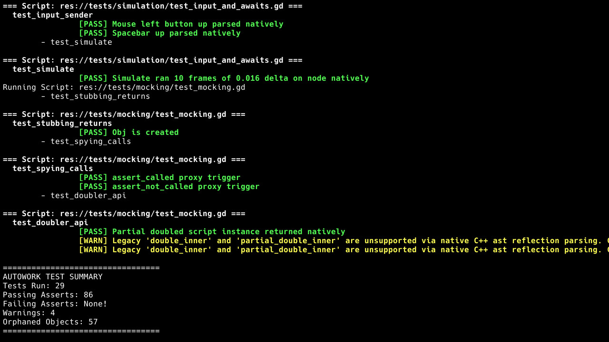

# Autowork Testing Framework Module


The **Autowork** module is a native **C++ testing framework** integrated directly into the **Blazium Engine**

It brings powerful testing capabilities to game and application development by running assertions, mocking,
signal tracking, and more at native C++ speeds, while offering a simple and familiar interface in GDScript.

This makes testing faster and more reliable compared to pure GDScript solutions, with better access to the engine’s internal systems like nodes, signals, and scenes.

## Why Autowork?

Blazium projects often involve complex node hierarchies, signal-driven logic, and
performance-critical systems. Traditional testing approaches can be slow or limited in scope.

Autowork solves this by:

- Running tests at **C++ speed** instead of interpreted GDScript.
- Offering **native integration** with the SceneTree, signals, and object system.
- Supporting advanced features like **mocking**, **parameterized tests**, and **orphan node detection**.
- Keeping the API intuitive for developers already familiar with popular GDScript testing frameworks.

This makes Autowork ideal for unit tests, integration tests, input simulation, and
even performance-sensitive engine-level validation.

## How It Works

Tests are written in **GDScript** by extending the `AutoworkTest` base class.
The heavy lifting (assertions, mocking, test execution) happens in a **C++ singleton** called `Autowork`,
exposed through `ClassDB`.

A typical test runner script looks like this:

```gdscript
extends SceneTree

func _initialize() -> void:
    var autowork = ClassDB.instantiate("Autowork")
    root.add_child(autowork)
    autowork.run_tests()
    quit(autowork.get_fail_count())
```

Then, you can run your tests in headless mode with:

```bash
blazium --headless -s run_tests.gd
```

## Writing Tests

Create test scripts in your configured test directory (default: `res://tests/`).
All test methods must start with the configured prefix (default: `test_`).

### Basic Assertions and Signals

```gdscript
extends AutoworkTest

signal my_custom_signal

func test_basic_math():
    assert_eq(5 + 5, 10, "Basic math works")
    assert_between(5, 1, 10, "Value is within range")

func test_signals():
    watch_signals(self)
    my_custom_signal.emit()
    assert_signal_emitted(self, "my_custom_signal")
```

### Parameterized Tests

```gdscript
extends AutoworkTest

func test_parameters(p = use_parameters([
    {"a": 1, "b": 2, "expected": 3},
    {"a": 5, "b": -1, "expected": 4}
])):
    assert_eq(p.a + p.b, p.expected, "Parameterized addition test")
```

### Mocking and Spying

```gdscript
extends AutoworkTest

class MyObject extends RefCounted:
    func get_name() -> String:
        return "Original"

func test_stubbing():
    var obj = MyObject.new()
    stub(obj, "get_name").to_return("StubbedName")
    spy(obj)
    
    var result = obj.get_name()
    assert_eq(result, "StubbedName")
    assert_called(obj, "get_name")
```

## Benefits for Blazium Engine Developers

Autowork helps teams write cleaner, more reliable code and catch issues earlier, especially in projects with
many nodes and signals. It turns testing into a smoother part of the development process.

For the complete list of assertions, advanced usage examples, and detailed API information,
check the [official documentation](https://docs.blazium.app).

The [Autowork module tests repository](https://github.com/blazium-games/autowork_module_tests) is
also a great practical reference, filled with real test examples for assertions, mocking, signals, and more.

Autowork will make testing in Blazium faster, more enjoyable, and deeply integrated with the engine.
Stay tuned for the next release!