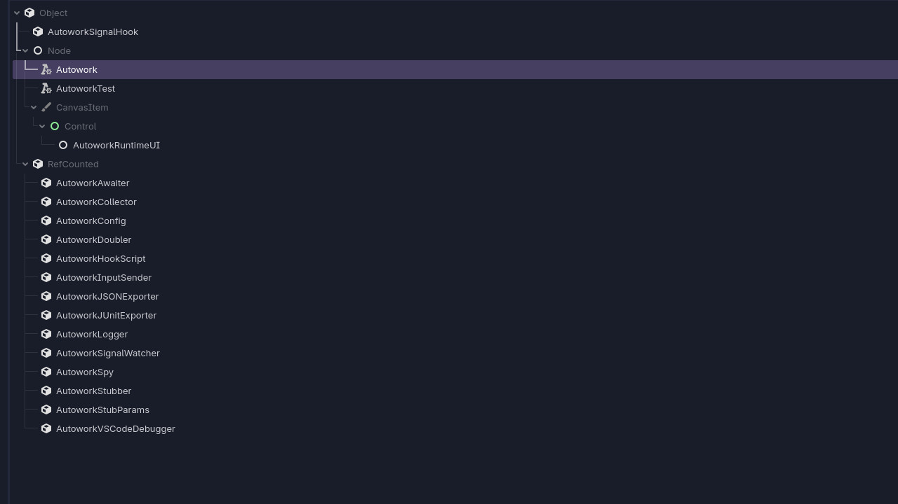

# Introducing Autowork

Blazium Game Engine now includes **Autowork**, a powerful new built-in testing framework designed
specifically for game and application development. Implemented natively in C++ and deeply integrated
with the engine via `ClassDB`, Autowork delivers fast, reliable, and expressive testing capabilities
directly inside Blazium — no external dependencies or slow GDScript-only runners required.

Tests are written in familiar GDScript (or C#) and extend the `AutoworkTest` class.
The framework automatically discovers test methods (by default those starting with `test_`),
runs them efficiently, and provides rich tooling for assertions, mocking, signal tracking,
parameterization, and engine simulation.

## Key Features

- **Native Speed & Deep Integration** — Assertions, mocking, and signal watching are bound directly in
C++ for maximum performance, even when testing complex engine interactions.
- **Rich Assertion Library** — Over 30 built-in assertions including `assert_eq`, `assert_between`, and
many more for values, properties, and edge cases.
- **Signal Testing** — Easily `watch_signals(node)` and then `assert_signal_emitted` to verify that
your nodes and systems fire signals correctly.
- **Mocking & Spying** — Create test doubles with `stub(object, "method").to_return(value)`, spy on
calls with `spy(object)`, and verify behavior using `assert_called`.
- **Parameterized Tests** — Run the same test logic against multiple data sets using `use_parameters([...])`.
- **Engine Simulation** — Support for `await`, input simulation, frame/time manipulation, and realistic
testing of time-dependent or physics-based logic.
- **Orphan Node Detection** — Automatically detects and reports leaked nodes that weren't properly freed during tests.
- **Configurable Test Discovery** — Controlled via `.autoworkconfig.json` (scan directories,
file prefixes/suffixes, include subdirs, hide orphans, etc.).
- **Headless CI-Friendly Execution** — Run tests from the command line in headless mode and get a
clean exit code based on failures.

## Why Use Autowork in Your Blazium Projects?

Autowork makes it practical to maintain high code quality in game development:

- **Unit & Integration Testing** — Test individual classes, nodes, systems, and full scenes with full access to the engine.
- **Regression Prevention** — Catch breaking changes early in UI logic, gameplay systems, networking, or procedural generation.
- **Behavior-Driven Development** — Combine assertions and signal watching to clearly express “what should happen” in your game.
- **Mocking Complex Dependencies** — Stub out external services, input, or heavy computations to keep tests fast and isolated.
- **Performance & Reliability** — Native implementation keeps test suites snappy even as your project grows to hundreds of tests.

It’s ideal for solo developers, indie teams, and larger studios who want robust automated testing
without leaving the Blazium ecosystem.

## Documentation & Next Steps

The module is already available in the [latest release of Blazium](article link) and
ships with comprehensive tests (see the dedicated
[autowork_module_tests repository](https://github.com/blazium-games/autowork_module_tests)
for validation examples).

For full technical details head over to the official **Blazium Documentation** at [docs.blazium.app](https://docs.blazium.app).

Autowork brings professional-grade, engine-native testing to Blazium — making it easier than ever to ship
stable, well-tested games and tools.