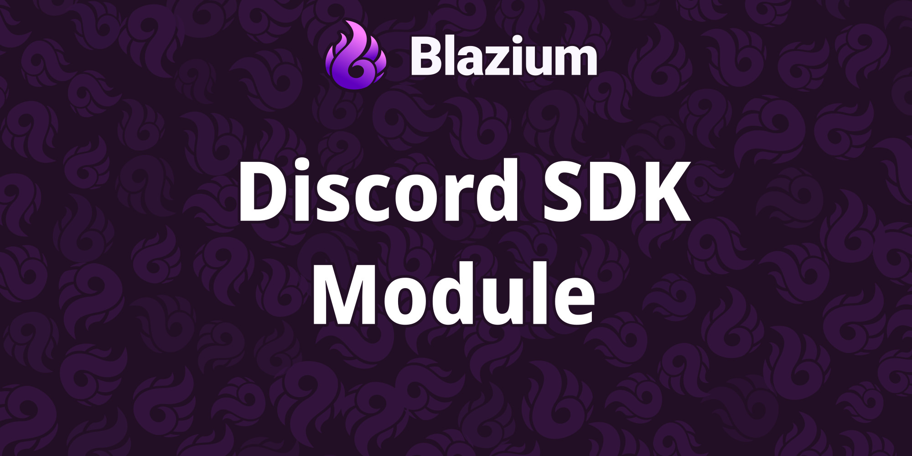
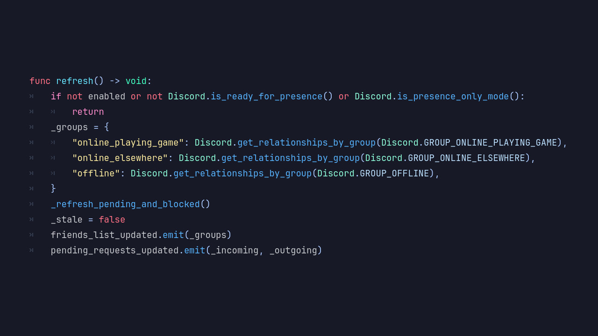

# Introducing the Discord Social SDK Module

Blazium Game Engine now includes a native **Discord Social SDK** module. It brings official Discord features straight into your games with a simple `Discord` singleton.

The module offers two modes: a lightweight version for rich presence and a full version with social tools like friends and invites. It was built to make connecting with Discord players smooth and straightforward.

## Key Features

- **Easy Setup**: Quick initialization for rich presence or full social features using your Discord app ID.
- **Rich Presence**: Show what players are doing in your game on their Discord profiles.
- **Social Tools**: Manage friends, send invites, and handle lobbies directly in-game.
- **Player Invites**: Let friends join games easily with activity invites and join requests.
- **User Info**: Access basic player details like username and status.
- **Helpful Extras**: Built-in logging and automatic updates for reliable performance.

## Why Use the Discord Social SDK Module in Your Blazium Project?

This module makes your game feel more connected and modern on Discord:

**For Games**
- Display live game status so friends can see what you're playing and join in.
- Build in-game friend lists and invite systems without leaving the game.
- Create fun multiplayer experiences with easy lobbies and activity sharing.
- Connect to your own servers securely using Discord login.

**For Tools & Apps**
- Make Discord-friendly tools or community dashboards inside Blazium.
- Test social features quickly during development.
- Keep players engaged with smooth notifications for invites and updates.

## Documentation & Next Steps

The module is available in the [latest nightly of Blazium](https://blazium.app/download).

---

**[Jump into our Discord](https://blazium.app/chat)** for real-time chats, dev support and feedback

Or follow us everywhere else:

- **[GitHub](https://github.com/blazium-games)**
- **[IndieDB](https://www.indiedb.com/engines/blazium-engine/articles)**
- **[X / Twitter](https://x.com/BlaziumGames)**
- **[YouTube](https://www.youtube.com/@blazium)**
- **[itch.io](https://blaziumengine.itch.io)**
