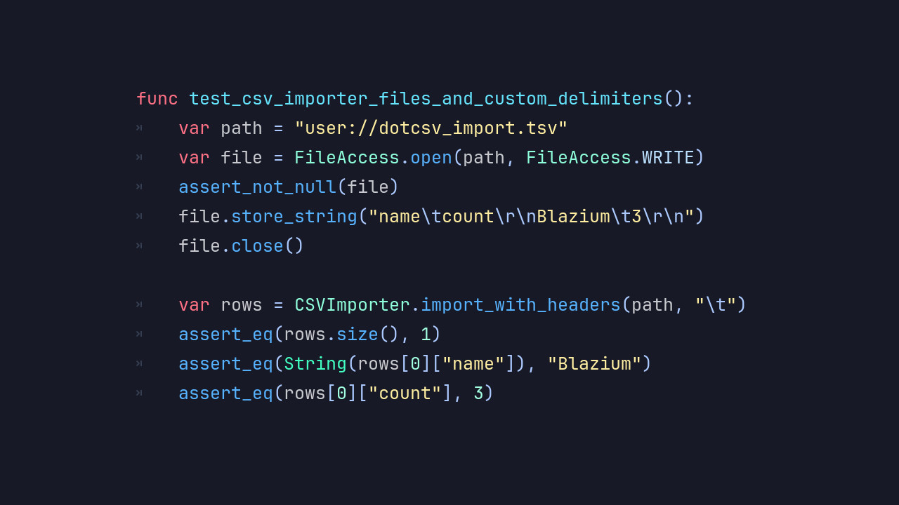

# Introducing the DotCSV Module

**DotCSV** is a lightweight and flexible CSV parsing and writing module built directly into **Blazium Engine**,
designed to make working with structured text data effortless inside your projects.
Whether you're handling game data, configuration files, or external datasets, DotCSV provides a clean and efficient
API without relying on external libraries.

## Key Features

- **Simple CSV Parsing** — Load and parse CSV files into structured arrays with minimal boilerplate.
- **Flexible Delimiters** — Supports custom delimiters beyond commas, making it adaptable to various data formats.
- **Read & Write Support** — Not just a parser, DotCSV allows you to generate and save CSV files directly from your project.
- **Type-Friendly Handling** — Works naturally with strings, numbers, and mixed data without cumbersome conversions.
- **Lightweight Design** — Minimal overhead ensures fast execution even when working with large datasets.
- **Engine-Native Integration** — Fully compatible with GDScript and C#, no external dependencies required.
- **Robust Error Handling** — Gracefully manages malformed rows, missing values, and edge cases.

## Why Use DotCSV in Your Blazium Projects?

DotCSV simplifies one of the most common data-handling tasks in development:

- **Data-Driven Design** — Store game balance values, dialogue, localization, or level data in easily editable CSV files.
- **Tooling & Pipelines** — Integrate with spreadsheets or external tools and import data directly into your game.
- **Rapid Iteration** — Designers can tweak values without touching code, speeding up development cycles.
- **Save/Export Systems** — Generate CSV outputs for debugging, analytics, or player-generated content.
- **Interoperability** — CSV remains one of the most widely supported formats, making integration with other tools trivial.

From indie prototypes to large-scale systems, DotCSV helps keep your data workflows clean, readable, and efficient.

## Documentation & Next Steps

The module is already available in the [latest nightly of Blazium](https://blazium.app/download) and
it comes with comprehensive tests (see the dedicated
[dotcsv_module_tests repository](https://github.com/blazium-games/dotcsv_module_tests)
for validation examples).

DotCSV brings straightforward, engine-native CSV handling to Blazium — helping you build data-driven
systemsfaster and with less friction.

---

**[Jump into our Discord](https://blazium.app/chat)** for real-time chats, dev support and feedback!

Or follow us everywhere else:

- **[IndieDB](https://www.indiedb.com/engines/blazium-engine/articles)**
- **[X / Twitter](https://x.com/BlaziumGames)**
- **[YouTube](https://www.youtube.com/@blazium)**
- **[itch.io](https://blaziumengine.itch.io)**
