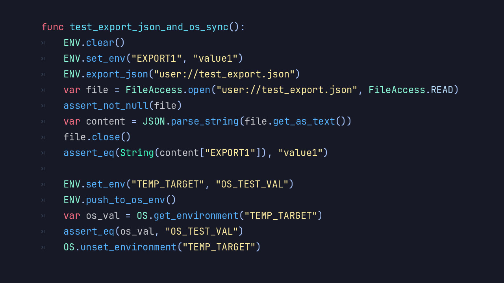

# Introducing the DotENV Module  

**DotENV** is a lightweight and practical environment configuration module built directly into **Blazium Engine**,
designed to simplify how projects manage environment variables and configuration files.
Inspired by the widely used `.env` pattern, DotENV allows developers to separate configuration from
code, making projects cleaner, safer, and easier to maintain.

Whether you're managing API keys, feature flags, or environment-specific settings, DotENV provides a
straightforward and engine-native solution without external dependencies.

## Key Features

- **.env File Parsing** — Easily load key-value pairs from `.env` files into your project at runtime.
- **Environment Separation** — Manage different configurations for development, testing, and production with ease.
- **Simple API** — Access variables through a clean and intuitive interface.
- **Secure Configuration Handling** — Keep sensitive data like tokens and credentials out of source code.
- **Lightweight Implementation** — Minimal overhead ensures fast loading and negligible performance impact.
- **Engine-Native Integration** — Fully compatible with GDScript and C#, no additional libraries required.
- **Flexible Usage** — Works seamlessly for both small projects and complex systems.

## Why Use DotENV in Your Blazium Projects?

DotENV addresses one of the most common challenges in modern development: configuration management.

- **Cleaner Codebase** — Remove hardcoded values and centralize configuration in dedicated `.env` files.
- **Improved Security** — Keep secrets out of your repository and reduce the risk of accidental exposure.
- **Environment Flexibility** — Switch between development and production settings without modifying code.
- **Team-Friendly Workflow** — Developers can maintain their own local configurations without conflicts.
- **Scalable Architecture** — Essential for larger projects with multiple deployment targets or services.
- **Rapid Setup** — Quickly configure new environments or features with minimal friction.

From indie games to complex applications, DotENV helps enforce best practices while
keeping your workflow simple and efficient.

## Documentation & Next Steps

The module is already available in the [latest nightly of Blazium](https://blazium.app/download) and
it comes with comprehensive tests (see the dedicated
[dotenv_module_tests repository](https://github.com/blazium-games/dotenv_module_tests)
for validation examples).

DotENV brings modern environment configuration handling to Blazium — making your projects more
maintainable, secure, and production-ready.

---  

**[Jump into our Discord](https://blazium.app/chat)** for real‑time chats, dev support and feedback!

Or follow us everywhere else:  

- **[IndieDB](https://www.indiedb.com/engines/blazium-engine/articles)**  
- **[X / Twitter](https://x.com/BlaziumGames)**  
- **[YouTube](https://www.youtube.com/@blazium)**  
- **[itch.io](https://blaziumengine.itch.io)**
