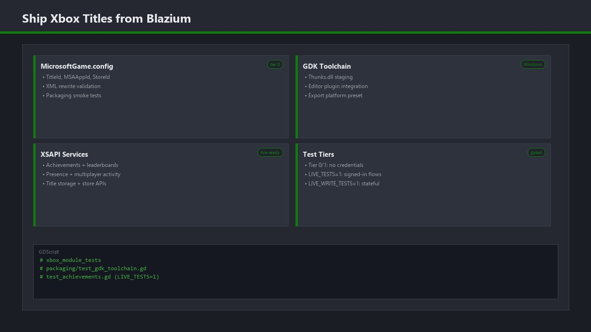

# Introducing the GDK Module

The **GDK Module** is a working integration with Microsoft's Game Development Kit on PC.
It links the engine against GDK runtime libraries, wires in Xbox Services (XSAPI), and adds
a dedicated Xbox export platform with editor tooling — so shipping an Xbox title from Blazium
is not a manual side quest.

The module follows Microsoft's custom-engine guidance for PC titles using `Thunks.dll`, and
includes a full Autowork test pass ported from the XBOX-Godot-Sample project.

## Key Features

- **GDK Runtime Integration** — Engine links against the GDK on PC using `Thunks.dll`, following Microsoft's custom-engine guidance for PC titles.
- **XSAPI Services** — Xbox Services API layer for achievements, presence, leaderboards, stats, and multiplayer activity.
- **Export Platform** — Dedicated Xbox export target with `MicrosoftGame.config` packaging support.
- **Editor Plugin** — GDK tooling lives inside the Blazium editor instead of bolted on from the outside.
- **Tiered Test Suite** — Packaging and toolchain smoke tests run without credentials; live Xbox Live tests gate on environment variables.

## Why Add the GDK Module to Your Blazium Project?

Xbox developers get a path from editor to packaged build without leaving the engine:

**For Games**
- **Platform services** — Achievements, stats, presence, and leaderboards through native XSAPI bindings.
- **Xbox export** — Package builds with the Xbox export preset and validated `MicrosoftGame.config`.
- **Sandbox testing** — Run tier-0 tests locally, then enable `LIVE_TESTS=1` for signed-in scenarios.

**For Studios**
- Validate GDK toolchain and packaging in CI without an Xbox dev kit for every check.
- Port existing Xbox sample test coverage through the dedicated test project.
- Keep PC GDK and export tooling in sync with engine updates.

## Documentation & Next Steps

The module is already available in the [latest nightly of Blazium](https://blazium.app/download)
and it comes with comprehensive tests — see the dedicated
[xbox_module_tests repository](https://github.com/blazium-games/xbox_module_tests)
for validation examples. Tier 0/1 tests cover class registration, packaging, and toolchain validation
without Xbox credentials; set `LIVE_TESTS=1` for signed-in Xbox Live scenarios.

For full technical details head over to the official **Blazium Documentation** at [docs.blazium.app](https://docs.blazium.app).

The GDK module brings Microsoft's Game Development Kit straight into Blazium on PC.

---

**[Jump into our Discord](https://blazium.app/chat)** for real-time chats, dev support and feedback

Or follow us everywhere else:

- **[IndieDB](https://www.indiedb.com/engines/blazium-engine/articles)**
- **[X / Twitter](https://x.com/BlaziumGames)**
- **[YouTube](https://www.youtube.com/@blazium)**
- **[itch.io](https://blaziumengine.itch.io)**
- **[Patreon](https://www.patreon.com/cw/Blazium)**
