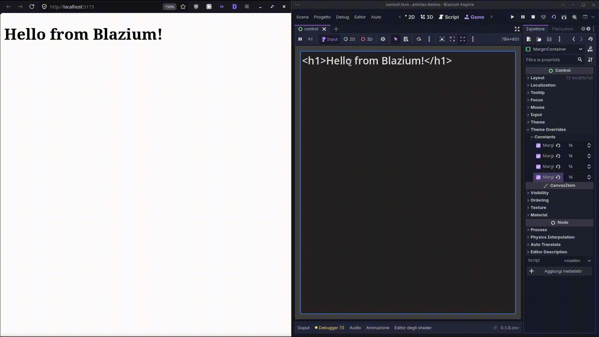

# HTTP Server Module

The **HTTP Server Module** brings a full-featured web server directly into the Blazium Engine.
It allows you to create REST APIs, serve static files, and push real-time updates using
Server-Sent Events (SSE) all without external dependencies.

The server runs in a dedicated background thread, handles multiple concurrent
connections efficiently, and uses a clean, route-based system for registering handlers.

This makes it perfect for:
- Building live dashboards or control panels
- Creating REST backends for your games
- Implementing real-time features (chat, status updates, multiplayer events)
- Serving assets or web-based tools alongside your game

## Basic Usage

Start the server and register routes with simple GDScript callbacks:

```gdscript
extends TextEdit

func _ready() -> void:
    # Start listening on port 5173
    HTTPServer.listen(5173)
    
    # Register a simple GET route
    HTTPServer.register_route("GET", "/", func(req: HTTPRequestContext, res: HTTPResponse):
        var html = """
            <!DOCTYPE html>
            <html lang="en">
            <head><meta charset="UTF-8"></head>
            <body>%s</body>
            </html>
        """ % text
        
        res.add_header("Content-Type", "text/html")
        res.set_body(html)
    )
```



## Why Use the Built-in HTTP Server?

Unlike running an external server or using addons, this module is:
- Natively integrated and optimized for Blazium
- Zero extra setup or dependencies
- Runs safely in the background without freezing the editor or game
- Fully controllable from GDScript

Whether you're building a web companion for your game, a streaming overlay tool, or a full backend service, the HTTP Server Module gives you the power you need in a simple, familiar package.

**Full documentation** is available at [docs.blazium.app](https://docs.blazium.app).