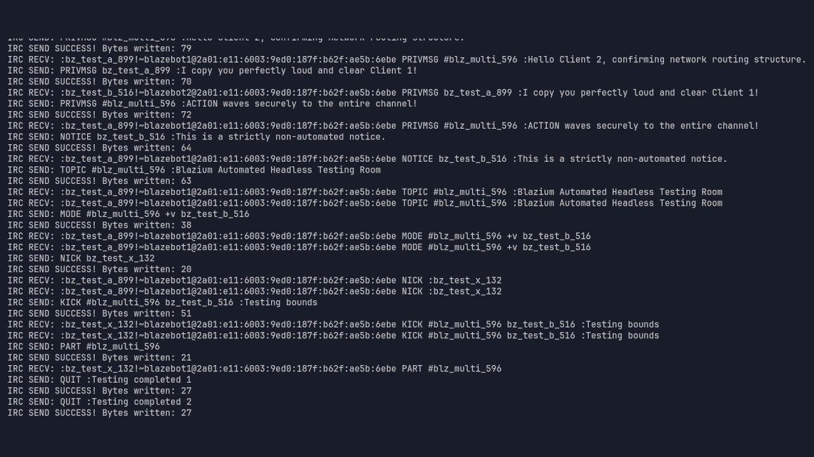

# Introducing the IRC Client Module

Blazium Game Engine has just gained a powerful new built-in IRC Client module.
This C++ module brings full IRC (Internet Relay Chat) client capabilities directly into the engine,
allowing developers to connect to any IRC server, join channels, exchange messages, handle user events,
and even perform Direct Client-to-Client (DCC) file transfers — all without third-party plugins or external libraries.

Exposed as the easy-to-use `IRCClientNode`, the module integrates seamlessly with the signal system.
You simply add the node to your scene, connect signals like `on_connect`, `on_message`, `on_user_join`, or
`on_channel_message`, and start chatting in real time using GDScript or C#.
It supports SSL, Twitch-specific extensions (badges, commands, etc.), and full message parsing via
helper classes like `IRCChannel`, `IRCUser`, `IRCMessage`, and `IRCDCC`.

## Why Add IRC to a Game or Application?

The IRC Module opens up a range of lightweight, low-bandwidth, and highly customizable networking possibilities:

**For Games**
- **In-game global or community chat rooms** — Connect players to public IRC servers or
your own private channels for persistent world chat, without spinning up custom WebSocket servers.
- **Twitch integration made simple** — Pull live chat from Twitch streams directly into your game UI,
display viewer badges, and let audiences interact with on-screen events or polls in real time.
- **Retro-style multiplayer coordination** — Perfect for text-based adventures, roguelikes, or
co-op games that want classic IRC-style lobbies or clan channels.
- **Server status & announcement systems** — Games can subscribe to IRC channels for live patch notes,
tournament alerts, or admin broadcasts.
- **Peer-to-peer file sharing via DCC** — Let players share custom levels, mods, or assets directly
through the game using built-in DCC support.

**For Applications & Tools**
- Build complete IRC clients, bots, or moderation dashboards entirely with the engine’s powerful editor and UI system.
- Create cross-platform chat tools, support ticketing systems, or community hubs that leverage existing IRC networks.
- Prototype lightweight, always-on messaging backends for any project that needs reliable, battle-tested text communication.

Because it uses the engine's native networking stack (`StreamPeerTCP`/`SSL`), the module is lightweight,
performant, and works in both editor and exported builds (including headless servers).

## Documentation & Next Steps

The module is already available in the [latest release of Blazium](https://blazium.app/download) and
ships with comprehensive tests (see the dedicated
[irc_module_tests repository](https://github.com/blazium-games/irc_module_tests)
for validation examples).

For full technical details head over to the official **Blazium Documentation** at [docs.blazium.app](https://docs.blazium.app).

Whether you’re building the next big multiplayer title, a Twitch-centric experience, or just want rock-solid
chat in your indie game, the new IRC Module gives you battle-tested, standards-compliant connectivity with almost zero setup.  