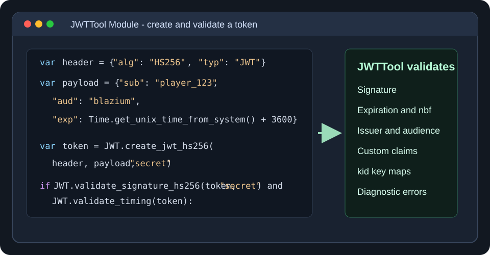
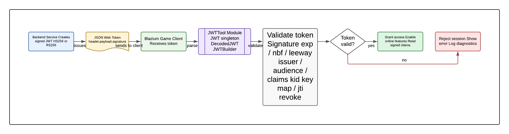
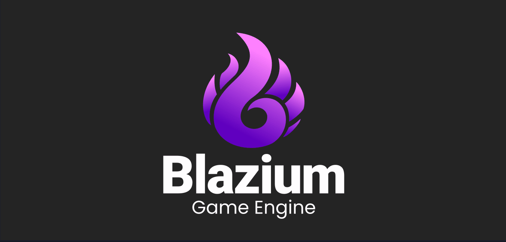

# Introducing the JWTTool Module

Blazium Game Engine now includes a built-in **JWTTool** module for working with JSON Web Tokens directly from your projects.
Whether you are authenticating players, validating backend-issued session tokens, signing local service messages,
or building secure tools, JWTTool brings token creation, parsing, and verification into the engine without relying on external addons.

The module exposes the *JWT* singleton for common operations, *JWTBuilder* for fluent token creation,
and *DecodedJWT* for inspecting parsed tokens and reading typed claims.
It supports HMAC-based *HS256* tokens, RSA-based *RS256* tokens through Blazium's *CryptoKey* support,
registered claim helpers, timing checks, key selection, revocation, and diagnostic results for better tooling and logs.

## Key Features

- **Engine-Level JWT Singleton** — Use the global *JWT* singleton to create, parse, decode, validate, and
inspect tokens from GDScript or C#.
- **HS256 and RS256 Support** — Sign and verify shared-secret tokens with *HS256*, or use RSA keys with
*RS256* for public/private key workflows.
- **Fluent Token Builder** — Create tokens with *JWTBuilder* by setting the algorithm, issuer, subject,
audience, expiration, JWT ID, and custom claims.
- **Decoded Token Helpers** — Use *DecodedJWT* to read headers, payload values, registered claims, and
typed claim values after parsing.
- **Claim and Header Validation** — Validate expected payload claims, header claims, algorithm choices, and
token structure with dedicated helpers.
- **Timing Controls** — Check expiration, not-before (*nbf*) values, issued-at timing, and leeway windows
for real-world clock drift.
- **Key ID Workflows** — Read *kid* headers and validate against key maps with *validate_with_map*,
making multi-key rotation easier to manage.
- **Revocation and Diagnostics** — Revoke tokens by *jti*, clear revocation state, and use
diagnostic dictionaries to explain validation failures.

## Why Add JWTTool to a Game or Application?

JWTs are a common bridge between games, web services, launchers, account systems, dashboards, and internal tooling.
With JWTTool built into Blazium, projects can validate tokens close to the gameplay or application logic that depends on them.
That makes it easier to gate features, read session metadata, and verify signed messages without writing a custom token stack.

**For Games**
- **Player authentication** — Accept backend-issued tokens and validate issuer, audience, expiration,
subject, and signature before enabling online features.
- **Entitlements and feature gates** — Store signed claims for DLC access, beta flags, roles, cosmetics, or tournament permissions.
- **Dedicated server handoff** — Pass short-lived tokens from matchmaking or account services to headless Blazium servers.
- **Secure streamer or creator integrations** — Validate signed identity or permission tokens before
connecting gameplay to external services.
- **Token rotation workflows** — Use *kid* headers and key maps to support multiple signing keys during migrations.

**For Applications & Tools**
- Build admin panels, launchers, dashboards, or internal tools that understand JWT-based authentication.
- Create signed automation payloads for CI, build tooling, local services, or companion applications.
- Use diagnostic validation output to surface clear token errors in logs, editor tools, or QA workflows.

Because the module works with Blazium's existing Crypto APIs, it fits naturally alongside other engine
networking and backend-facing features.
Applications can keep remote JWKS fetching, account policy, or secret storage in their own service layer
while JWTTool handles the token mechanics inside the engine.

## Documentation & Next Steps

The module is already available in the [latest nightly of Blazium](https://blazium.app/download) and
ships with comprehensive tests (see the dedicated
[jwttool_module_tests repository](https://github.com/blazium-games/jwttool_module_tests)
for validation examples).

From small internal tools to online games with account-backed services, the JWTTool module gives Blazium projects a practical native foundation for token-based authentication and signed claims.

---

**[Jump into our Discord](https://blazium.app/chat)** for real-time chats, dev support and feedback

Or follow us everywhere else:

- **[IndieDB](https://www.indiedb.com/engines/blazium-engine/articles)**
- **[X / Twitter](https://x.com/BlaziumGames)**
- **[YouTube](https://www.youtube.com/@blazium)**
- **[itch.io](https://blaziumengine.itch.io)**
