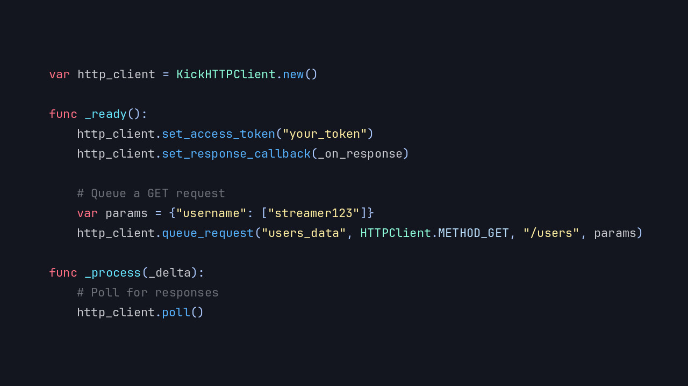

# Introducing the KickAPI Module

Blazium Game Engine expands its live-streaming integrations with the **KickAPI** module.
This native C++ module delivers direct access to the Kick Dev API from within your
Blazium projects, so you can build Kick-connected games and tools without external wrappers.

## Key Features

- **Native Access to Kick Dev API**: Perform authenticated requests to Kick's public API endpoints for
channels, livestreams, users, and more.
- **Built-in HTTP Client**: Efficient handling of requests, headers, OAuth-style authentication,
and responses with full TLS support.
- **Deep Blazium Integration**: Expose Kick data directly to GDScript or C# logic, UI systems,
signals, and game mechanics.
- **Headless & Editor Ready**: Works in the editor, exported games, and headless mode,
ideal for bots, overlays, or backend services.
- **Lightweight & Performant**: C++ core keeps overhead low when polling live stream data or
reacting to events in real time.

## Why Add KickAPI to Your Project?

Kick.com has become a major platform for streamers who value high engagement and creator-friendly policies.
The KickAPI module lets you tap into that audience:

- **Live Stream Overlays & Widgets**: Display real-time channel info, viewer counts, livestream status, or
follower alerts directly in your game or tool.
- **Audience-Driven Experiences**: Sync in-game events with Kick stream status, enable special modes while
live, or reward active viewers.
- **Custom Dashboards & Tools**: Build moderation helpers, analytics viewers, or chat-enhanced experiences.
- **Cross-Platform Streaming Support**: Combine with TwitchAPI to support multiple streaming services in one project.
- **Bots & Automation**: Run headless Blazium instances as Kick bots or notification systems.
- **Viewer Engagement**: Create games where the Kick stream influences gameplay, progression, or community events.

## Documentation & Next Steps

The module is already available in the [latest release of Blazium](https://blazium.app/download) and
includes a dedicated test project (see
[kickapi_module_tests](https://github.com/blazium-games/kickapi_module_tests)
for examples).

For full technical details head over to the official **Blazium Documentation** at [docs.blazium.app](https://docs.blazium.app).

Whether you're building a Kick-centric game, multi-streamer tools, or interactive overlays, the
KickAPI module makes integration native to Blazium.

---

**[Jump into our Discord](https://blazium.app/chat)** for real-time chats, dev support and feedback

Or follow us everywhere else:

- **[IndieDB](https://www.indiedb.com/engines/blazium-engine/articles)**
- **[X / Twitter](https://x.com/BlaziumGames)**
- **[YouTube](https://www.youtube.com/@blazium)**
- **[itch.io](https://blaziumengine.itch.io)**
- **[Patreon](https://www.patreon.com/cw/Blazium)**
