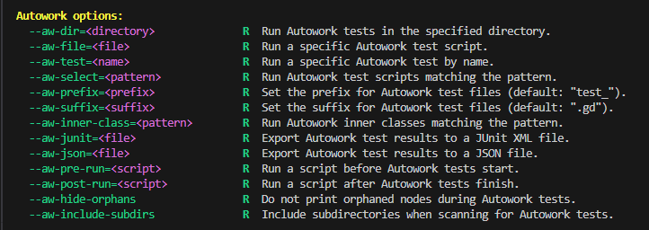

# Blazium Engine Release 0.6.X

This marks the **last release based on Godot 4.3** and will serve as
the future **Long-Term Support (LTS)** version once the next 4.6-based release arrives.

Thanks to the significant number of new features, we’ve re-launched our
official [documentation website](https://docs.blazium.app) to help you make the most of Blazium.

## New Features

### Autowork Unit Testing Module

A powerful unit testing framework directly integrated into the engine,
inspired by the popular [GUT (Godot Unit Test)](https://github.com/bitwes/Gut) addon.

Learn more in the [dedicated article]().

### HTTP Server Module

A full-featured HTTP server with support for REST APIs, static file serving,
and Server-Sent Events (SSE).

Learn more in the [dedicated article]().

### SocketIO Module

Easily connect to and manage Socket.IO connections from your projects.

Learn more in the [dedicated article]().

### IRC Client Module

Quick and simple IRC client integration for real-time chat in your games.

Learn more in the [dedicated article]().

### ENet Module

A more flexible and less restrictive ENet implementation compared to the default one.

Learn more in the [dedicated article]().

### CrowdControl Module

Seamless Crowd Control integration, making it easy to add interactive chat and
viewer-driven events for streamers.

Learn more in the [dedicated article]().

### Twitch API Module

Full Twitch API integration for your streaming and community features.

Learn more in the [dedicated article]().

### Kick API Module

Kick API integration for modern streaming platforms.

Learn more in the [dedicated article]().

### OBS Client Module

Control OBS Studio directly from within Blazium.

Learn more in the [dedicated article]().

### Alternative Scrollbar Style

Option to enable thicker editor scrollbars, making them much easier to grab and use.

**Contributed by [Tekisasu-JohnK](https://github.com/blazium-games/blazium/pull/584)**

### QTerminal Support
Added support for **QTerminal** as a supported terminal emulator on Linux.

**Contributed by [MisterPuma80](https://github.com/blazium-games/blazium/pull/602)**

## Removals

### GodotSteam Module Removed

After encountering ongoing issues with the existing integration and considering
that it is maintained by a separate team, we decided to remove the GodotSteam module.
We plan to develop our own robust solution in the future.

### Six-Way Volumetric Lighting Material Removed

The original Godot shader implementation remains available here:  
[TheAenema/Godot-Six-Way-Volumetric-Shader](https://github.com/TheAenema/Godot-Six-Way-Volumetric-Shader).

## Download

[Download the latest release on blazium.app](https://blazium.app/download)

For the complete list of changes, see the [changelog](https://blazium.app/changelog?v=release_0.6.X).