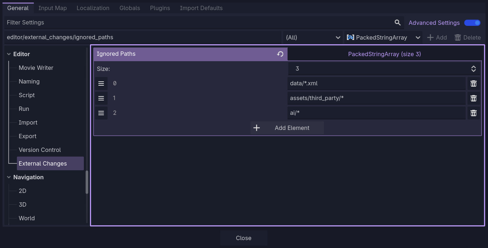
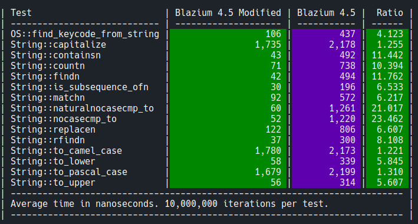

# Blazium Engine Release 0.6.X

Blazium Engine 0.6.X is one of the biggest updates to the engine so far, bringing a wide range of new modules,
workflow improvements, tooling integrations, and performance upgrades.

This release focuses heavily on developer productivity, data handling, automation, and modern tooling support while
continuing to improve engine stability and runtime performance.

[Download the latest release on blazium.app](https://blazium.app/download)

## New Features

### MCP Integration

This release adds an **MCP** server to the editor through the **JustAMCP** module.
Integrate your favourite AI agent into you workflow with up to *308 tools* available to agents
to create and modify your project.

Learn more about the MCP module in the
[dedicated article](https://www.indiedb.com/engines/blazium-engine/news/mcp-module).

### Autowork Module

**Autowork** is a built-in testing framework for game and application development.
It provides an easy way to automate gameplay testing, validation workflows, regression testing, and project verification directly inside the engine.

Learn more about the Autowork module in the
[dedicated article](https://www.indiedb.com/engines/blazium-engine/features/autowork-testing-framework-module).

### New Steam Module

After GodotSteam was removed in release 0.5.246, we built our own path forward. The result covers achievements, stats, inventory, web API tickets, and backend authentication, the pieces most games actually need on day one.

Learn more about the new Steam module in the
[dedicated article](https://www.indiedb.com/engines/blazium-engine/news/steam-module).

### Discord Social SDK Module

Native support for the [Discord Social SDK](https://discord.com/developers/social-sdk) to easly add rich-presence and discord social features into your games.

Learn more about the Discord SDK module in the
[dedicated article](https://www.indiedb.com/engines/blazium-engine/news/discord-social-sdk-module).

### Microsoft GDK Module

[Microsoft's Game Development Kit](https://github.com/microsoft/GDK) straight into the editor, with export tooling, live services, and a test suite.

Learn more about the GDK module in the
[dedicated article](https://www.indiedb.com/engines/blazium-engine/news/gdk-module).

### DotCSV Module

Read and writes CSV files directly in engine for game data, config exports, and spreadsheet imports.

Learn more about the DotCSV module in the
[dedicated article](https://www.indiedb.com/engines/blazium-engine/features/dotcsv-module).

### DotENV Module

**DotENV** loads `.env` files, so you can keep config and secrets out of source code.

Learn more about the DotENV module in the
[dedicated article](https://www.indiedb.com/engines/blazium-engine/features/dotenv-module).

### DotINI Module

**DotINI** reads and writes INI config files directly in in engine for settings and structured data with custom type-checking.

Learn more about the DotINI module in the
[dedicated article](https://www.indiedb.com/engines/blazium-engine/features/dotini-module).

### Multiuser Editor Module

The **Multiuser Editor** module brings real-time collaborative editing to the Blazium editor. Multiple developers can work on the same project at once, syncing scripts, files, and editor state across the network without leaving the engine.

Learn more about the Multiuser Features in the
[dedicated article](https://www.indiedb.com/engines/blazium-engine/news/multiuser-editor-module).

### GOAP Module

The new **GOAP (Goal-Oriented Action Planning)** module adds goal-based AI planning to the engine.
Developers can build NPC behavior that picks actions based on world state instead of rigid state machines.

Learn more about the GOAP module in the
[dedicated article](https://www.indiedb.com/engines/blazium-engine/features/goap-module).

### BigNum++ Integration

The **BigNum++** intgration, enables support for arbitrary precision mathematics.
This is especially useful for idle games, simulation projects, scientific tooling, financial systems, and
projects that require extremely large or highly precise numeric values.

Learn more about the BigNum integration in the
[dedicated article](https://www.indiedb.com/engines/blazium-engine/features/bignum-integration).

### JWT Module

Developers can now easily generate, validate, and decode JWT tokens directly from inside the engine for backend services,
multiplayer systems, APIs, and online authentication.

Learn more about the JWT module in the
[dedicated article](https://www.indiedb.com/engines/blazium-engine/features/jwttool-module).

### Tiled Importer

Easily import maps created with the
[Tiled map editor](https://www.mapeditor.org/),
making it easier to integrate external level design workflows into your projects.

Learn more about the Tiled Importer module in the
[dedicated article](https://www.indiedb.com/engines/blazium-engine/news/tiled-importer-module).

### Experimental Luau Module

We have added Luau support to the engine.
The module is still experimental so expect issues while trying Luau in you projects.
We plan to use Luau as scripting language for our scriptable game server and
this module will allow users to write networking code directly in the engine.

### Disable newer file check on specific files

Added the ability to exclude file refresh checks on specific files in the project settings.

**[pull/709 by TheKingScott](https://github.com/blazium-games/blazium/pull/709)**

## Updates

### Updated SQLite Module

The built-in SQLite module received major improvements, including updated bindings, improved reliability, and better integration with
modern database workflows. This update improves performance and stability for projects relying heavily on local storage and structured data.

Learn more about the updated SQLite module in the
[dedicated article](https://www.indiedb.com/engines/blazium-engine/features/sqlite3-module).

### Optimized unicode _find_upper and _find_lower.

Replaced slow binary search with perfect compile time hash table, when converting unicode to uppercase and lowercase.
This increases the speed of `to_lower`/`to_upper` by 4 to 6 times, wich increases the speed of a few other functions,
including GDScript compilation, localization, and stuff in the editor.

**[pull/652 by MisterPuma80](https://github.com/blazium-games/blazium/pull/652)**

### Fix textures repeat mode for GLES3 renderer.

Fixed texture repeat handling in the GLES3 renderer, improving compatibility and rendering correctness for materials and
textures relying on repeat sampling modes.

**[pull/632 by WhalesState](https://github.com/blazium-games/blazium/pull/632)**

### Updated Engine.get_version_info

`Engine.get_version_info()` has been expanded to provide Blazium Engine version info along with Godot's.

**[pull/642 by sshiiden](https://github.com/blazium-games/blazium/pull/642)**

### Fixed Texture2D Image Cache not updating Inspector Preview

Fixed Texture2D Image Cache not updating Inspector Preview when image file changes.

**[pull/684 by TheKingScott](https://github.com/blazium-games/blazium/pull/684)**

### Assorted GUI fixes and cherry-picks

[Pull Request list on GitHub](https://github.com/blazium-games/blazium/pulls?q=is%3Apr+%23636+%23643+%23646+%23649+%23657+%23651+%23675+%23674)

## Download

[Download the latest release on blazium.app](https://blazium.app/download)

For the complete list of changes, see the [changelog](https://blazium.app/changelog?v=release_0.6.X).

---

**[Jump into our Discord](https://blazium.app/chat)** for real-time chats, dev support and feedback

Or follow us everywhere else:

- **[GitHub](https://github.com/blazium-games)**
- **[IndieDB](https://www.indiedb.com/engines/blazium-engine)**
- **[X / Twitter](https://x.com/BlaziumGames)**
- **[YouTube](https://www.youtube.com/@blazium)**
- **[itch.io](https://blaziumengine.itch.io)**
