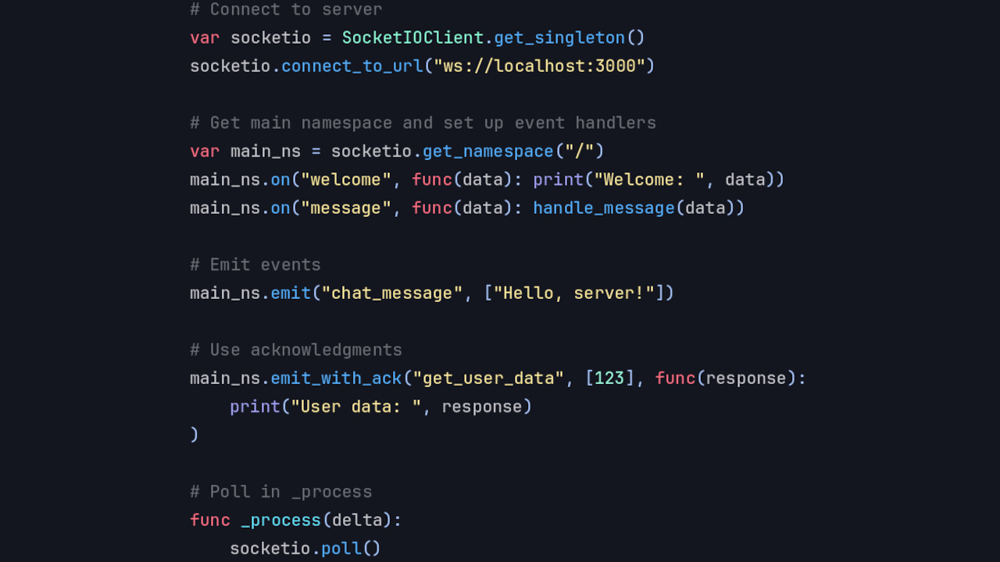

# Introducing the SocketIO Client Module

Blazium Game Engine now includes a dedicated **SocketIO Client** module, bringing the popular
Socket.IO protocol directly into your projects. This allows real-time bidirectional communication
between your game or application and any Socket.IO-compatible server.

The module provides an easy-to-use `SocketIOClient` node (and supporting classes like `SocketIONamespace`) that
works naturally with Blazium's signal system. You can connect to servers, join namespaces or rooms, emit events
with data, listen for incoming events, and handle automatic reconnection, all from GDScript or C#.

## Key Features

- **Full Socket.IO Protocol Support**: Connect over WebSocket with fallback transports, handle Engine.IO framing,
and manage acknowledgments.
- **Event System**: `emit()` custom events with JSON-compatible data and listen with `on()` or signals for incoming messages.
- **Namespaces & Rooms**: Support for Socket.IO namespaces and room-based messaging for organized multi-room experiences.
- **Automatic Reconnection**: Built-in reconnection logic with configurable options to keep connections alive.
- **JSON & Data Handling**: Convenient sending and receiving of structured data, including objects and arrays.
- **Deep Integration**: Works with Blazium's scene tree, signals, and other networking modules.

## Possible Uses in Games and Applications

Socket.IO is excellent for real-time features that require low-latency, bidirectional updates:

**For Games**
- **Live multiplayer chat and lobbies**: Build persistent chat systems, matchmaking lobbies, or in-game social features.
- **Real-time synchronization**: Sync player positions, scores, game state, or procedural events across clients and
servers with minimal latency.
- **Twitch-style live interactions**: Connect to Socket.IO backends for viewer polls, events, or collaborative gameplay.
- **Co-op and MMO elements**: Handle room-based gameplay, shared worlds, or dynamic events without managing raw WebSockets.
- **Companion apps and overlays**: Create web-based companions or admin tools that talk directly to your running game.

**For Applications & Tools**
- Build interactive tools, dashboards, or collaborative editors that need instant updates.
- Integrate with existing web services, IoT setups, or backend platforms that use Socket.IO.
- Develop real-time monitoring, logging, or control interfaces.

The module shines in scenarios where you want reliable, event-driven communication without the complexity of
managing raw connections yourself.

## Documentation & Next Steps

The module is already available in the [latest release of Blazium](https://blazium.app/download) and
includes a dedicated test project (see
[socketio_module_tests](https://github.com/blazium-games/socketio_module_tests)
for examples).

For full technical details head over to the official **Blazium Documentation** at [docs.blazium.app](https://docs.blazium.app).

With the SocketIO Client module, adding real-time features to your Blazium projects is straightforward.
Whether you're building a multiplayer game or a dynamic interactive tool, Socket.IO support is ready to power your connections.

---

**[Jump into our Discord](https://blazium.app/chat)** for real-time chats, dev support and feedback

Or follow us everywhere else:

- **[IndieDB](https://www.indiedb.com/engines/blazium-engine/articles)**
- **[X / Twitter](https://x.com/BlaziumGames)**
- **[YouTube](https://www.youtube.com/@blazium)**
- **[itch.io](https://blaziumengine.itch.io)**
- **[Patreon](https://www.patreon.com/cw/Blazium)**
