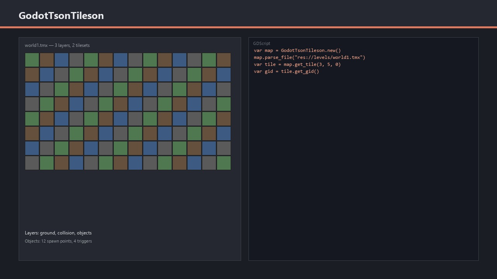
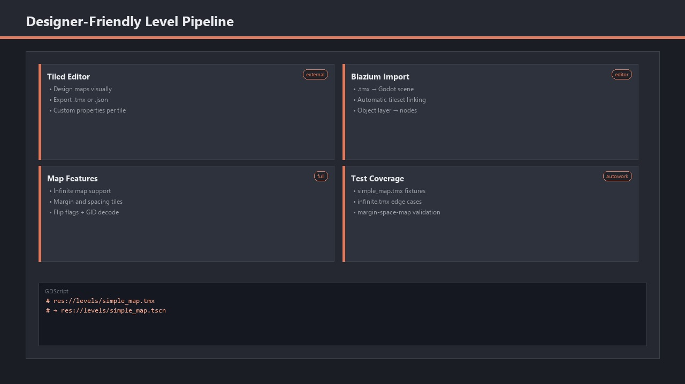

# Introducing the Tiled Importer Module

The **Tiled Importer** module lets Blazium projects load maps created in the
[Tiled map editor](https://www.mapeditor.org/) without manual conversion.
It parses `.tmx` and `.json` map files and exposes the data through `GodotTsonTileson` bindings
with typed accessors for tiles, layers, objects, and tilesets.

Designers keep working in Tiled. Developers import maps as scenes and wire up gameplay on top.
Tile flip flags, animated tiles, infinite maps, and custom properties are all handled in the import path.

## Key Features

- **TMX & JSON Parsing** — Load maps from file or string via `GodotTsonTileson.parse_file` and `parse_string`.
- **Tile Layers** — Access tile GIDs, flip flags, drawing rects, and per-tile properties.
- **Object Layers** — Read spawn points, collision shapes, and custom object metadata.
- **Tileset Support** — Tile images, animations, terrain definitions, and sub-rectangle offsets.
- **Editor Import** — Import `.tmx` files directly as scenes from the asset pipeline.
- **Edge Case Handling** — Infinite maps, margin/spacing tilesets, and compressed map data.

## Why Use the Tiled Importer in Your Blazium Projects?

Level design stays in a dedicated tool while runtime stays in the engine:

**For Games**
- **2D level pipelines** — Platformers, RPGs, and top-down games with designer-friendly map editing.
- **Rapid iteration** — Re-export from Tiled and re-import without rebuilding level geometry by hand.
- **Tile animations** — Use Tiled's animation frames directly through the tile accessor API.

**For Applications & Tools**
- Batch-import map libraries for procedural or data-driven world generation.
- Validate map parsing with the Autowork test suite covering simple, infinite, and margin maps.
- Prototype level editors that read and write Tiled-compatible data.

## Documentation & Next Steps

The module is available in the [latest nightly of Blazium](https://blazium.app/download) and
ships with comprehensive tests (see the dedicated
[tiled_importer_module_tests repository](https://github.com/blazium-games/tiled_importer_module_tests)
for validation examples).

---

**[Jump into our Discord](https://blazium.app/chat)** for real-time chats, dev support and feedback

Or follow us everywhere else:

- **[GitHub](https://github.com/blazium-games)**
- **[IndieDB](https://www.indiedb.com/engines/blazium-engine/articles)**
- **[X / Twitter](https://x.com/BlaziumGames)**
- **[YouTube](https://www.youtube.com/@blazium)**
- **[itch.io](https://blaziumengine.itch.io)**
