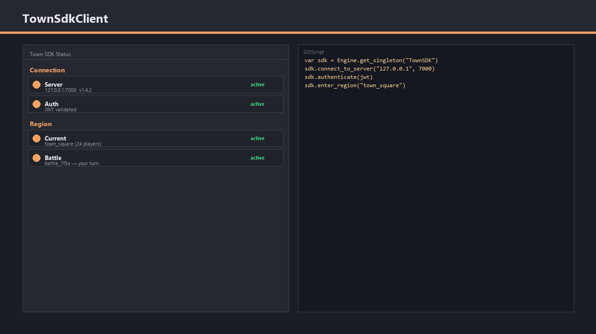
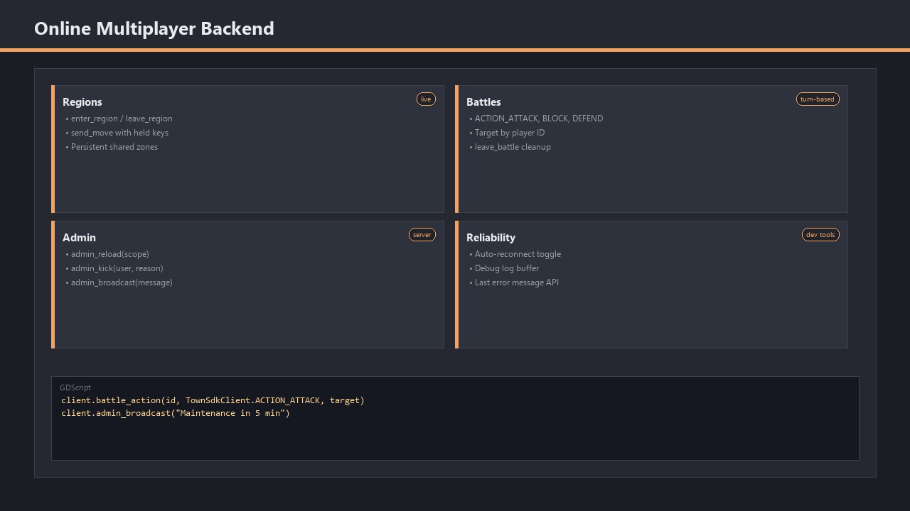

# Introducing the Town SDK Module

The **Town SDK** module gives Blazium projects a native client for Town online game servers.
It exposes `TownSdkClient` as an engine singleton (`TownSDK`) so you can connect, authenticate,
move through regions, and dispatch battle actions from GDScript or C#.

The client handles connection lifecycle, auto-reconnect, debug logging, and admin commands —
enough to build persistent online worlds without writing low-level socket code from scratch.

## Key Features

- **Server Connection** — `connect_to_server(address, port)` with disconnect, reconnect, and connection state queries.
- **JWT Authentication** — Authenticate players with tokens from your backend before entering gameplay regions.
- **Region & Movement** — Enter and leave regions, send movement updates with held-key state and delta timing.
- **Battle Actions** — Attack, block, and defend actions dispatched to active battles by ID.
- **Admin Commands** — Reload scopes, kick users, request stats, and broadcast messages to connected players.
- **Debug Logging** — Toggle debug output with configurable log buffer size for development builds.

## Why Add the Town SDK to Your Blazium Project?

If your game needs a hosted online backend, the module keeps the client side simple:

**For Games**
- **Persistent online regions** — Drop players into shared zones and sync movement server-side.
- **Turn-based combat** — Dispatch battle actions without hand-rolling protocol packets.
- **Live ops** — Use admin commands for reloads, kicks, and server-wide announcements during development.

**For Applications & Tools**
- Build Town-connected prototypes entirely inside Blazium.
- Run the full Autowork test suite against a live or local Town server.
- Inspect connection failures through the built-in debug log.

## Documentation & Next Steps

The module is available in the [latest nightly of Blazium](https://blazium.app/download) and
ships with comprehensive tests (see the dedicated
[town_sdk_module_tests repository](https://github.com/blazium-games/town_sdk_module_tests)
for validation examples).

---

**[Jump into our Discord](https://blazium.app/chat)** for real-time chats, dev support and feedback

Or follow us everywhere else:

- **[GitHub](https://github.com/blazium-games)**
- **[IndieDB](https://www.indiedb.com/engines/blazium-engine/articles)**
- **[X / Twitter](https://x.com/BlaziumGames)**
- **[YouTube](https://www.youtube.com/@blazium)**
- **[itch.io](https://blaziumengine.itch.io)**
