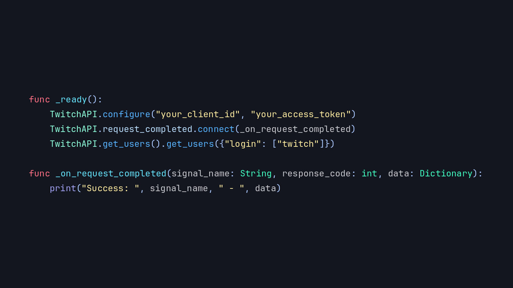
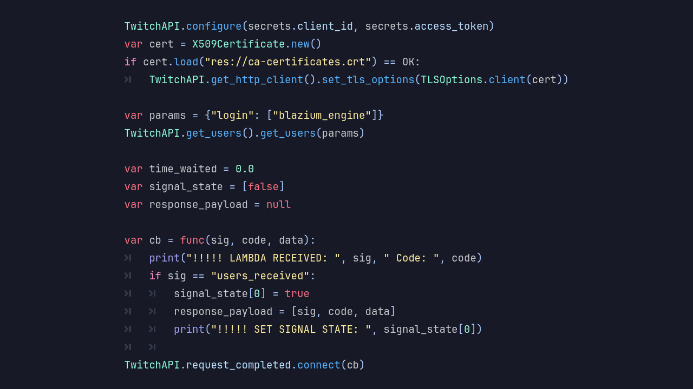

# Introducing the TwitchAPI Module

Blazium Game Engine continues to expand its live-streaming and audience-interaction toolkit with
the **TwitchAPI** module. This native C++ module provides direct access to
the Twitch Helix API (and related services) from your Blazium projects. No
external plugins, GDScript HTTP wrappers, or third-party SDKs required.

## Key Features

- **Native Helix API Access**: Perform authenticated requests to Twitch's modern API endpoints with minimal overhead.
- **Built-in HTTP Client**: The `TwitchHttpClient` handles connections, headers, OAuth tokens, and
responses using Blazium's networking stack.
- **Deep Engine Integration**: Expose Twitch data directly to GDScript/C# logic, UI elements, signals, and game systems.
- **Authentication Support**: OAuth flow handling for client-side or server-side use cases.
- **Editor-Friendly**: Works in the Blazium editor and exported projects
(including headless mode for bots or backend tools).
- **Lightweight & Performant**: C++ implementation keeps responses fast when polling or reacting to live stream events.

## Why Add TwitchAPI to Your Project?

Twitch integration opens up options for game developers targeting live audiences:

- **Live Stream Overlays & Dashboards**: Display real-time viewer count, follower alerts,
subscriber goals, or channel information directly in-game.
- **Twitch-Enhanced Gameplay**: Fetch stream status to enable special modes when live,
reward loyal viewers, or synchronize in-game events with chat activity.
- **Chat & Community Tools**: Build custom chat visualizations, moderation helpers, or poll systems.
- **Analytics & Data-Driven Features**: Pull game-specific analytics, clip data, or user
profiles to create personalized experiences.
- **Bots & Automated Systems**: Run headless Blazium instances as Twitch bots or notification services.
- **Viewer Engagement**: Create games where the stream itself influences progression, rewards, or
narrative.

Whether you're building a Twitch-centric title or just want optional live features,
the TwitchAPI module removes the friction of API integration.

## Documentation & Next Steps

The module is already available in the [latest release of Blazium](https://blazium.app/download) and
includes a dedicated test project (see
[twitchapi_module_tests](https://github.com/blazium-games/twitchapi_module_tests)
for examples).

For full technical details head over to the official **Blazium Documentation** at [docs.blazium.app](https://docs.blazium.app).

Bring your games closer to the Twitch community with native API access, whether for
overlays, interactivity, or full audience-driven features.

---

**[Jump into our Discord](https://blazium.app/chat)** for real-time chats, dev support and feedback

Or follow us everywhere else:

- **[IndieDB](https://www.indiedb.com/engines/blazium-engine/articles)**
- **[X / Twitter](https://x.com/BlaziumGames)**
- **[YouTube](https://www.youtube.com/@blazium)**
- **[itch.io](https://blaziumengine.itch.io)**
- **[Patreon](https://www.patreon.com/cw/Blazium)**
