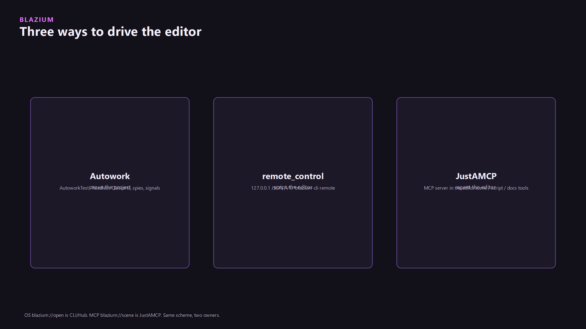

Tag a resource once. Search it later from the dock or from an agent. The modules were added so the tag dictionary stays in the project as JSON, the dock can edit it, and JustAMCP can search it without a sidecar database that drifts from the files. Blazium Games used them in-house to validate tagging and agent search. Two editor-only modules: `assettags` and `semanticsearch`. `semanticsearch` does not build unless `assettags` does. Neither module is in an export template. `config.py` limits both to editor builds. HTTP embedding work is deferred so editor startup stays responsive.

## Status

Both modules are on `blazium-dev` and both build only for the editor. A shipped game does not load them. `EditorExportAssetTags` can bake tag data into the export. That bake is a file the export plugin writes. It is not the editor module running in the player.

Search backends that exist today are `lexical` (default), `embedding`, and `hybrid`. Embedding providers are `hash_vector` (default), `ngram`, and `http`. HTTP uses `blazium/semanticsearch/embedding_http_url` and falls back to `hash_vector` when the request fails. Changing `backend` or `embedding_provider` needs an editor restart. There is no separate hosted embedding service in the Blazium repos. If you set `http`, you bring the URL.

## Use it

1. Project Settings, tab **Asset Tags**. Add a name. The placeholder in the editor is `Environment.Nature.Tree`. Comment, rename, and remove are on that tab. **Cleanup Unused** drops dictionary names nothing references.
2. FileSystem dock, select the file, context menu **Edit Asset Tags...**. Apply writes the assignment. Multi-select applies only the tags you add or remove, to every selected file. The dialog lists tags shared by all of them.
3. Commit `res://.blazium/asset_tags/tags.json` and `asset_index.json` if the tags belong to the project. They are not an editor cache.
4. For an agent, enable JustAMCP and call the tools below. Search goes through `blazium_semantic_search`, not `resources/read`. The server tells the caller to switch.

## Where the data lives

The dictionary and the path index are files in the project:

- `res://.blazium/asset_tags/tags.json`
- `res://.blazium/asset_tags/asset_index.json`

`AssetTagManager` is the dictionary (add, rename, comment, batch, save). `AssetTagRegistry` is the path-to-tags index (`add_tags_to_asset`, `find_assets_by_tag`, `search_assets`). `AssetTagCoordinator` wraps a change so the filesystem dock can undo it. They are created in the editor init callback, not as `Engine` singletons you grab from gameplay code. `AssetTagRuntime` is the class registered at scene init. Its job in this module is the export bake (`bake_tags_for_export`, `read_tags_for_export_bake`). `EditorExportAssetTags` is the export plugin that runs that bake. A shipped game does not load the module.

Project Settings:

| Key | Default |
|---|---|
| `blazium/assettags/strict_paths` | `false` |
| `blazium/assettags/strict_tags` | `false` |
| `blazium/assettags/taggable_extensions` | a comma-separated list (`png`, `gd`, `tscn`, `glb`, and the rest) |

`strict_paths` rejects a tag on a path that is not on disk. `strict_tags` rejects a name that is not in the dictionary. The tag dictionary UI is the Project Settings "Asset Tags" tab. The filesystem dock context menu (`AssetTagsContextMenuPlugin`) is how you attach a tag to the file you are looking at.

## Search

`SemanticAssetIndex` is the index JustAMCP calls. Default backend is `lexical` (`blazium/semanticsearch/backend`). `embedding` and `hybrid` are the other two. Embedding providers are `hash_vector` (default), `ngram`, and `http`. An HTTP provider uses `blazium/semanticsearch/embedding_http_url` and falls back to `hash_vector` when the request fails. Changing `backend` or `embedding_provider` needs an editor restart.

Other keys: `scan_filesystem` (default `false`), `embedding_http_timeout_ms` (30000), `async_job_ttl_ms` (1800000), `max_concurrent_async_jobs` (8).

`search`, `search_with_filters`, `find_similar`, and `find_similar_with_filters` are the synchronous calls. `SemanticAsyncSearchWorker` is `enqueue_search` / `poll_search` / `cancel_search`.

## Agents

JustAMCP exposes the modules so your AI agents can organize and search without a custom plugin. Tool names from the engine guides:

- `blazium_tags_list`
- `blazium_tags_set_on_asset`
- `blazium_tags_find_assets`
- `blazium_tags_search_assets`
- `semantic_search` and `blazium_semantic_search`
- `semantic_search_enqueue`, `semantic_search_poll`, `semantic_search_cancel`

Resource `blazium://tags/dictionary` is the dictionary. Prompt `blazium_asset_tagging_workflow` is the step list the agent is given. Search queries go through the tool, not through `resources/read`. The server will tell the caller to use `blazium_semantic_search` instead.

JustAMCP is the editor MCP server on port 6506. The dictionary stays in the project as JSON so a sidecar database cannot drift from the files. The commit that added the modules also deferred HTTP embedding so editor startup stays responsive.

## Limits

Editor only. No CLI flag. Tags on a file the export plugin did not bake are not in the running game. HTTP embeddings are not refreshed on the same frame as the first filesystem scan. A bad embedding dimension comes back empty and the fallback provider is used.

`strict_paths` rejects a tag on a path that is not on disk. `strict_tags` rejects a name that is not in the dictionary. Both default to false, so a typo is stored until you turn them on.

The files live in the project so a rename outside a sidecar database cannot leave the index behind. Engine docs: [docs.blazium.app](https://docs.blazium.app).

---

**[Jump into our Discord](https://blazium.app/chat)** for real-time chats, dev support and feedback

Or follow us everywhere else:

- **[GitHub](https://github.com/blazium-games)**
- **[IndieDB](https://www.indiedb.com/engines/blazium-engine)**
- **[X / Twitter](https://x.com/BlaziumGames)**
- **[YouTube](https://www.youtube.com/@blazium)**
- **[itch.io](https://blaziumengine.itch.io)**
