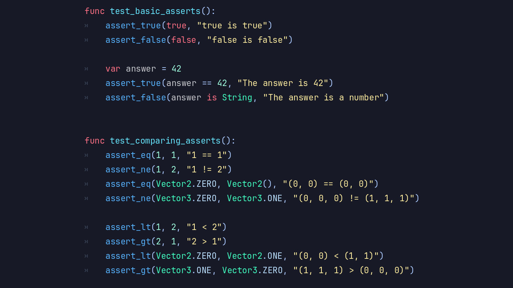

# Introducing Autowork

**Autowork** is a built-in testing framework for game and application development.
Inspired by [GUT](https://github.com/bitwes/Gut) and implemented natively in the engine, Autowork delivers
fast, reliable testing without external dependencies or GDScript-only runners.

Tests are written in GDScript (or C#) by extending the `AutoworkTest` class.
The framework discovers test scripts following your configuration, runs them, and provides logging
for assertions, mocking, signal tracking, parameterization, and engine simulation.

## Key Features

- **Rich Assertion Library**: Over 30 built-in assertions including `assert_eq`, `assert_between`, and
many more for values, properties, and edge cases.
- **Signal Testing**: `watch_signals(node)` and then `assert_signal_emitted` to verify that
your nodes and systems fire signals correctly.
- **Mocking & Spying**: Create test doubles with `stub(object, "method").to_return(value)`, spy on
calls with `spy(object)`, and verify behavior using `assert_called`.
- **Parameterized Tests**: Run the same test logic against multiple data sets using `use_parameters([...])`.
- **Engine Simulation**: Support for `await`, input simulation, frame/time manipulation, and realistic
testing of time-dependent or physics-based logic.
- **Orphan Node Detection**: Automatically detects and reports leaked nodes that weren't properly freed during tests.
- **Configurable Test Discovery**: Controlled via `.autoworkconfig.json` (scan directories,
file prefixes/suffixes, include subdirs, hide orphans, etc.).
- **Headless CI-Friendly Execution**: Run tests from the command line in headless mode and get a
clean exit code based on failures.

## Why Use Autowork in Your Blazium Projects?

Autowork makes it practical to maintain high code quality in game development:

- **Unit & Integration Testing**: Test individual classes, nodes, systems, and full scenes with full access to the engine.
- **Regression Prevention**: Catch breaking changes early in UI logic, gameplay systems, networking, or procedural generation.
- **Behavior-Driven Development**: Combine assertions and signal watching to clearly express what should happen in your game.
- **Mocking Complex Dependencies**: Stub out external services, input, or heavy computations to keep tests fast and isolated.
- **Performance & Reliability**: Native implementation keeps test suites snappy even as your project grows to hundreds of tests.

It works well for solo developers, indie teams, and larger studios who want automated testing
without leaving the Blazium ecosystem.

## Documentation & Next Steps

The module is already available in the [latest nightly of Blazium](https://blazium.app/download) and
includes a dedicated test project (see
[autowork_module_tests](https://github.com/blazium-games/autowork_module_tests)
for examples).

Autowork brings engine-native testing to Blazium so you can ship stable, well-tested games and tools.

---

**[Jump into our Discord](https://blazium.app/chat)** for real-time chats, dev support and feedback!

Or follow us everywhere else:

- **[IndieDB](https://www.indiedb.com/engines/blazium-engine/articles)**
- **[X / Twitter](https://x.com/BlaziumGames)**
- **[YouTube](https://www.youtube.com/@blazium)**
- **[itch.io](https://blaziumengine.itch.io)**
