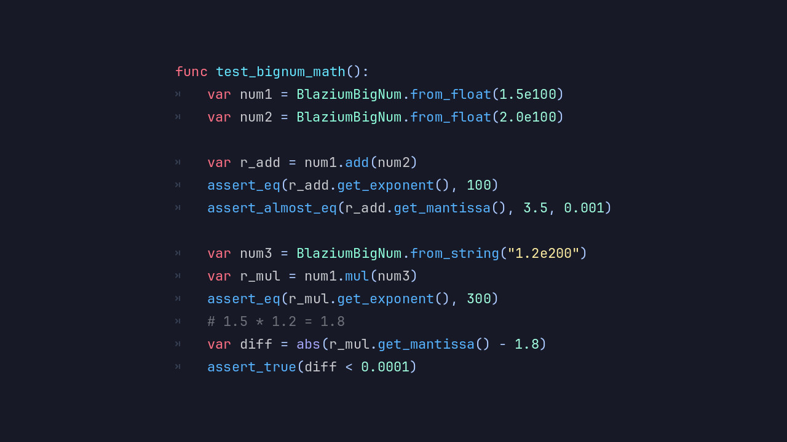
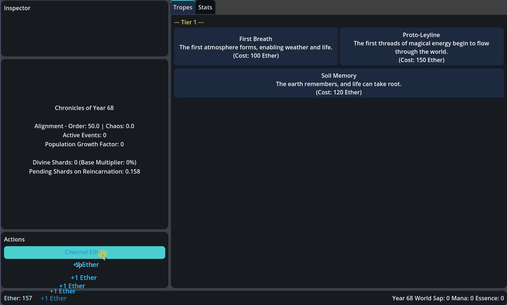

# BigNum++ Integration

**BlaziumBigNum** is a new class added to the Blazium Game Engine, powered by [BigNum++](https://github.com/AmmoniumX/BigNumPlusPlus).
It handles extremely large numbers with precision and performance up to **1e(2^64)**.
Built for incremental, idle, and simulation-heavy games, BlaziumBigNum removes the traditional limits of
standard numeric types so you can scale systems without hitting integer overflow.

## Key Features

- **Arbitrary Precision Arithmetic**: Work with numbers far beyond 64-bit limits without overflow or
precision loss, enabling truly massive values.
- **Optimized for Incremental Systems**: Built for frequent updates, exponential growth, and
high-performance calculations typical in idle and clicker games.
- **Scientific Notation Support**: Efficiently represents and formats extremely large values
for UI display and debugging.
- **Deterministic Calculations**: Consistent results across frames, saves, and platforms, which matters
for simulation and progression systems.
- **Serialization-Friendly**: Save and load large values without losing precision or introducing rounding errors.

## Why Use BlaziumBigNum in Your Blazium Projects?

BlaziumBigNum opens up design options for systems that rely on large-scale progression:

- **Idle & Clicker Games**: Handle currencies that grow into the billions, trillions, and beyond without breaking your logic.
- **Advanced Economy Systems**: Build complex simulations with scaling resources, inflation models, and long-term progression.
- **Procedural Scaling**: Dynamically adjust difficulty, rewards, and stats using exponential formulas without worrying about limits.
- **Clean Game Logic**: Avoid hacks like logarithmic storage or capped values. Write systems the way they're meant to scale.
- **Future-Proof Design**: Ensure your game can grow in scope without requiring a rewrite of core numeric systems.

Whether you're building a minimalist idle game or a deep simulation, BlaziumBigNum provides the mathematical foundation to support it.

## Documentation & Next Steps

BlaziumBigNum is available as part of the ClickerTools module in the Blazium repository.

BlaziumBigNum is already available in the [latest nightly of Blazium](https://blazium.app/download) and includes
a dedicated test project (see [clickertools_module_test](https://github.com/blazium-games/clickertools_module_tests)
for examples).

It integrates directly into your project and includes practical usage patterns for large-number handling in real gameplay systems.

BlaziumBigNum brings scalable, high-precision math to Blazium for systems that need to grow as big as your game design calls for.

---

**[Jump into our Discord](https://blazium.app/chat)** for real-time chats, dev support and feedback!

Or follow us everywhere else:

- **[IndieDB](https://www.indiedb.com/engines/blazium-engine/articles)**
- **[X / Twitter](https://x.com/BlaziumGames)**
- **[YouTube](https://www.youtube.com/@blazium)**
- **[itch.io](https://blaziumengine.itch.io)**
