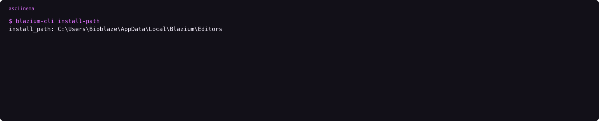
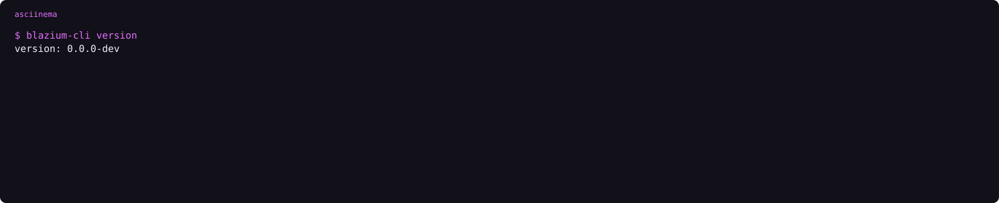
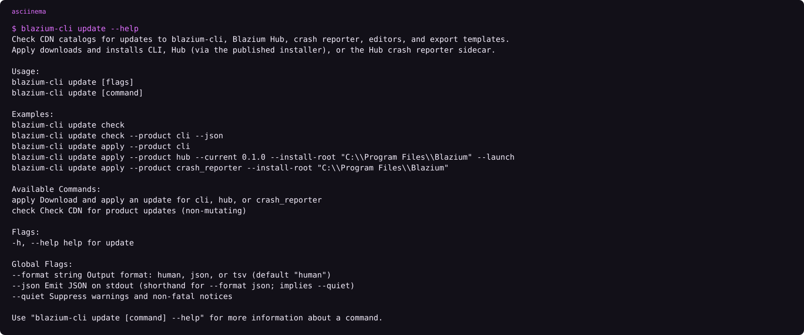
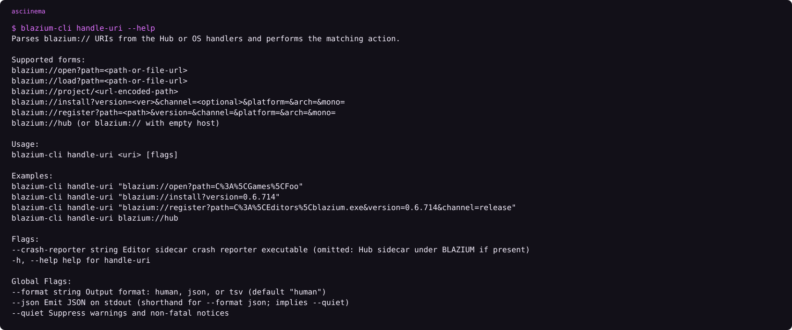

`blazium-cli` is the binary Hub shells, CI calls, and Windows/Linux register for `blazium://`. Hub is the desktop window on top of this binary. Downloads are on [blazium.app/dev-tools](https://blazium.app/dev-tools). The pair exists so a window and a script share one install path: Hub lists projects, and this binary writes the registry and fetches editors. It installs editors, keeps the project registry, fetches export templates, updates itself, talks to a running editor, and can deploy a finished build to Steam or itch.io. Blazium Games store uploads are a different tool (`chauffeur`), not this binary. Store docs are [docs.blazium.games](https://docs.blazium.games). Engine docs are [docs.blazium.app](https://docs.blazium.app). The CLI repo is [blazium-cli](https://github.com/blazium-games/blazium-cli). Hub's repo is [blazium-hub](https://github.com/blazium-games/blazium-hub).

## Status

The CLI repo is [blazium-cli](https://github.com/blazium-games/blazium-cli). Published binaries are Linux and Windows, x86_64 and x86_32. A CLI you compile on macOS can still install a macOS editor. CI does not publish a macOS CLI binary. npm packages match that set: `@blazium-engine/cli-linux-x64`, `cli-linux-ia32`, `cli-win32-x64`, `cli-win32-ia32`.

There is no official Flatpak. [blazium#428](https://github.com/blazium-games/blazium/issues/428) asks for one. It is an open request, not a download on [blazium.app](https://blazium.app).

`go build` without CI stamps prints `0.0.0-dev` until `data/cliBuild.txt` exists. Go 1.25 or later.

## Get it

Installing Hub is the path that also installs the CLI. The other paths are for machines that should not run Hub.

1. **Hub bundle.** Inno (Windows) and the `.deb` (Linux) put `blazium-cli` next to Hub and on `PATH`.
2. **npm.** `npm install -g @blazium-engine/cli` or `npx @blazium-engine/cli`. The optional packages are `@blazium-engine/cli-linux-x64`, `cli-linux-ia32`, `cli-win32-x64`, and `cli-win32-ia32`. If that package is present, nothing is downloaded from the CDN.
3. **GitHub Releases.** `blazium-cli-windows-x86_64.exe`, `blazium-cli-windows-x86_32.exe`, `blazium-cli-linux-x86_64`, `blazium-cli-linux-x86_32`. Published binaries are Linux and Windows. A CLI you build yourself on macOS can still install a macOS editor.
4. **CDN manifest.** `https://cdn.blazium.app/cli/cli.json`. Files live at `https://cdn.blazium.app/cli/{os}/{arch}/{version}/blazium-cli[.exe]`.

Local `go build` prints `0.0.0-dev` until CI stamps `data/cliBuild.txt`. Go 1.25 or later. `go test ./...` then `go build -o blazium-cli .`


<!-- ASCIINEMA: assets/cli-help.cast | blazium-cli --help -->

```text
asciinema play assets/cli-help.cast
```

## Install an editor

```text
blazium-cli install 0.6.725
blazium-cli install nightly --templates
blazium-cli install 0.6.751 --channel nightly
blazium-cli uninstall 0.6.725
```

Current `EditorInstallDir` puts editors in `{install-path}/{channel}/{version}`. Channels are `release`, `prerelease`, and `nightly`. An empty channel is treated as `release`. `--templates` also pulls the `.tpz` bundle for that version from `cdn.blazium.app`. Templates follow Blazium `0.6.x`, not a Godot `4.3.2.stable` folder.

The `editors` cast below is from an older CLI: that machine stored `0.6.725` directly under `Editors\`, with `channel:release` only as a field. New installs follow the channel directory.


<!-- ASCIINEMA: assets/cli-install-path.cast | blazium-cli install-path -->

`blazium-cli install-path` prints the root. `blazium-cli install-path D:\Blazium\Editors` changes it. `--move` relocates editors that are already on disk.

## List and default

```text
blazium-cli editors
blazium-cli editors default
blazium-cli editors default --channel release --version latest
blazium-cli editors default 0.6.725
blazium-cli editors add C:\path\to\blazium.exe --version 0.6.725
blazium-cli install-path
```

Unset policy is **latest release** among installed editors. `default_editor_channel` is `release`, `prerelease`, or `nightly`. `default_editor_version` is `latest` or a concrete version. A hard pin (`editors default 0.6.725`) wins when that build is installed.


<!-- ASCIINEMA: assets/cli-editors.cast | blazium-cli editors -->


<!-- ASCIINEMA: assets/cli-version.cast | blazium-cli version -->

## Projects

```text
blazium-cli projects
blazium-cli projects add ./MyProject
blazium-cli projects remove MyProject
blazium-cli open ./MyProject
blazium-cli load ./MyProject
blazium-cli run ./MyProject
blazium-cli project-manager
```

`open` and `load` start the editor with `--editor --path`. They do not run the game. `load` also prints a project profile: JustAMCP, remote_control, editor_version, features.

Both attach remote control by default (`remote.enable_on_open`, default true). After `/v1/health` responds, the CLI assigns a 6-character instance id with `POST /v1/instance`.

`run` (alias `play`) starts the game with `--path` and without `--editor`. If `application/run/main_scene` is empty, the CLI returns a JSON error and does not start the binary. Remote control stays off for `run`.

`project-manager` starts the default editor with `--project-manager` and no project path.

Registry file: `%APPDATA%\blazium\hub.json` (Windows) or `~/.config/blazium/hub.json`.

## Templates

```text
blazium-cli install 0.6.725 --templates
blazium-cli templates list
blazium-cli templates download 0.6.725 --tpz
```

Templates are versioned as Blazium `0.6.x`, not Godot `4.3.2`. Individual file helpers resolve metadata in this order: `https://cdn.blazium.app/{channel}/{version}/template_files.json`, then `templates.json`, then `details.json`, then `GET /api/v1/templates/{deploy_type}/{version}` on `https://blazium.app`. Override that API base with `BLAZIUM_CEREBRO_URL`. Hub does not call it. On Windows the template root is `%LOCALAPPDATA%\Blazium\export_templates`. On Unix it is `~/.local/share/blazium/export_templates`.


<!-- ASCIINEMA: assets/cli-templates-help.cast | blazium-cli templates --help -->

## Upgrade

```text
blazium-cli upgrade --dry-run
blazium-cli upgrade
blazium-cli update check
blazium-cli update apply --product cli
blazium-cli update apply --product hub --install-root "C:\Program Files\Blazium"
blazium-cli update apply --product launcher --install-root "C:\Program Files\Blazium\Games"
```

`update apply` knows `cli`, `hub`, `crash_reporter`, and `launcher`. `--product launcher` installs BlaziumLauncher and, on Windows, starts setup with `/NOCLI` so an existing `blazium://` handler is left alone. Under Program Files, apply may raise a UAC prompt.


<!-- ASCIINEMA: assets/cli-update-help.cast | blazium-cli update --help -->

## Remote

The editor module listens on `127.0.0.1:6508` by default. Routes include `GET /v1/health`, `GET /v1/status`, `POST /v1/exec`, and `POST /v1/eval`. Eval stays off until `blazium/remote_control/allow_eval` is true. JustAMCP, the editor MCP server, is port 6506. A game export port of `0` means 6507. Do not point this CLI at 6507.

| Command | Job |
|---|---|
| `remote status` | Health, instance id, project |
| `remote ping` / `remote exec` | Built-in commands |
| `remote eval` / `eval-gdscript` / `eval-lua` | Expressions (`allow_eval` must be on) |
| `remote logs` / `errors` | Engine log |
| `remote autowork run --wait` | Run Autowork |
| `remote snapshot editor` | PNG of the editor |
| `remote doctor` | Config check |


<!-- ASCIINEMA: assets/cli-remote-help.cast | blazium-cli remote --help -->

One live instance is used automatically. Two or more: the newest is the default, and the CLI prints a warning unless you pass `--quiet`. Select with `--instance <id>` or `--project <path>`.

Env overrides: `BLAZIUM_REMOTE_HOST`, `BLAZIUM_REMOTE_PORT`, `BLAZIUM_REMOTE_TOKEN`. CLI prefs live in `%APPDATA%\blazium\cli.json` or `~/.config/blazium/cli.json`.

Turn remote off for later opens with `blazium-cli remote config set enable-on-open false`.

## URI handler

OS installers point `blazium://` at this binary (`handle-uri`).

| URI | Action |
|---|---|
| `blazium://hub` | Focus Hub on port 39218 |
| `blazium://open?path=` | Open project |
| `blazium://load?path=` | Open project and print the profile |
| `blazium://install?version=` | Install editor |
| `blazium://register?path=` | Register a local binary |
| `blazium://game/<uuid>` | Forward to the Games launcher (port 39220) |


<!-- ASCIINEMA: assets/cli-handle-uri-help.cast | blazium-cli handle-uri --help -->

`blazium-cli hub-remote ensure` writes `hub_remote.json` if neither the user file nor the machine file is valid. It does not rotate a valid token. Do not hand-edit that file.

## Deploy

Steam and itch.io deploys live in this CLI. Optional `blazium-deploy.yml` next to the game. Secrets come from flags, then the YAML, then `BLAZIUM_*` env.

```text
blazium-cli deploy tools status
blazium-cli deploy steam upload --dry-run
blazium-cli deploy itch push ./build --target user/game:windows
```

Steam Guard setup is interactive. Do not run `deploy steam guard setup` on a CI runner. itch.io push uses butler as a Go module. It does not download broth.

## Limits

`open` and `load` start the editor. They do not run the game. `run` (alias `play`) starts the game and errors if `application/run/main_scene` is empty. Remote control stays off for `run`. `open` and `load` turn it on unless `remote.enable_on_open` is false.

Current installs use `{install-path}/{channel}/{version}`. The `editors` cast above is an older CLI that stored the version directly under `Editors\` with the channel only as a field. Do not copy that path into a script that talks to a current binary.

Two remote editors: the newest is the default, and the CLI warns unless `--quiet`. Pass `--instance` or `--project`.

`deploy steam guard setup` is interactive. Do not run it on a CI runner. itch.io push uses butler as a Go module and does not download broth. `blazium-toolchain steam setup` only pin-fetches steamcmd. It is not this deploy command.

`blazium-cli hub-remote ensure` writes `hub_remote.json` when neither the user file nor the machine file is valid. It does not rotate a valid token.

## CI

CI starts with [setup-blazium-cli](https://github.com/blazium-games/setup-blazium-cli) at `v0.2.1`, then this binary. The other actions are [setup-blazium-engine](https://github.com/blazium-games/setup-blazium-engine) at `v0.3.0`, [export-blazium-game](https://github.com/blazium-games/export-blazium-game) at `v0.3.2`, and [deploy-blazium-game](https://github.com/blazium-games/deploy-blazium-game) at `v0.0.2`. `version: latest` on setup-engine tracks the nightly channel. Downloads: [Hub and CLI](https://blazium.app/dev-tools).


---

**[Jump into our Discord](https://blazium.app/chat)** for real-time chats, dev support and feedback

Or follow us everywhere else:

- **[GitHub](https://github.com/blazium-games)**
- **[IndieDB](https://www.indiedb.com/engines/blazium-engine)**
- **[X / Twitter](https://x.com/BlaziumGames)**
- **[YouTube](https://www.youtube.com/@blazium)**
- **[itch.io](https://blaziumengine.itch.io)**
