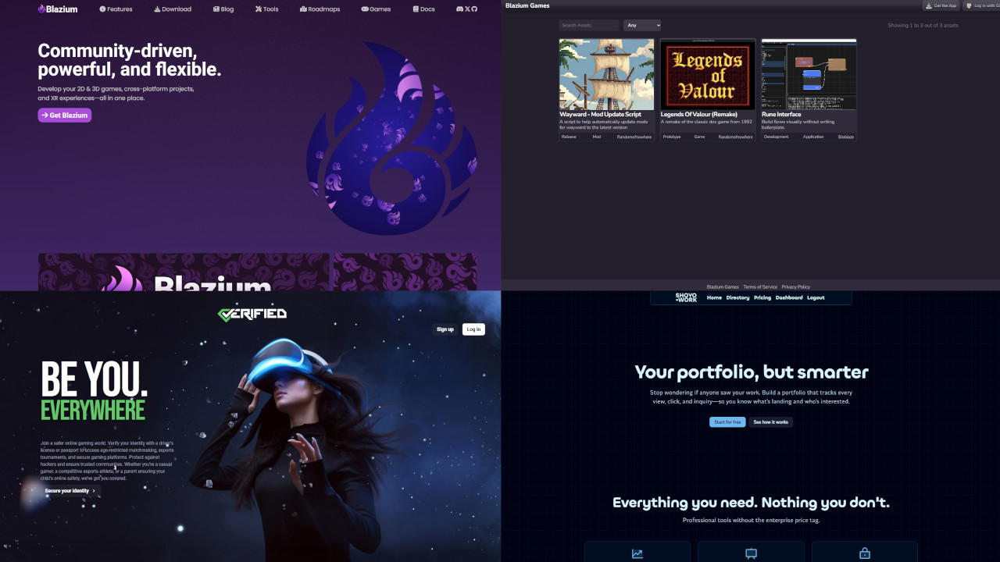
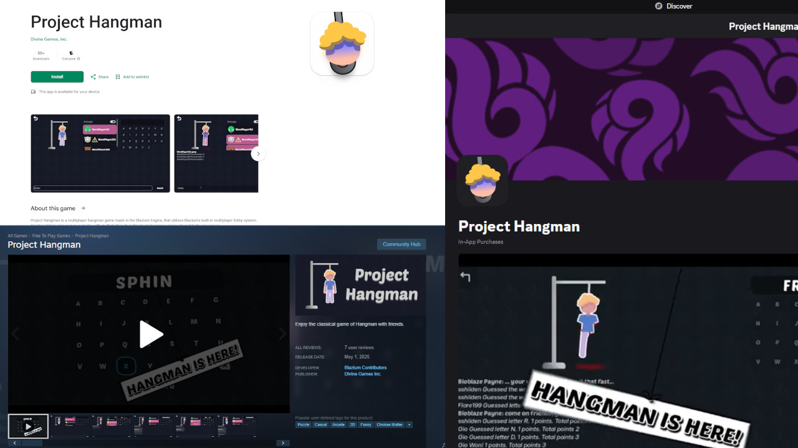
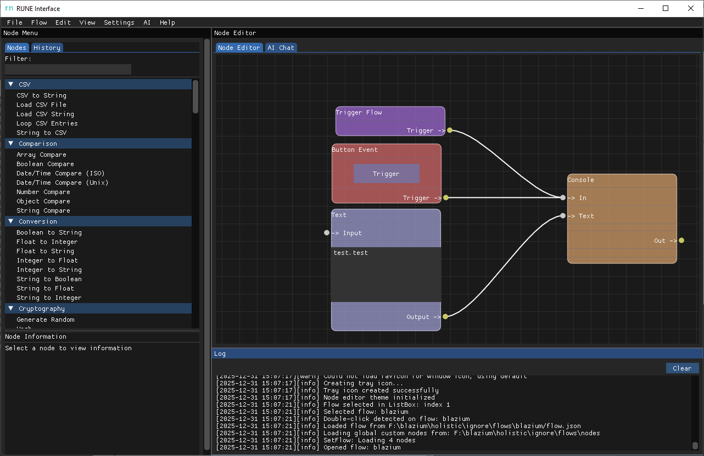

Hello!

It is I ~ **Bioblaze Payne**, the infamous one ~ here with our
**New Year Community Update** for the Blazium Game Engine.

2025 was a year of building, breaking, patching, learning, and pushing forward.
We shipped bug fixes, expanded features, designed systems we once thought were
“later problems,” and kept the momentum alive even when life got heavy. We also
watched amazing people join, and we watched some people leave. We lost friends.
We lost family. 2025 was exhausting.

But **2026**?
That’s going to be our year.

## What We Built in 2025

When we say we’ve been moving, we mean it. In 2025 we built and shipped:

- **Custom Lobby System (Golang)**
- **Golang Lobby System with Anko**
- **Golang Lobby System with Luau**
- **Custom Lobby System w/ Lua Scripting (C++)**
- **Verify.Community** (identity platform)
- **Shoyo.work** (portfolio showcase for developers++)
- **WeRemember.Today** (social media recorder for keeping post records)
- **Pre-Alpha Blazium Games** (game hosting platform)
- **MasterServer Service (Golang)** (tracks dedicated game servers)
- **Login Service (Golang)** (login via social media providers)
- **Open-source full engine deployment framework** for Godot/Blazium CI/CD
- **Blazium CLI**
- **Dozen+ GitHub Actions** for continuous deployment
- **Our first game**: *Project Hangman*
- **500+ updates** to Blazium’s fork of the Godot Engine
- **Custom export methods** for Discord, YouTube, and more for the Godot Engine
- **10+ custom modules** for Blazium’s Godot Engine
- **Our first application**: *Rune Interface*
- And the biggest win of all: **our awesome community**

## What We Learned in 2025

2025 didn’t just produce projects ~ it produced hard-earned knowledge:

- How to launch a game across multiple digital storefronts:
[Github.com](https://github.com/blazium-engine/blazium-game-checklist)
- How to survive the **Apple Store** experience
- How to have patience with people (the real endgame boss)
- How to work together as a team and build something bigger than any one person

## What We Achieved in 2025

We’re grateful ~ truly ~ for the support that helped keep things moving:

- Sponsorship from **DigitalOcean**
- Sponsorship from **Docker**
- **GitHub Developer Access** for the Blazium organization
- Sponsorship from **Google**
- Sponsorship from **POGR**
- And yes… we **survived 2025** ❤️

## The Plan for 2026

We’ve got a lot planned, and we’re ready to execute.

**In 2026, we’re aiming to launch 3 games** ~ roughly one every four months (give or
take). Alongside that, we’re planning to ship and expand:

- Our **VoIP service**
- Our **networking servers**
- Our **game servers**
- Our **lobby service**
- Continued expansion of **Blazium Games** ~ including plans to accept payments,
giving developers another way to sell games without being at the mercy of “XXXXX
Company” deciding a project should disappear.

There’s more. A lot more.
But we’ll save some of it for later updates. 😉
Check Out What We’re Building

If you want to see what we’re launching and working on, here are a few places to start:

- [Blazium.games](https://blazium.games)
- [Rune.shoyo.work](https://rune.shoyo.work)
- [Blazium-games.github.io/rune_docs](https://blazium-games.github.io/rune_docs)
- [Shoyo.work](https://shoyo.work)
- [Bioblaze.blazium.games/rune-interface](https://bioblaze.blazium.games/rune-inteface)

## We’re Opening Team Slots for 2026

To make 2026 sustainable ~ and to keep output flowing consistently ~
we’re opening up team slots in several areas:

- **Community Rep**: Outreach + helping manage community activity
- **Social Media Specialist**: Posts, influencer outreach, partnerships, event coordination
- **C++ Engineers**: We need a few good peeps who love C++
- **Vibe Coders**: Help support the “vibe coder” community with game-dev aligned contributions
- **Golang Engineers (Backend Services)**: Contribute to our backend services ecosystem

And honestly ~ **there are more roles than this**. If you think you can contribute
and don’t see your specialty listed, reach out anyway. We’d love to chat. ❤️

## Final Words

So much we want to do. So little time.

But this year?
**This year is the Year of Blazium.**

Thank you for being part of this journey up until now ~
and let’s be prepared for the future.

**Conquer 2026!!!!!**