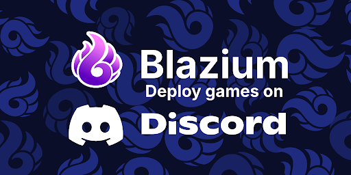
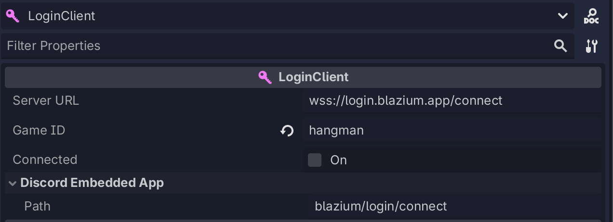
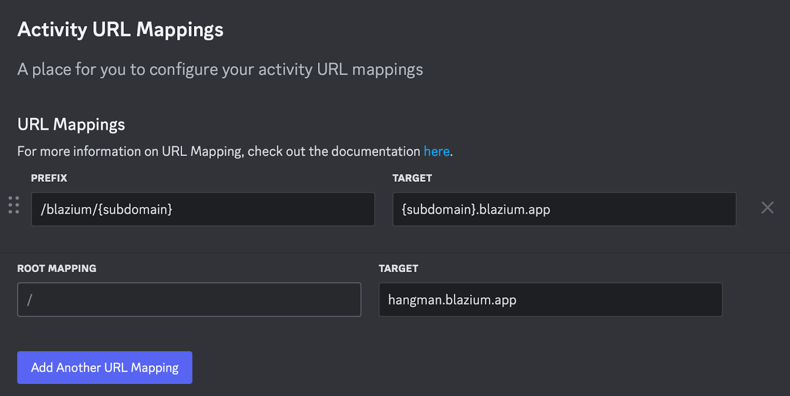

While developing our upcoming Hangman game, we recognized an ideal opportunity
to launch it on Discord as an Embedded App, allowing it to be played seamlessly
within voice chat. With the recent release of the Discord Embedded App
JavaScript SDK, we noticed initial attempts to integrate it into the Engine.
However, our goal was to take this further by ensuring it runs natively by
default, without requiring any additional installation.

## Features

The features we aimed to deliver included:

- Enabling exports to function on Discord
- Ensuring our services work seamlessly with Discord exports
- Making the experience effortless for the user

To achieve this, we first developed the `DiscordEmbeddedApp` node. This node
communicates with the JavaScript window, verifies whether it is running on a
Discord website, and only then activates. It is fully compatible with the
Discord Embedded App JavaScript SDK.


From this point, our goal was to integrate the system into our existing
services. One of the main challenges was that Discord only accepts connections
through domains such as `<discord_id>.discordsays.com`. To address this, we
implemented logic so that when deploying to Discord, our services (Lobby
Service, Login Service, etc.) automatically detect the environment and replace
the default URL with the Discord-generated one. Additionally, we provide an
optional override that allows you to specify a custom path through the Discord
Admin Console.



## Discord Admin Configuration

On the Discord side, the only required configuration is to:

- Create an application
- Set up URL mappings



For Blazium services, it is sufficient to map the subdomain—everything else is handled automatically. For the game itself, we use a custom Docker setup that rewrites the `.proxy` paths. The implementation is available on GitHub.

## Outcome

And that’s it. With this approach, we can create a game, deploy it to Discord, and take full advantage of everything offered in its SDK, such as user authentication.


This part was implemented with:

```gdscript
@export var discord: DiscordEmbeddedApp

func _ready():
    if discord.is_discord_environment():
        await discord.is_ready().finished
        var result = await discord.authorize("code", "", "none", ["identify"]).finished
        print(result.data.has("code"))
```

From here, we send this code to the **Blazium Login Service**, which is already
linked to our **Lobby Service**. This ensures the backend service recognizes and
processes user authentication.

The best part? There are no limitations with this approach—it works just like
any other Discord Embedded App, but you can write it in **Blazium** and deploy it
across **desktop**, **mobile**, **console**, and **Discord**.

## Where to Go From Here

- Visit the [Download Page](https://blazium.app/download) to access the latest version.
- Explore our [Roadmaps](https://blazium.app/roadmaps) to
learn about the project's direction and future updates.
- Learn about the [Tool and services](https://blazium.app/dev-tools) we have made for the community.
- Join the [Discord Server](https://blazium.app/chat) to discuss issues,
share your work and collaborate with others.
- Check our [Youtube Channel](https://www.youtube.com/@Blazium) for tutorials
