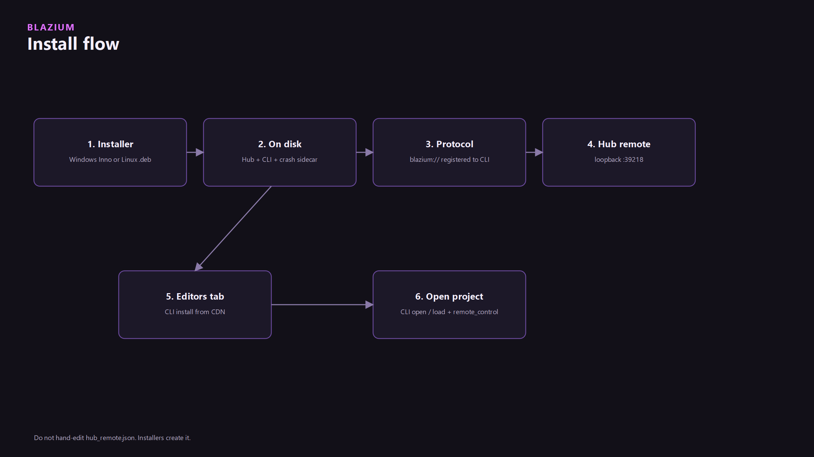

Blazium Hub is a shell for [blazium-cli](../blazium-cli/blazium-cli.md). The installer puts Hub on disk and, with it, the CLI and the crash sidecar. Hub does not download editors itself. Install, uninstall, open, and project registration all go through the CLI. Why the pair exists, including the store launcher versus `chauffeur`, is in [Blazium Hub & Blazium CLI](../blazium-hub-and-cli/blazium-hub-and-cli.md).

Windows uses Inno Setup. Setup is machine-wide under `{autopf}\Blazium` and requires admin. `BlaziumHub.exe` lands in `{autopf}\Blazium\Engine`. `blazium-cli.exe` and `crash_reporter.exe` stay in `{autopf}\Blazium`. Linux is an nfpm `.deb` that registers `x-scheme-handler/blazium`. Both installers point `blazium://` at the CLI, not at Hub.

Hub itself is a 2D project (`gl_compatibility`, low processor mode, no XR). CI builds that binary from the engine branch `blazium_4.8` with a short module allowlist: GDScript, `httpserver`, `remote_control`, `crash_reporter`, and `analytics`, baked as `editor_app_id=blazium-hub`. That is the Hub executable, not the editor you install from the Editors tab.

## Status

Hub the application is [blazium-hub](https://github.com/blazium-games/blazium-hub). Installers exist for Windows (Inno, machine-wide, admin) and Linux (nfpm `.deb`). There is no Hub installer for macOS in that packaging tree. The editors it installs are whatever channel you pick on `cdn.blazium.app`. Those editor builds are the `0.6.x` line. Hub's own executable stays on the `blazium_4.8` CI branch. Those are two different binaries on purpose.

The project card scene includes a version `OptionButton`. `projects_view.gd` opens with `HubCli.open_project_async(path)` and does not read that control. No Hub issue tracks wiring it. Until the script passes a version, Open is `blazium-cli open`, and the editor is the CLI default. Set that default with `blazium-cli editors default` if you need a pin. The button on the card does not do it.

## Projects

The Hub can import projects by scanning folders for `project.godot`. Opening a project through the Hub is the same as `blazium-cli open`.

Once a project has been opened through the Hub it stays on the list. Favorite pins the card (`HubSettings.set_favorite_project`). Remove takes it off the list (`blazium-cli projects remove`). Open does not take a version argument. See Status.

The shared registry is `%APPDATA%\blazium\hub.json` on Windows and `~/.config/blazium/hub.json` elsewhere. Hub and CLI read the same file.

## Editors

The channel dropdown is `release`, `prerelease`, and `nightly`. The installed list comes from the CLI registry. The available list is fetched from `https://cdn.blazium.app` only (`scripts/gdscript/cdn_client.gd` refuses any other host). Install, Uninstall, and Refresh shell the CLI. A log console at the bottom of the tab shows that output.

Current CLI builds land editors under `{install-path}/{channel}/{version}` (`EditorInstallDir`). In the recorded session the install root is `C:\Users\Bioblaze\AppData\Local\Blazium\Editors` and the resolved default is `0.6.725`. That cast still shows the binary at `Editors\0.6.725` with no channel folder. That is the layout of the CLI that was recorded. New installs insert `release`, `prerelease`, or `nightly` between the root and the version. The root itself is per machine. Change it with `blazium-cli install-path`, or from the Settings tab, which calls the same command.

If you never set a default, the CLI policy is the latest installed editor on the `release` channel.

## News

Hub fetches `https://cdn.blazium.app/articles/rss.xml`, then `meta.json` and `content.bbcode` for the opened slug. External `hosts` entries (IndieDB, itch.io, and the rest) show up as links. BBCode is allowlisted in `hub_sanitize.gd` before it is drawn. This article shows up in that list only after `deployed` is set to true and the publish workflow has uploaded it.

Untrusted CDN, News, URI, and CLI JSON all go through that sanitizer: HTTPS only for external opens, size caps on CDN responses, and loopback-only for remote control even if a config file has been edited.

## Settings

Settings is where Hub stores the two paths the CLI needs and a few window behaviors:

- CLI path. Hub will not install or open anything until this points at `blazium-cli`.
- Editor install path. This is the root passed to `blazium-cli install-path`, not a single editor binary.
- Close to tray (Windows). Hides the window instead of quitting.
- Check for updates. A Hub update covers Hub plus the bundled CLI and crash sidecar. Under Program Files, `blazium-cli update apply` may raise a UAC prompt.

The log under Settings can be copied or cleared. It is the same stream as the Editors tab console.

## Tray (Windows)

The tray menu can show Hub, open a recent project, or quit. Recent projects are the same registry as the Projects tab, so a favorite you set in the window is the one the tray lists first.

## Deep links

The CLI is the OS protocol handler. Hub listens on loopback port **39218**. The installers create `hub_remote.json` (token plus that port). We strongly recommend against editing it. A bad token or a non-loopback host will fail closed: Hub forces the bind host back to loopback.

Load order is the user file (`%APPDATA%\blazium\hub_remote.json` or `~/.config/blazium/hub_remote.json`), then the machine file (`%ProgramData%\blazium\hub_remote.json` or `/etc/blazium/hub_remote.json`). `blazium-cli hub-remote ensure` creates a missing file and does not rotate a token that is already valid.

| URI | Action |
|---|---|
| `blazium://hub` | Focus Hub (`show_hub` / `focus_window` over remote control) |
| `blazium://open?path=` | Open a project in the editor |
| `blazium://load?path=` | Open a project and print the full profile |
| `blazium://project/<encoded-path>` | Shorthand for open |
| `blazium://install?version=` | Download that editor |
| `blazium://register?path=` | Register a local editor binary |

`blazium://install/<uuid>`, `blazium://game/<uuid>`, and `blazium://buy/<uuid>` are forwarded to the Games launcher on port **39220** (`launcher_remote.json`). They do not install an editor.

JustAMCP also uses `blazium://scene/…` inside the editor. That is a different owner of the same scheme. See [Drive the editor](../remote-control-and-mcp/remote-control-and-mcp.md).

## Next

[The stack](../what-is-the-blazium-ecosystem/what-is-the-blazium-ecosystem.md) · [CLI](../blazium-cli/blazium-cli.md) · [Crash reports](../crash-reporter/crash-reporter.md)

---

**[Jump into our Discord](https://blazium.app/chat)** for real-time chats, dev support and feedback

Or follow us everywhere else:

- **[GitHub](https://github.com/blazium-games)**
- **[IndieDB](https://www.indiedb.com/engines/blazium-engine)**
- **[X / Twitter](https://x.com/BlaziumGames)**
- **[YouTube](https://www.youtube.com/@blazium)**
- **[itch.io](https://blaziumengine.itch.io)**
