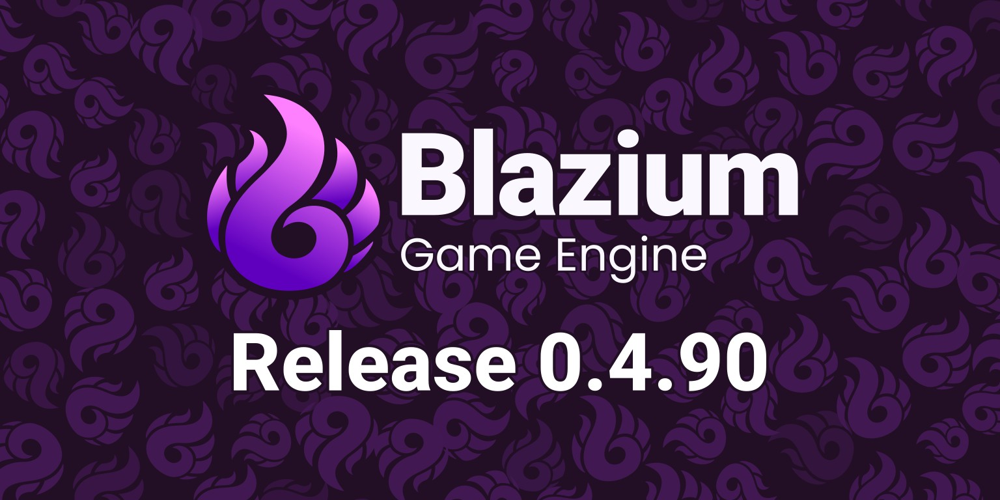

We’re happy to announce the first release of Blazium Engine! It’s been a heck of
a journey and we’d like to give a very big thank you to our community and
sponsors for helping our team get this far. We couldn’t have done it without
your passion and efforts.

Blazium Engine is launching alongside several services, tools and example
projects. We have articles that cover more about these items, so we will just
list them here.

- [Blazium Services](https://blazium.app/dev-tools/blazium-services)
- [Project hangman](https://blazium.app/games/hangman)
- [Docker web build template](https://github.com/blazium-engine/docker-webbuild-template)
- [Example hangman game template](https://github.com/blazium-engine/example-game-hangman)

Blazium 0.4.90 is based on Godot 4.3 with extra features added, from both the
team and Godot 4.4, while maintaining compatibility with Godot 4.3 projects.
Switching should be rather straightforward, as even GDExtensions are compatible.

## Where to Download
As of today, you can now obtain copies of the Blazium binaries from the following locations:

- [Pre Built binaries on the website](https://blazium.app/download)
- [Digital stores](https://blazium.app/download/digital-store)

If you are going to obtain Blazium via a digital store, there’s a few things to
know. We’ll have regular updates, but we will only be pushing release versions.
Our nightlies and pre-release versions will not be available. We made this
decision to simplify our automated publishing process as well as to ensure auto
updates are always stable. Also, Digital store versions do not include the
editor with C# support, except for Itch.io.

We also have the [web editor](https://editor.blazium.app) that is live on our website.

Everything is deployed by our [CI/CD](https://github.com/blazium-engine/ci_cd).

## Release Features

### [Blazium SDK module](https://github.com/blazium-engine/blazium-sdk-module)

The Blazium SDK is a module that we use to implement our addition to the engine,
primarily the [Blazium Services](https://blazium.app/dev-tools/blazium-services) to
offer a free option to create multiplayer games for indie developers.

---

POGRClient node for integration with [POGR](https://pogr.gg/developer).
[GitHub Pull Requests](https://github.com/blazium-engine/blazium/pull/189).
By [Ughuuu](https://github.com/Ughuuu), [bioblaze](https://github.com/bioblaze).

---

DiscordEmbededAppClient node for integration of the discord embedded app sdk.
[Read more](https://www.indiedb.com/engines/blazium-engine/news/blazium-deploys-games-on-discord).
[GitHub Pull Requests](https://github.com/blazium-engine/blazium/pull/237).
By [Ughuuu](https://github.com/Ughuuu),
[sshiiden](https://github.com/sshiiden),
[bioblaze](https://github.com/bioblaze).

---

YoutubePlayablesClient node for integration of the Youtube Playables SDK.
[Read more](https://www.indiedb.com/engines/blazium-engine/news/blazium-youtube-playables-integration).
[GitHub Pull Requests](https://github.com/blazium-engine/blazium/pull/329).
By [sshiiden](https://github.com/sshiiden).

---

.ENV file support.
[Read more](https://www.indiedb.com/engines/blazium-engine/news/blazium-env-file-support).
[GitHub Pull Requests](https://github.com/blazium-engine/blazium/pull/276).
By [Ughuuu](https://github.com/Ughuuu).

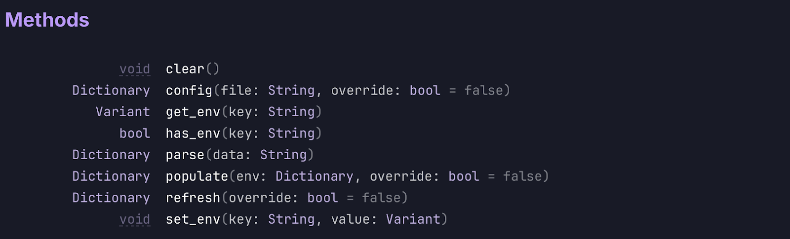

---

Improved CSV file importing by adding a new, default preset for arbitrary data
CSV files allowing to use them for more than translations.
[Read more](https://www.indiedb.com/engines/blazium-engine/news/blazium-csv-file-support).
[GitHub Pull Requests](https://github.com/blazium-engine/blazium/pull/301).
By [Ughuuu](https://github.com/Ughuuu).

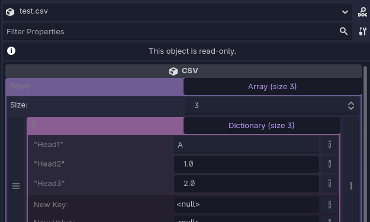

### Added Modules

Added GodotSteam for steam integration.
[Read more](https://www.indiedb.com/engines/blazium-engine/news/blazium-steam-integration).
[GitHub Pull Requests](https://github.com/blazium-engine/blazium/pull/259).
By [Ughuuu](https://github.com/Ughuuu), [GodotSteam](https://github.com/GodotSteam/GodotSteam).

---

Added SQLite database support.
[Read more](https://www.indiedb.com/engines/blazium-engine/news/blazium-sqlite-integration).
[GitHub Pull Requests](https://github.com/blazium-engine/blazium/pull/275).
By [Ughuuu](https://github.com/Ughuuu), [V-Sekai](https://github.com/V-Sekai/godot-vsk-sqlite).

### Platform support

Added Windows arm32 support. Linux does not have arm builds because of a problem
with the cross compile tools which generates the x86 builds instead, You only
can build it on native arm processors.
[GitHub Pull Requests](https://github.com/blazium-engine/blazium/issues?q=is:pr+196+197+199+312+336).
By [WhalesState](https://github.com/WhalesState), [bioblaze](https://github.com/bioblaze).

### Exporting

Added meta tags on web export to ease their addition to the html file.
[GitHub Pull Requests](https://github.com/blazium-engine/blazium/pull/255).
By [bioblaze](https://github.com/bioblaze).

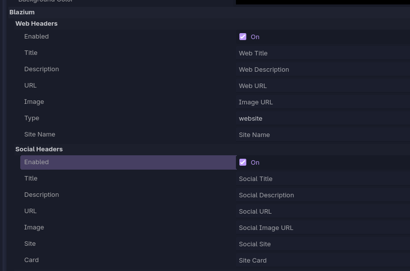

---

When exporting for the web, all inline JavaScript is now in separate files,
eliminating the need for manual adjustments to comply with content security
policies.
[GitHub Pull Requests](https://github.com/blazium-engine/blazium/issues?q=is:pr+361+383).
By [sshiiden](https://github.com/sshiiden).

### UI changes

Editor font changed to Inter.
[GitHub Pull Requests](https://github.com/blazium-engine/blazium/issues?q=is:pr+102+116).
By [DeeJayLSP](https://github.com/DeeJayLSP).

---

Various changes to make editor window minimum size smaller.
[GitHub Pull Requests](https://github.com/blazium-engine/blazium/issues?q=is:pr%20state:merged%20281%20305%20343%20374).
By [WhalesState](https://github.com/WhalesState).

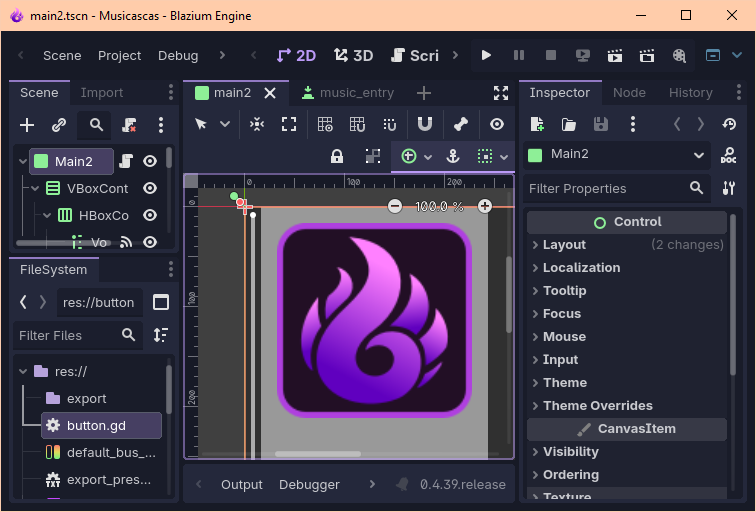

---

Made the default theme more usable for advanced theming.
[Read more](https://www.indiedb.com/engines/blazium-engine/news/blazium-theme-generator).
[GitHub Pull Requests](https://github.com/blazium-engine/blazium/issues?q=is:pr%20state:merged%20250%20324).
By [WhalesState](https://github.com/WhalesState).

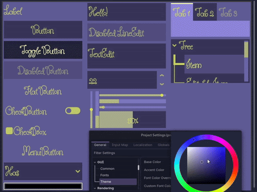

---

Added size_mode to button node.
[GitHub Pull Requests](https://github.com/blazium-engine/blazium/pull/157).
By [WhalesState](https://github.com/WhalesState).

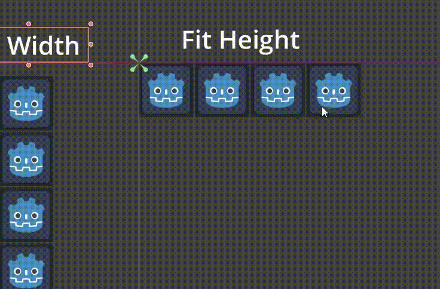

---

Added expand_text property to button node to fix icon and text overlap.
[GitHub Pull Requests](https://github.com/blazium-engine/blazium/pull/317).
By [WhalesState](https://github.com/WhalesState).

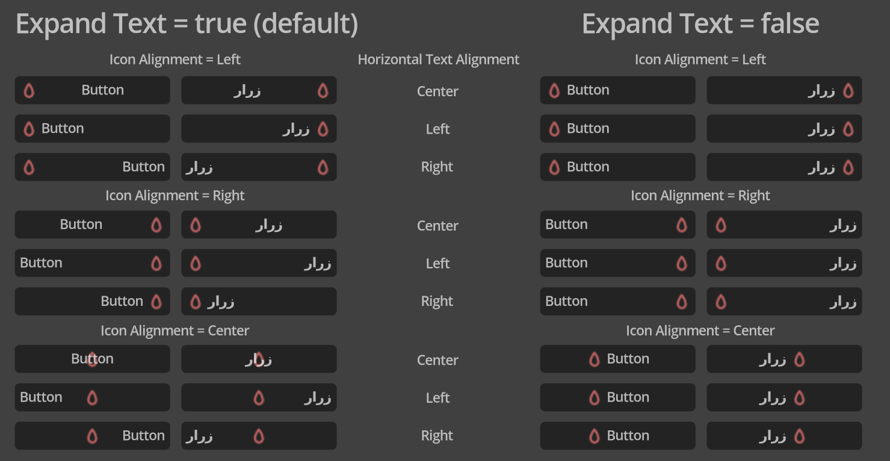

---

Remade ColorPicker node with the new ColorButton node.
[GitHub Pull Requests](https://github.com/blazium-engine/blazium/issues?q=is:pr%20state:merged%2047%20230%20234%20248%20266%20335).
By [WhalesState](https://github.com/WhalesState).

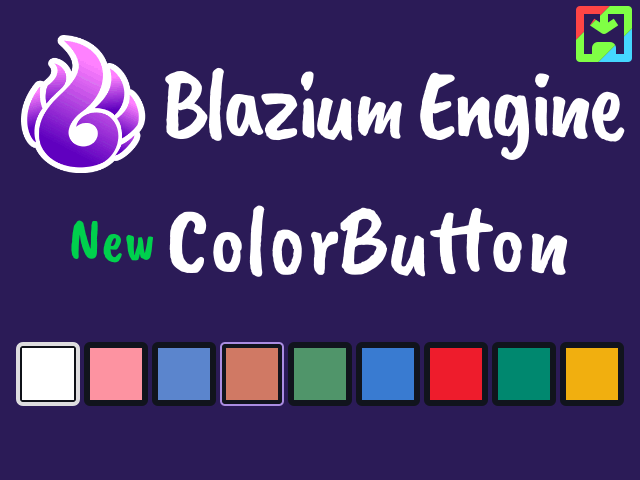

---

Added new SplitContainer node.
[GitHub Pull Requests](https://github.com/blazium-engine/blazium/pull/272).
By [WhalesState](https://github.com/WhalesState).

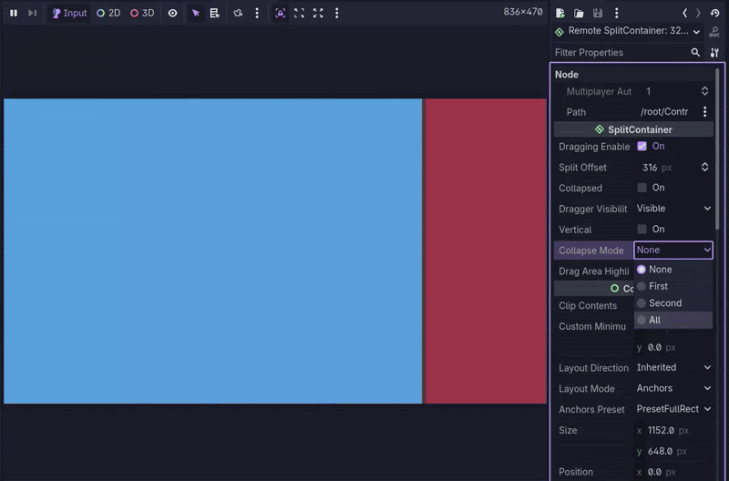

---

Added new FoldableContainer node.
[GitHub Pull Requests](https://github.com/blazium-engine/blazium/issues?q=is:pr%20state:merged%2077%20248%20338).
By [WhalesState](https://github.com/WhalesState).

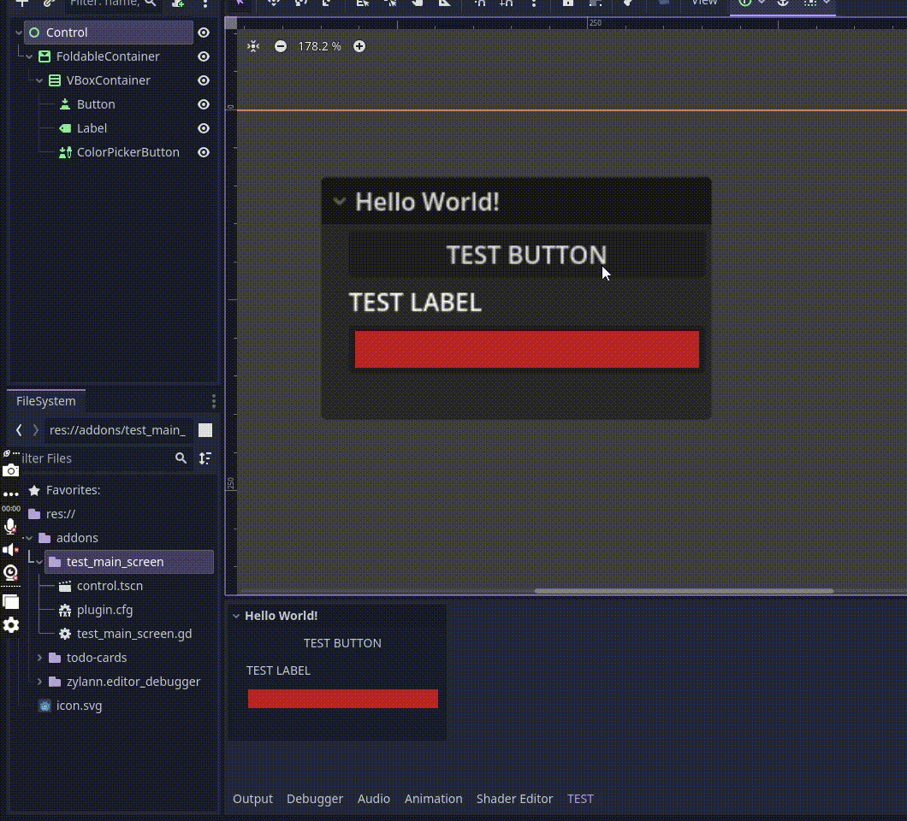

---

Added keep_editing_on_text_submit to LineEdit, and expose edit and unedit methods.
[GitHub Pull Requests](https://github.com/blazium-engine/blazium/pull/267).
By [WhalesState](https://github.com/WhalesState).

### Physics

Add PhysicsServer2/3D::space_step() to step physics simulation manually.
Works both Godot physics and Jolt.
[GitHub Pull Requests](https://github.com/blazium-engine/blazium/issues?q=is:pr%20136%20403).
By [Ughuuu](https://github.com/Ughuuu),
[sshiiden](https://github.com/sshiiden),
[Daylily-Zeleen](https://github.com/Daylily-Zeleen).

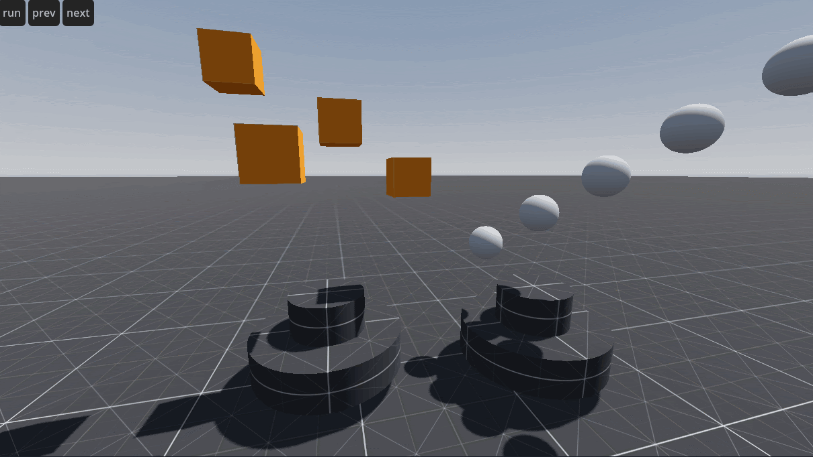

---

Configure joints, 2D or 3D, to become inactive when disabled. This makes it more
straightforward to implement neat physics tricks, such as disassembly and
reassembly of physics objects with moving parts. Works in both Godot physics and Jolt.
[GitHub Pull Requests](https://github.com/blazium-engine/blazium/pull/258).
By [Ughuuu](https://github.com/Ughuuu).

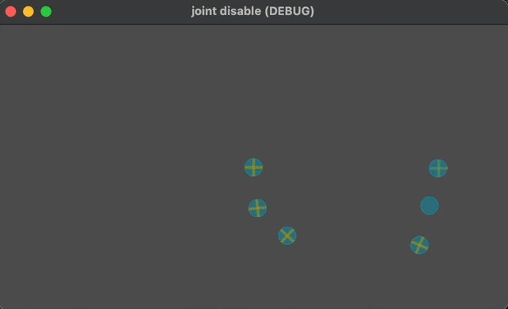

### Asset Importing

Preview external materials within the advanced mesh importer. Previously, seeing
what meshes looked like with external materials required finishing the import
and closing the advanced importer.
[GitHub Pull Requests](https://github.com/blazium-engine/blazium/pull/330).
By [jss2a98aj](https://github.com/jss2a98aj).

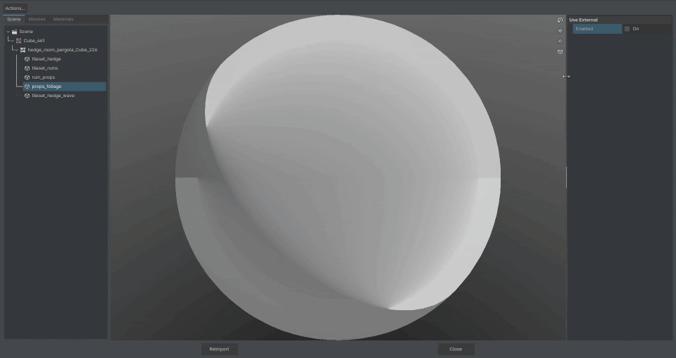

---

The demonstration gif about external materials preview also shows off support
for external materials on GLTF meshes with placeholder materials, something that
unfortunately does not work in upstream Godot.
[GitHub Pull Requests](https://github.com/blazium-engine/blazium/pull/89).
By [antonWetzel](https://github.com/antonWetzel), [jss2a98aj](https://github.com/jss2a98aj).

### C# support

Swizzle support for mono Vector implementations. This includes the expected
things like getting a Vector2 from a Vector 3 with the syntax `vec3.XZ`, but
also constructors like `Vector3(num, vector2)`. Writing values through a swizzle
is also supported if there are not any values that would be written more than
once. Vector2, Vector3, Vector4, Vector2I, Vector3I, and Vector4I are all
supported.
[GitHub Pull Requests](https://github.com/blazium-engine/blazium/pull/164).
By [jss2a98aj](https://github.com/jss2a98aj).

---

Support for VSCodium as a standalone C# editor. Godot 4.3 does not support it at
all, and Godot 4.4 only supports it if VSCode is not installed.
[GitHub Pull Requests](https://github.com/blazium-engine/blazium/pull/51).
By [jss2a98aj](https://github.com/jss2a98aj).

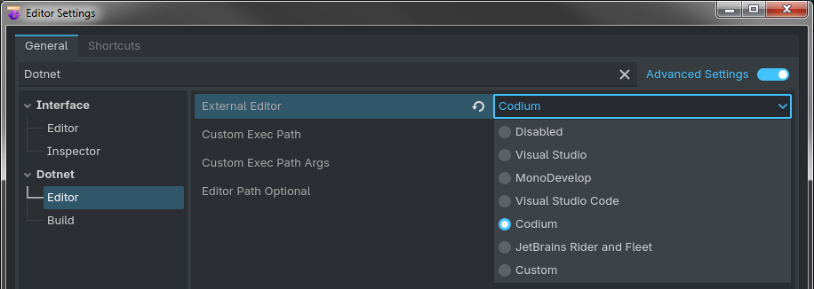

---

Support building mono glue with .NET 6. While .NET 6 is supported in Godot 4.3,
it requires .NET 8 to build the Mono glue making fixing bugs more difficult when
working from certain operating systems. As such, support for building with .NET
6 has been re-introduced in Blazium. It is recommended that .NET 8 be used to
build Mono glue when possible, though.
[GitHub Pull Requests](https://github.com/blazium-engine/blazium/pull/27).
By [jss2a98aj](https://github.com/jss2a98aj).

### Optimization

Made Node.find_children around significantly faster than the previous implementation.
[GitHub Pull Requests](https://github.com/blazium-engine/blazium/pull/399).
By [MisterPuma80](https://github.com/MisterPuma80).

---

Reduced memory allocations when Java strings are used on Android.
This was achieved by using string builders instead of more allocation heavy multiple string concatenation. [GitHub Pull Requests](https://github.com/blazium-engine/blazium/pull/31).
By [RandomOfNoWhere](https://github.com/RandomOfNoWhere).

### Miscellaneous

Fix bug in Safari for iOS where the browser would zoom in the text field.
[GitHub Pull Requests](https://github.com/blazium-engine/blazium/pull/214).
By [Ughuuu](https://github.com/Ughuuu).

---

Added get_open_scenes_root to Editor Interface API for getting the root node of all open scenes.
[GitHub Pull Requests](https://github.com/blazium-engine/blazium/pull/211).
By [TheAenema](https://github.com/TheAenema).

---

Add API Type Override Method to ClassDB + ClassDB Binding Enhancements.
[GitHub Pull Requests](https://github.com/blazium-engine/blazium/pull/380).
By [TheAenema](https://github.com/TheAenema).

---

Added the ability to set write flags for Image.save_png with PNG_FLAG_FAST set by default to
speed up writing.
[GitHub Pull Requests](https://github.com/blazium-engine/blazium/pull/371).
By [myaaaaaaaaa](https://github.com/myaaaaaaaaa), [sshiiden](https://github.com/sshiiden).

---

Added editor option to drag and drop resources as UID.
[GitHub Pull Requests](https://github.com/blazium-engine/blazium/pull/408).
By [salianifo](https://github.com/salianifo), [KoBeWi](https://github.com/KoBeWi).

### 4.4 features

We also manage to integrate a lot of Godot 4.4 features while keeping
compatibility with 4.3 projects.
[GitHub Pull Requests](https://github.com/blazium-engine/blazium/issues?q=is:pr%20merged:2025-04-02%20label:cherry-pick).

- Jolt physics
- 3D physics interpolation
- Embedded game window
- Universal uid support
- Linux camera support
- Animation markers
- Runtime WAV loading
- Betsy texture compressor
- Export tool button annotation
- Android editor support for XR devices
- 3D object snapping
- Manifold library replaces CSG implementation
- Temporary file and directory utilities
- Favorite editor items
- New expression evaluator
- Camera3D preview
- Custom colors for collision shapes
- Persistent window state
- Scene startup optimizations
- Visual shader goodies
- Autostart for all profilers
- Error less first project import
- Android editor: Export support
- Swappy – Android Frame Pacing library
- Themed icons
- Gdscript tooltips
- Metal rendering backend
- Dotnet support for android
- Partial Navigation system refactor
- Lightmaps: bicubic sampling & transparency
- Vertex shading
- 2D batching
- Rendering driver fallback
- Emission shapes for 3D particle systems
- JavaClassWrapper fixed
- Optimizations
- Androidfilepicker support
- Scenetree system overhaul
- AgX tone mapping
- lookatmodifier3D
- springbonesimulator3D
- Shadow caster mask property
- New glTF extension

The complete list of changes can be found at the
[changelog page](https://blazium.app/changelog?v=release_0.4.90).

## Where to Go From Here

- Visit the [Download Page](https://blazium.app/download) to access the latest version.
- Explore our [Roadmaps](https://blazium.app/roadmaps) to
learn about the project's direction and future updates.
- Learn about the [Tool and services](https://blazium.app/dev-tools) we have made for the community.
- Join the [Discord Server](https://blazium.app/chat) to discuss issues,
share your work and collaborate with others.
- Check our [Youtube Channel](https://www.youtube.com/@Blazium) for tutorials
