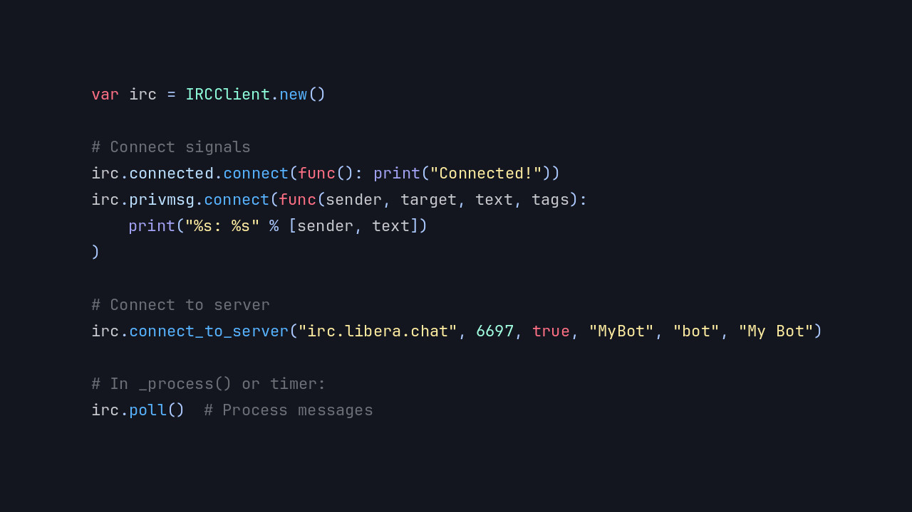
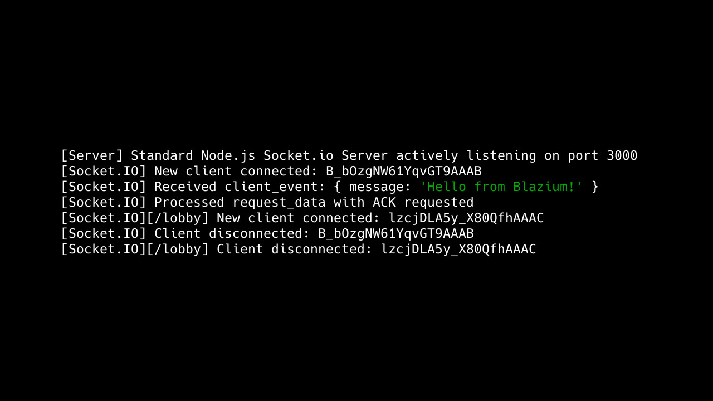
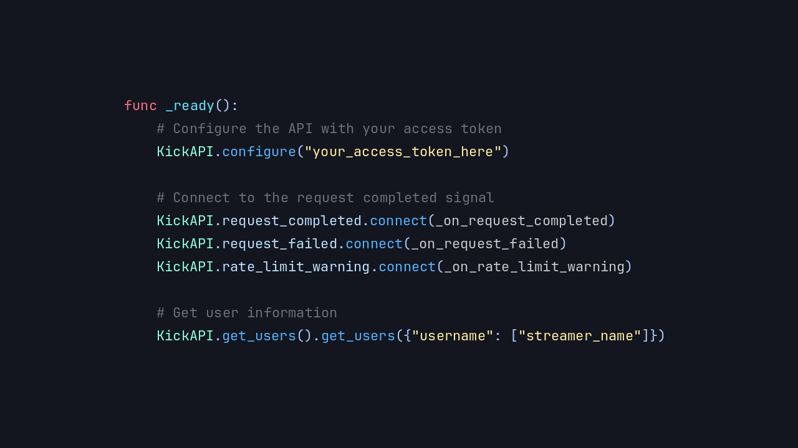
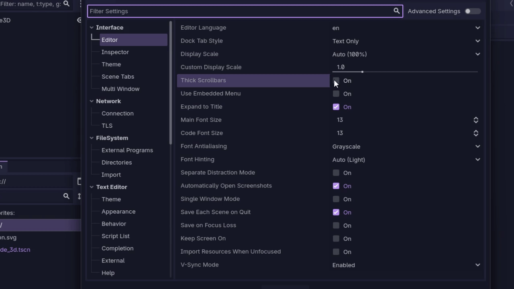

# Blazium Engine Release 0.5.246

This marks the **last release based on Godot 4.3** and will serve as
the future **Long-Term Support (LTS)** version once the next 4.6-based release arrives.

Thanks to the significant number of new features, we’ve re-launched our
[official documentation](https://docs.blazium.app) to help you make the most of Blazium.

## New Features

### HTTP Server Module

A full-featured HTTP server with support for REST APIs, static file serving, and Server-Sent Events (SSE).

Learn more about the HTTP Server in the [dedicated article](https://www.indiedb.com/engines/blazium-engine/features/http-server-module).

### RCON Module

Connect as a client to existing RCON-enabled servers or run your own RCON server inside a Blazium project.

Learn more in the [dedicated article](https://www.indiedb.com/engines/blazium-engine/features/rcon-module).

### IRC Client Module

Quick and simple IRC client integration for real-time chat in your games.

Learn more in the [dedicated article](https://www.indiedb.com/engines/blazium-engine/features/irc-client-module).

### New ENet Module

A more flexible and less restrictive ENet implementation compared to the default one.

Learn more in the [dedicated article](https://www.indiedb.com/engines/blazium-engine/features/new-enet-module).

### SocketIO Client Module

Easily connect to and manage Socket.IO connections from your projects.

Learn more in the [dedicated article](https://www.indiedb.com/engines/blazium-engine/features/socketio-client-module).

### CrowdControl Module

Crowd Control integration for interactive chat and
viewer-driven events for streamers.

Learn more in the [dedicated article](https://www.indiedb.com/engines/blazium-engine/features/crowd-control-module).

### Twitch API Module

Full Twitch API integration for your streaming and community features.

Learn more in the [dedicated article](https://www.indiedb.com/engines/blazium-engine/features/twitchapi-module).

### Kick API Module

Kick API integration for modern streaming platforms.

Learn more in the [dedicated article](https://www.indiedb.com/engines/blazium-engine/features/kickapi-module).

### OBS Client Module

Control OBS Studio directly from within Blazium.

Learn more in the [dedicated article](https://www.indiedb.com/engines/blazium-engine/features/obs-client-module).

### Alternative Scrollbar Style

Option to enable thicker editor scrollbars, making them much easier to grab and use.

**Contributed by [Tekisasu-JohnK](https://github.com/blazium-games/blazium/pull/584)**

### QTerminal Support
Added support for **QTerminal** as a supported terminal emulator on Linux.

**Contributed by [MisterPuma80](https://github.com/blazium-games/blazium/pull/602)**

## Removals

### GodotSteam Module Removed

After encountering issues with the existing integration of the
[GodotSteam gdextension](https://godotsteam.com) into the engine and considering
that it is maintained by a separate team, we decided to remove the GodotSteam module.

We plan to develop our own robust solution in the future.

### Six-Way Volumetric Lighting Material Removed

The original Godot shader implementation remains available here:  
[TheAenema/Godot-Six-Way-Volumetric-Shader](https://github.com/TheAenema/Godot-Six-Way-Volumetric-Shader).

## Download

[Download the latest release on blazium.app](https://blazium.app/download)

For the complete list of changes, see the [changelog](https://blazium.app/changelog?v=release_0.5.246).

---

**[Jump into our Discord](https://blazium.app/chat)** for real-time chats, dev support and feedback

Or follow us everywhere else:

- **[IndieDB](https://www.indiedb.com/engines/blazium-engine)**
- **[X / Twitter](https://x.com/BlaziumGames)**
- **[YouTube](https://www.youtube.com/@blazium)**
- **[itch.io](https://blaziumengine.itch.io)**
- **[Patreon](https://www.patreon.com/cw/Blazium)**
