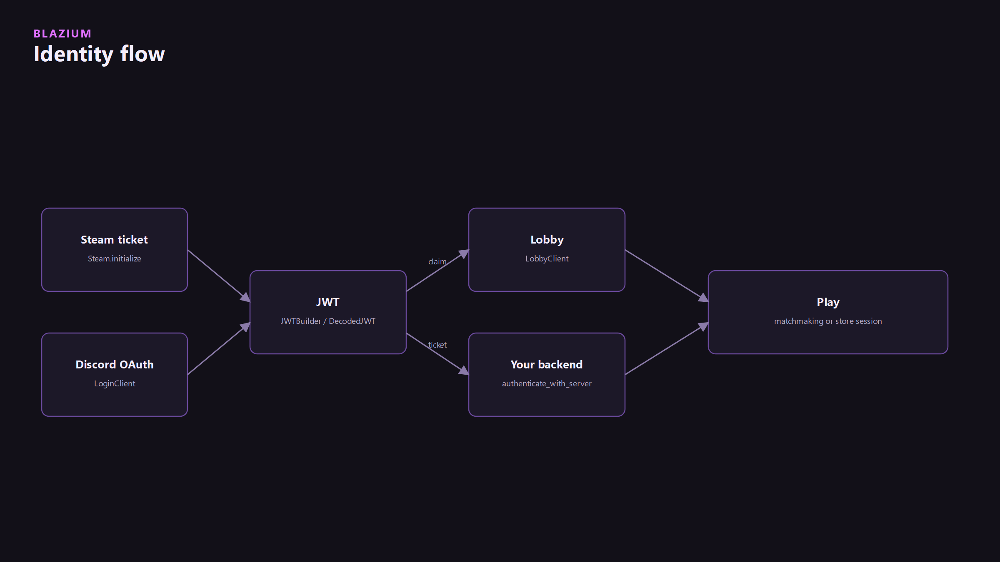
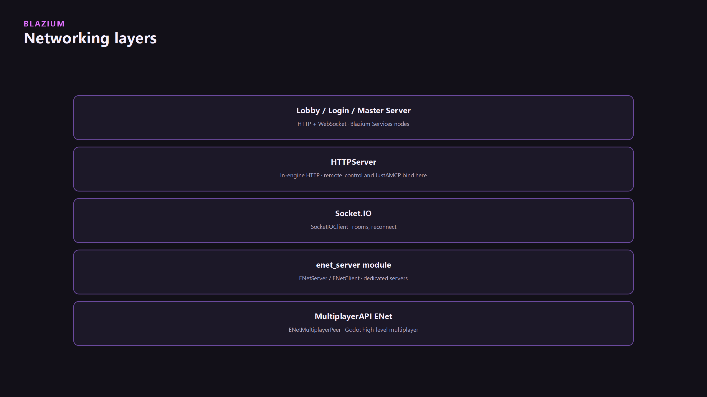

Hangman needed matchmaking without giving away player IPs. The clients shipped as engine nodes. They talk HTTP and WebSocket to a service. A free hosted endpoint sits on Blazium's domain. Self-host if that is not enough.

## Four clients

| Node | Job |
|---|---|
| `LobbyClient` | Matchmaking, rooms, peers. Does not leak IPs |
| `ScriptedLobbyClient` | Same, with server-side lobby scripts |
| `LoginClient` | Social login, returns a JWT |
| `MasterServerClient` | Track dedicated game servers |

<!-- CAPTURE: assets/node-create-lobby.png | Editor | Create-node dialog filtered to Lobby / Login / MasterServer -->
<!-- CAPTURE: assets/cover.png | Editor | Scene with LoginClient + LobbyClient visible -->

## Login, then Lobby



```gdscript
extends LoginClient

func _init() -> void:
    received_jwt.connect(_received_jwt)
    var result := await connect_to_server().finished
    if result.has_error():
        push_error(result.error)

func request_login_and_open() -> void:
    var login_result: LoginURLResult = await request_login_info("discord").finished
    if login_result.has_error():
        push_error(login_result.error)
        return
    OS.shell_open(login_result.login_url)

func _received_jwt(jwt: String, type: String, access_token: String) -> void:
    print("login ok, jwt length=", jwt.length())
```

```gdscript
extends LobbyClient

@export var reconnects := 0
var config := ConfigFile.new()

func _ready() -> void:
    config.load("user://blazium.cfg")
    reconnection_token = config.get_value("LobbyClient", "reconnection_token", "")
    disconnected_from_server.connect(_disconnected)
    connected_to_server.connect(_connected)
    connect_to_server()

func _connected(_peer: LobbyPeer, new_reconnection_token: String) -> void:
    reconnects = 0
    config.set_value("LobbyClient", "reconnection_token", new_reconnection_token)
    config.save("user://blazium.cfg")
```

Do not print live tokens. The JWT goes to Lobby or to your own backend. Store path: [Identity, Steam, and Xbox](../online-identity-and-stores/online-identity-and-stores.md).

<!-- CAPTURE: assets/login-jwt.png | Editor | Inspector or log with a redacted JWT -->
<!-- CAPTURE: assets/lobby-list.png | Running game | Lobby list / matchmaking UI -->

## Where this sits vs ENet



Lobby is HTTP/WebSocket. Dedicated game traffic is still `enet_server` or MultiplayerAPI ENet. Do not put world simulation on the lobby node.

## Discord activities

On `*.discordsays.com` the service nodes rewrite their URLs. Docker `.proxy` maps complete the path. Details: [Discord on Blazium](../discord-on-blazium/discord-on-blazium.md) and [Docker web export](../docker-web-export/docker-web-export.md).

## Self-host

The nodes accept a server URL. Class reference: [docs.blazium.app](https://docs.blazium.app). This article does not deploy your replica.
