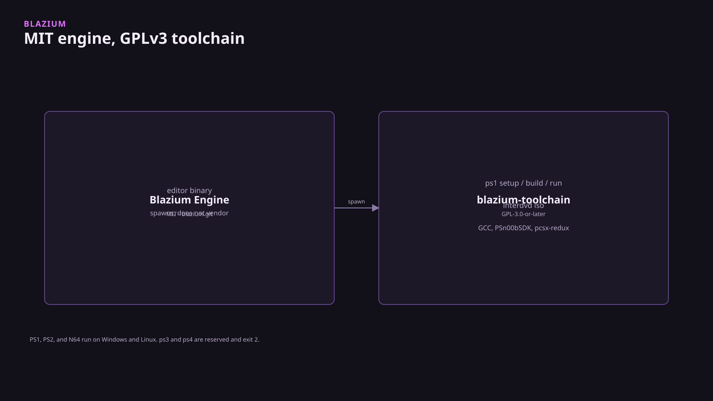

The Blazium engine stays under the MIT license. The compilers live in this GPL CLI so the editor does not absorb GCC, PSn00bSDK, or libdragon. This CLI is GPL-3.0-or-later so it can fetch GCC, PSn00bSDK, pcsx-redux, mkpsxiso, OpenBIOS, the ps2dev toolchain, and libdragon. Those trees are never merged into `blazium.git`. The editor looks up `blazium-toolchain` and runs it. It does not vendor the compilers. Blazium Games used the CLI in-house to validate PS1, PS2, N64, and Interactive DVD exports. That is not a shipped console title.

## Status

Repo: [blazium-toolchain](https://github.com/blazium-games/blazium-toolchain). Catalog: `https://cdn.blazium.app/toolchain/toolchain.json`. Published binaries are Linux and Windows. A local macOS build can master Interactive DVD. PS1, PS2, and N64 setup and build exit `2` on that host. CI does not ship a macOS binary.

On `blazium-dev` the editor spawn that exists is Interactive DVD (`modules/inter_dvd`). It runs `blazium-toolchain interdvd iso` and `blazium-toolchain interdvd ffmpeg`. There is no PS1, PS2, or N64 export platform class. Those are terminal commands after `setup`.

`ps3` and `ps4` are reserved names. Commands exit `2`. They are not a shipping target and the CLI does not document a date for them.

The license split is the design: the MIT editor executes the binary and does not vendor the compilers. Putting those SDKs in `blazium.git` would force that license onto the editor.



The preset key is `export/inter_dvd/toolchain`. Empty means `BLAZIUM_TOOLCHAIN`, then `PATH`. Dummy-VOB export works without the CLI. ISO export does not. PS1, PS2, and N64 are commands you run yourself.

## Install

npm, Linux and Windows, x64 and ia32:

```text
npm install -g @blazium-engine/toolchain
```

The command is `blazium-toolchain`. Or build it:

```text
git clone https://github.com/blazium-games/blazium-toolchain.git
cd blazium-toolchain
go test ./...
go build -o blazium-toolchain.exe ./cmd/blazium-toolchain
```

Go 1.23.8 or later. Drop `.exe` on Unix. Published binaries are Linux and Windows. A local macOS build can still master Interactive DVD. CI does not ship a macOS binary.

Cache: `%LOCALAPPDATA%\Blazium\blazium-toolchain` on Windows, `~/.local/share/blazium-toolchain` elsewhere. Override with `--prefix` or `BLAZIUM_TOOLCHAIN_PREFIX`.

```text
blazium-toolchain --json version
blazium-toolchain --json list
```

`--json version` is `{ "name", "version", "license" }`. Settings file lookup is `--settings`, then `$BLAZIUM_TOOLCHAIN_SETTINGS`, then `blazium-toolchain.yml` or `.blazium-toolchain.yml` walking up from the working directory. SHA pins live in the embedded `pins.json`.

Stdout is one verb per line (`fetching`, `installing`, `skip`, `wrote`, `ready`, `error`). Exit `2` means a reserved platform or a host that cannot compile. Exit `3` means a host tool is missing.

## PS1

| Profile | Contents |
|---|---|
| `compile` | gcc 12.3.0 + PSn00bSDK 0.24 + elf2x |
| `dev` | compile + OpenBIOS + pcsx-redux CLI |
| `iso` | dev + mkpsxiso |

```text
blazium-toolchain ps1 setup --profile dev
blazium-toolchain ps1 env
blazium-toolchain ps1 status
blazium-toolchain ps1 build --out GAME.EXE --sample template
blazium-toolchain ps1 run --timeout 120s GAME.EXE
```

`--offline` skips the network. `ps1 run` is headless unless you pass `--ui`. `ps1 build` without `--src` uses the MIT guest stub embedded in the CLI. `--overlay DIR` copies extra `*.cpp` on top. Sony BIOS images are not fetched.

## PS2

`ps2` ships. It does not exit 2.

| Profile | Contents |
|---|---|
| `compile` | ps2dev EE gcc + PS2SDK |
| `dev` | compile + your `PCSX2_EXE` (BIOS is not fetched) |
| `iso` | dev + `ps2 iso --dir TREE` |

```text
blazium-toolchain ps2 setup --profile compile
blazium-toolchain ps2 build --out hello.elf --sample cube
blazium-toolchain ps2 elf-info hello.elf
blazium-toolchain ps2 iso --dir ./tree --out game.iso
```

Set `PCSX2_EXE` before `ps2 run`. `ps2 chd` wraps an ISO with `chdman` when that tool is on `PATH`. Size gates `ps2.elf_text_max` and `ps2.elf_file_max` apply to `ps2 build` and `ps2 elf-info`.

## N64

There is no ISO command. `n64 iso` is rejected. The product is a big-endian `.z64` (`80 37 12 40`).

| Profile | Contents |
|---|---|
| `compile` | libdragon preview: `N64_INST`, `mips64-elf-gcc`, `n64.mk`, `libdragon.a` |
| `dev` | compile + Ares and/or Project64 |
| `rom` | compile + `mkdfs` / `n64tool` |

```text
blazium-toolchain n64 setup --profile compile
blazium-toolchain n64 build --out hello.z64 --display 320
blazium-toolchain n64 run --emu ares --rdram 8 hello.z64
```

`--display` is `320` or `640`. `--rdram 8` is the Expansion Pak default. `--rdram 4` matches a 4 MiB boot. `--rumble` drives a Rumble Pak when one is present. Samples: `helloworld`, `rdpqdemo`, `t3dquad`, `ovldemo`. `C:\ultra` is ignored. PIF dumps are not fetched.

## Interactive DVD

```text
blazium-toolchain interdvd meta init --out disc.interdvd.json
blazium-toolchain interdvd iso --dir ./disc --out disc.iso --meta disc.interdvd.json
```

The folder must already contain `VIDEO_TS/` (optional `AUDIO_TS/`). **No mkisofs** means the CLI writes ISO9660 + UDF 1.02 itself. It does not shell out to `mkisofs` or `oscdimg`. `InterDVDIfoWriter` in the engine documents the same limit: the argument list is `--dir`, `--out`, `--meta`, `--write-meta`, `--json`, and it does not invoke those tools.

`--extra` and `--recursive` drop PC files beside the video folders. `menu_language`, `audio_language`, `subtitle_language`, `region_mask`, and `parental_level` are stored in `disc.interdvd.json`. They are not written into IFO or UDF.

`interdvd setup` can fetch a pinned FFmpeg. `interdvd ffmpeg` and `interdvd ffprobe` run that binary. The editor's scene baker uses `blazium-toolchain interdvd ffmpeg` to encode a cell. If the CLI is missing, bake fails with "blazium-toolchain is not ready."

Mastering works on a macOS build of the CLI even though PS1/PS2/N64 setup and build exit `2` on that host.

## Reserved

`ps3` and `ps4` are reserved names. Commands exit `2`. They are not a shipping target.

## Limits

Compilers are downloaded into the cache on `setup`. They are not inside the Go binary. The MIT guest sources are. `export-guest --out DIR` writes that stub. Third-party licenses are in `THIRDPARTY.md` in the toolchain repo. libpsn00b, ps2sdk, and libdragon link into the exported guest, not into the editor.

---

**[Jump into our Discord](https://blazium.app/chat)** for real-time chats, dev support and feedback

Or follow us everywhere else:

- **[GitHub](https://github.com/blazium-games)**
- **[IndieDB](https://www.indiedb.com/engines/blazium-engine)**
- **[X / Twitter](https://x.com/BlaziumGames)**
- **[YouTube](https://www.youtube.com/@blazium)**
- **[itch.io](https://blaziumengine.itch.io)**
