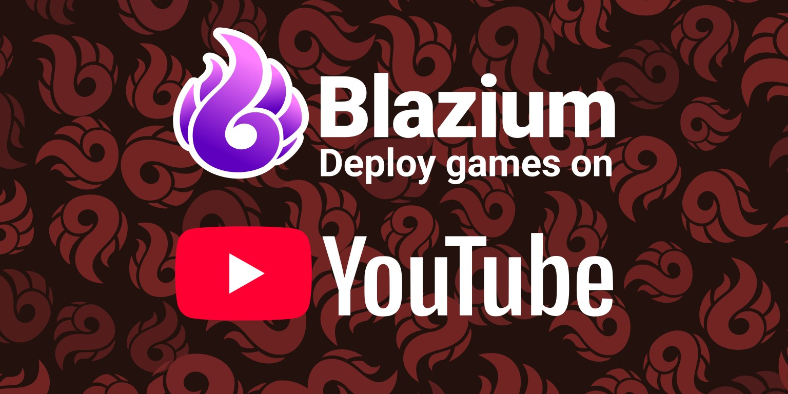
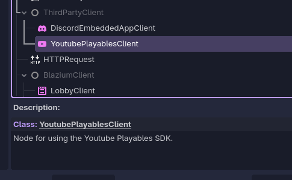
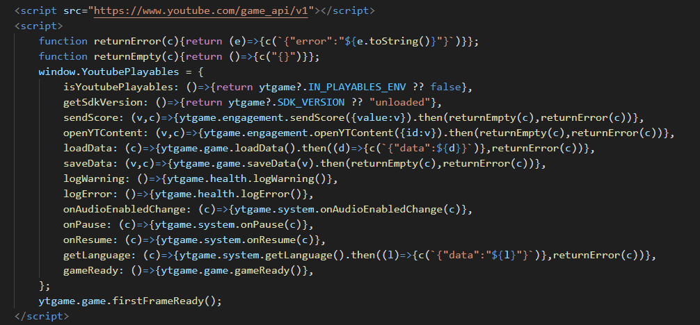
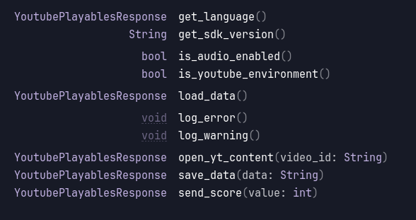
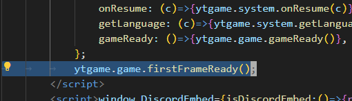
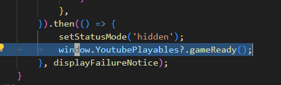

Hi, [sshiiden](https://github.com/sshiiden) here, after working on the
Discord App integration we started looking for other platforms that have web
games integrated into their applications to ease the process of building web
games for those platforms.

One of them is [Youtube Playables](https://developers.google.com/youtube/gaming/playables),
which are interactive games and experiences published to YouTube.
While still in an early access stage with limited access
to specific regions, we wanted to get ahead and allow game developers interested
to easily use the Youtube Playables SDK without having to worry about
integrating it themselves.

In order to use the new integration, add the YoutubePlayablesClient node to the
scene, and that's it, all the rest of the heavy lifting is handled by us as long
as you check the Youtube Playable export option.

## The YoutubePlayablesClient node

The main problem is that the Youtube Playables SDK is JavaScript included in the
HTML which adds a ytgame object. So, to interface with the SDK, I have added the
YoutubePlayablesClient node which, with the help of an extra YoutubePlayables
JavaScript object, abstracts the SDK into methods and signals that can be used
in Blazium.

**YoutubePlayables JavaScript object:**

**YoutubePlayablesClient node:**

onPause, onResume and onAudioEnabledChange have been abstracted into signals.

## The SDK integration requirements

The Youtube Playables SDK has some important requirements,

- Call firstFrameReady when the game is ready to render to the screen
- Call gameReady when the game has finished loading and ready for user input
- Have the initial bundle size less than 15MB

As a consequence, firstFrameReady and gameReady don’t have an equivalent in YoutubePlayablesClient.

The firstFrameReady is called directly after defining the YoutubePlayables object:

While gameReady is called indirectly, after the game has loaded, via the
YoutubePlayables object to allow the usage of the optional chaining operator, so
that when the game is not exported with the youtube playable option, the
function won't be called.

To meet the requirement about the initial bundle size, we had to compress the
exported WASM file as a GZIP, since it was over 30MB, and have a web server
serve that to the client which would uncompress it before use.

To ease this process we decided to add the compression step as an export option
with a suboption to keep the uncompressed WASM file.

This, plus a modification to the
[docker-webbuild-template](https://github.com/blazium-engine/docker-webbuild-template)
to serve the compressed WASM when possible, will allow developers to easily deploy their
games for Youtube Playable.
