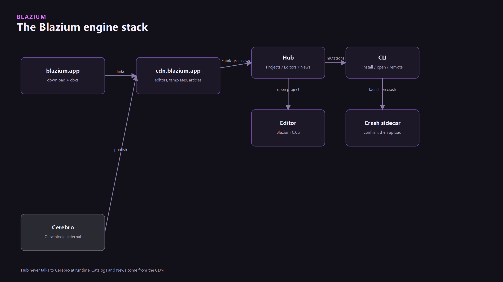

Confirm-before-upload is the product. The engine writes files. A sidecar UI asks. Send is a decision, not a default.



The module is `modules/crash_reporter`. It builds on Windows and Linux/BSD only (`config.py`). macOS, web, Android, and iOS do not compile it. Breakpad is the in-process client (`USE_BREAKPAD` when `crash_reporter=yes` or `editor_crash_reporter=yes`). The module does not ship the out-of-process `crash_generation_server`. The sidecar repo, [blazium_crash_reporter](https://github.com/blazium-games/blazium_crash_reporter), does not contain Breakpad. It only shows the two files and uploads them after you confirm.

## What the engine writes

`{crash-dir}/{id}.dmp` plus `{id}.json`. The editor crash directory is `{EditorPaths data}/crashes`, or `BLAZIUM_CRASH_REPORTER_CRASH_DIR` if that is set. Export templates use `application/crash_reporter/crash_dir_name` (default `crashes`) under the user data directory.

The singleton is `CrashReporter`. Signals: `upload_started`, `upload_progress`, `upload_succeeded`, `upload_failed`. `induce_crash()` only does something when Breakpad was compiled in.

## The sidecar

The engine resolves identity, then launches the sidecar with:

```text
crash_reporter --crash-dir <dir> --report-id <id> --endpoint <url> --app-id <id> --build-id <id> --contact-url <url> --privacy-url <url>
```

Those flags are built in `crash_reporter.cpp` (`--crash-dir`, `--report-id`, `--endpoint`, `--app-id`, `--build-id`, `--contact-url`, `--privacy-url`). The sidecar UI is Send, Discard, or Refresh, plus a "what happened" field and an anonymous option. The privacy URL is on the dialog so the upload target is visible before you send.

Point the editor at a local sidecar with `--crash-reporter <path>`. Relative paths resolve next to the editor executable. The engine help text documents the flag. The arg loop does not store it in `main`. `AppIdentity::cmdline_flag_value("crash-reporter")` reads it later.

In an editor build, `get_upload_mode()` is `UPLOAD_SIDECAR` when that path is valid, and `UPLOAD_DISABLED` otherwise. `is_http_upload_available()` is always false in the editor. The editor does not POST the dump itself.

Editor env overrides (not Project Settings): `BLAZIUM_CRASH_REPORTER_ENABLED`, `BLAZIUM_CRASH_REPORTER_CRASH_DIR`, `BLAZIUM_CRASH_REPORTER_ENDPOINT`, `BLAZIUM_CRASH_REPORTER_APP_NAME`, `BLAZIUM_CRASH_REPORTER_APP_VERSION`, `BLAZIUM_CRASH_REPORTER_BUILD_CHANNEL`, `BLAZIUM_CRASH_REPORTER_CONTACT_URL`. The editor ignores `application/crash_reporter/*` for those fields. Two Editor Settings keys are read-only displays: `blazium/crash_reporter/app_id` and `blazium/crash_reporter/build_id`.

## Exported games

Place `crash_reporter.exe` (Windows) or `crash_reporter` (Linux) next to the game, or set a path. Compile the template with `crash_reporter=yes` or the dump writer is absent. Project Settings (defaults from `crash_reporter_project_settings.cpp`):

| Key | Default |
|---|---|
| `application/crash_reporter/enabled` | `false` |
| `application/crash_reporter/upload_mode` | `0` (Disabled) |
| `application/crash_reporter/reporter_filename` | `crash_reporter` |
| `application/crash_reporter/reporter_filename.windows` | `crash_reporter.exe` |
| `application/crash_reporter/spawn_on_crash` | `true` |
| `application/crash_reporter/spawn_on_next_launch` | `true` |
| `application/crash_reporter/require_user_consent` | `true` |
| `application/crash_reporter/endpoint` | empty, or the template bake |
| `application/crash_reporter/timeout_sec` | `30` |
| `application/crash_reporter/max_upload_mb` | `32` |
| `application/crash_reporter/crash_dir_name` | `crashes` |

`upload_mode` is `0` Disabled, `1` in-engine HTTP, `2` sidecar, `3` both. In-engine upload is the multipart POST available in export templates. The editor never takes that path. `require_user_consent` defaults to true, so a template that uploads still waits.

`reporter_sha256`, when set, is the expected lowercase hex of the sidecar binary.

## App ids

SCons `editor_app_id` defaults to `custom_blazium_engine`. Official CI overrides it.

| id | Who |
|---|---|
| `blazium-editor` | Official editor CI, when that bake is passed |
| `blazium-hub` | Hub (`ci/hub_scons.env`) |
| `custom_blazium_engine` | Local editor builds that do not pass `editor_app_id` |

`editor_build_id` empty means the git `VERSION_HASH` at runtime. Same ids as [opt-in analytics](../analytics-opt-in/analytics-opt-in.md). `CrashReporter.get_resolved_config()` returns the values the process actually used.

## Where it goes

Hub's baked endpoint is `https://crash.blazium.app/v1/reports`. The POST is multipart: the minidump plus the metadata JSON. Analytics, when enabled, uses `https://crash.blazium.app/v1/events` on that same host. They are different paths.

Dumps are still written when the endpoint is empty. Upload is the part you turn on. Hub ships the sidecar next to itself, and a Hub update can refresh that binary (`blazium-cli update apply --product crash_reporter`).

---

**[Jump into our Discord](https://blazium.app/chat)** for real-time chats, dev support and feedback

Or follow us everywhere else:

- **[GitHub](https://github.com/blazium-games)**
- **[IndieDB](https://www.indiedb.com/engines/blazium-engine)**
- **[X / Twitter](https://x.com/BlaziumGames)**
- **[YouTube](https://www.youtube.com/@blazium)**
- **[itch.io](https://blaziumengine.itch.io)**
