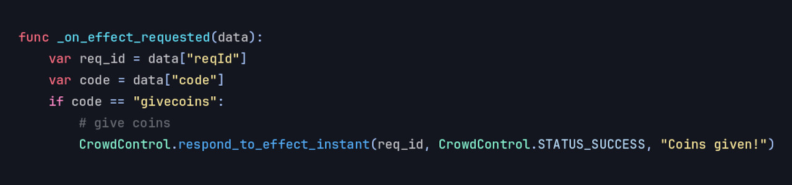
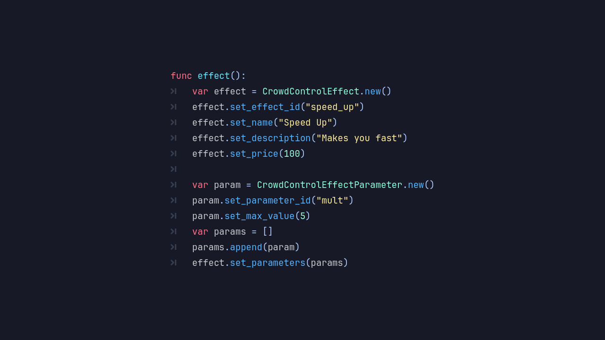

# Introducing the Crowd Control Module

Blazium Game Engine adds a new capability with the [Crowd Control](https://crowdcontrol.live) module.
This native C++ module integrates with the Crowd Control platform, enabling streamers
and developers to let their live audience directly influence gameplay in real time.

The module is exposed primarily through the `CrowdControl` object and a set of helper classes for
managing effects, parameters, and game packs. It handles communication via HTTP and WebSocket for reliable,
real-time effect delivery.

## Key Features

- **Real-Time Audience Effects**: Receive and apply effects triggered by viewers instantly during live streams.
- **Effect System**: Define and handle custom effects with the `CrowdControlEffect` and `CrowdControlEffectParameter` classes, supporting parameters like duration, intensity, or custom values.
- **Game Packs**: Organize effects into structured `CrowdControlGamePack` bundles with metadata (`CrowdControlGamePackMeta`) for easy management per game or version.
- **HTTP & WebSocket Support**: Built-in `CrowdControlHttpClient` for downloading packs and connecting to Crowd Control services, with WebSocket for low-latency bidirectional communication.
- **Deep Engine Integration**: Effects can directly interact with your scenes, nodes, signals, and game logic using Blazium's familiar node and signal system.
- **Editor Tools**: Includes editor support for configuring packs and effects directly in the Blazium editor.

## Why Add Crowd Control to Your Game?

Crowd Control turns passive viewers into active participants, increasing engagement, watch time,
and community excitement. Common use cases include:

**For Games & Stream Experiences**
- **Viewer-driven chaos**: Let viewers vote on or directly trigger power-ups, enemy spawns,
environmental changes, or silly cosmetic effects.
- **Twitch-integrated gameplay**: Popular for roguelikes, platformers, survival games, racing titles,
and party games where audience input creates unpredictable fun.
- **Monetization & Retention**: Streamers love games with strong Crowd Control support because
it encourages more subs, bits, and channel points usage.
- **Custom Effect Systems**: Define your own game-specific effects that viewers can purchase or redeem
through the Crowd Control app and website.

**For Developers**
- Rapid prototyping of interactive features without writing your own live audience backend.
- Cross-platform support (desktop, and potentially mobile/web depending on export templates).
- Lightweight and performant, built directly into the engine using Blazium's networking primitives.

It builds on the existing official Crowd Control developer tools and SDK patterns
(already available for Godot and other engines), but as a native Blazium module it offers better performance,
deeper engine integration, and no need for external GDExtension plugins.

## Documentation & Next Steps

The module is already available in the [latest release of Blazium](https://blazium.app/download) and
includes a dedicated test project (see
[crowdcontrol_module_tests](https://github.com/blazium-games/crowdcontrol_module_tests)
for examples).

For full technical details head over to the official **Blazium Documentation** at [docs.blazium.app](https://docs.blazium.app).

Whether you're building the next viral streaming hit or just want to add a fun interactive layer to your
existing game, the Crowd Control module makes it simple and native.

---

**[Jump into our Discord](https://blazium.app/chat)** for real-time chats, dev support and feedback

Or follow us everywhere else:

- **[IndieDB](https://www.indiedb.com/engines/blazium-engine/articles)**
- **[X / Twitter](https://x.com/BlaziumGames)**
- **[YouTube](https://www.youtube.com/@blazium)**
- **[itch.io](https://blaziumengine.itch.io)**
- **[Patreon](https://www.patreon.com/cw/Blazium)**
