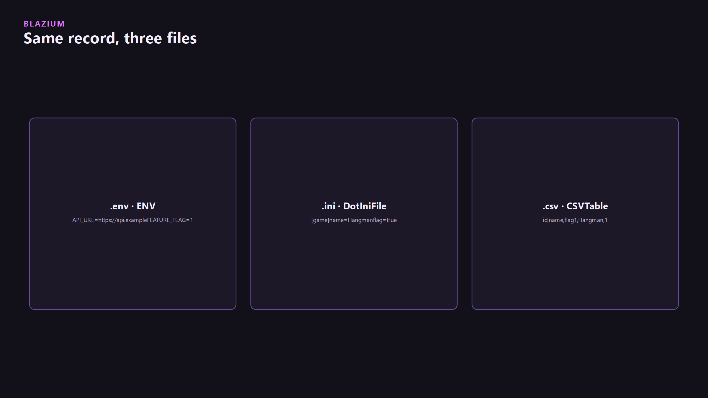

One record: a display name, an API URL, a feature flag. Three modules on `blazium-dev` can hold it. Pick the format that matches the job. All three build on every platform. None of them registers Project Settings of its own.



## `.env` / `ENV`

`ENV` is an engine singleton (`modules/dotenv`). It loads `.env` files and can read them back as strings, bools, ints, floats, colors, and vectors. It is not a security boundary. Anyone with the file can read it.

The crash reporter does not read this file. A game's upload URL is `application/crash_reporter/endpoint` in Project Settings (or the SCons template bake). Put that there. Use `.env` for values your own scripts read.

`auto_config(dir, mode)` loads, in order, `.env`, `.env.local`, `.env.{mode}`, and `.env.{mode}.local` under `dir` (default `res://`). Mode defaults to `development` in the editor and `production` in an export. `config(file)` loads one file. OS environment wins when you ask it to (`get_prioritize_os_env`).

```env
GAME_NAME=Hangman
API_URL=https://api.example
FEATURE_FLAG=1
OBS_URL=ws://127.0.0.1:4455
OBS_PASSWORD=
```

```gdscript
ENV.auto_config("res://")
var url := str(ENV.get_env("API_URL", ""))
var port_ok := bool(ENV.get_env_bool("FEATURE_FLAG", false))
ENV.generate_example("res://.env.example")
```

`get_env` returns the default when the key is missing. Typed helpers are `get_env_bool`, `get_env_int`, `get_env_float`, `get_env_array`, `get_env_dict`. `push` into the process environment is `push_to_os_env`. Signals: `file_loaded`, `cleared`, `refreshed`.

Do not commit production secrets. Ship `.env.example` from `generate_example` and gitignore the real file.

## `.ini` / `DotIniFile`

`DotIniFile` (`modules/dotini`) is a `RefCounted` INI with sections, includes, macros, and type constraints. Godot's `ConfigFile` is still there. DotINI is the extra checking path. You do not have to migrate.

```ini
[game]
name=Hangman
flag=true

[net]
api_url=https://api.example
```

```gdscript
var ini := DotIniFile.new()
ini.load("res://game.ini")
var name := str(ini.get_value("game", "name", ""))
var flag := ini.get_value_bool("game", "flag", false)
```

`from_config_file` and `from_dictionary` exist when you already have a `ConfigFile` or a `Dictionary`. `get_section_as_dict` is the reverse. Includes and macros are optional. A short settings file does not need them.

## `.csv` / `CSV`

`modules/dotcsv` is a table toolkit, not only a translation importer. `CSV` is a resource (`load_file`, `load_string`, `save_to_string`). `CSVTable` is the query side. `ResourceImporterCSV` is the import dock. `CSVReader` / `CSVWriter` stream. `CSVAsyncTask` is the background path.

```csv
id,name,flag
1,Hangman,1
```

```gdscript
var table := CSVTable.from_file("res://data/levels.csv")
for row in table.where_equals("name", "Hangman").get_rows():
    print(row)
```

`CSVTable` also has `select_columns`, `sort_by`, `group_by`, `inner_join`, `left_join`, and `limit`. Dialect sniffing is `CSVDialect.sniff`. Headers, delimiters, and true/false token lists are importer options, not Project Settings.

Release 0.4.90 already imported CSV for translations. This module is any table a designer edits.

## Decision

| Kind | Put it in |
|---|---|
| Secret or machine-local string your script reads | `.env` via `ENV` |
| Structured settings with sections | `DotIniFile`, or Project Settings when the engine itself must see the key |
| Bulk rows a designer edits | `.csv` via `CSVTable` or the import dock |
| Crash upload URL, app id | `application/crash_reporter/*`, not `.env` |

Tests and samples: [dotenv_module_tests](https://github.com/blazium-games/dotenv_module_tests), [dotini_module_tests](https://github.com/blazium-games/dotini_module_tests), [dotcsv_module_tests](https://github.com/blazium-games/dotcsv_module_tests).

---

**[Jump into our Discord](https://blazium.app/chat)** for real-time chats, dev support and feedback

Or follow us everywhere else:

- **[GitHub](https://github.com/blazium-games)**
- **[IndieDB](https://www.indiedb.com/engines/blazium-engine)**
- **[X / Twitter](https://x.com/BlaziumGames)**
- **[YouTube](https://www.youtube.com/@blazium)**
- **[itch.io](https://blaziumengine.itch.io)**
