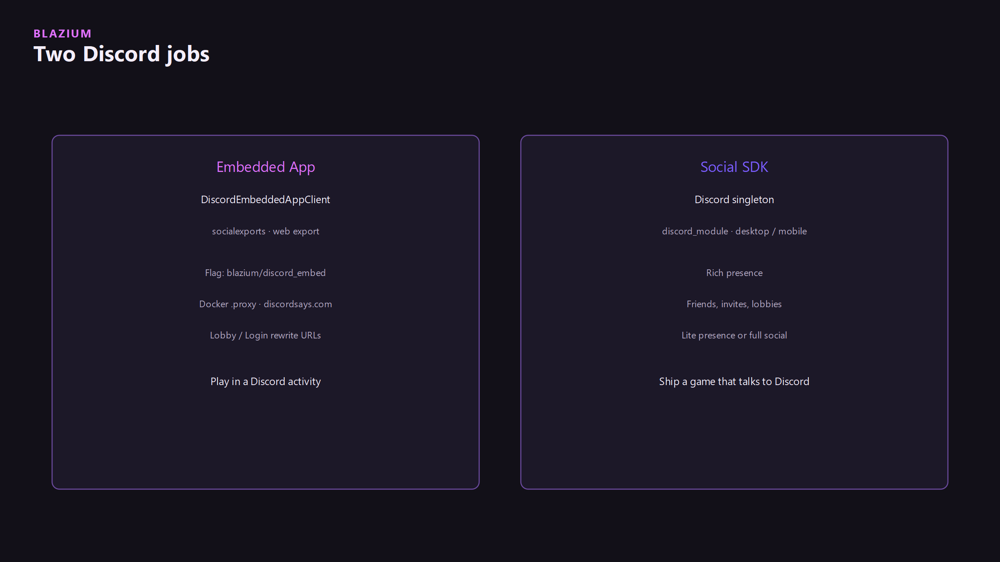
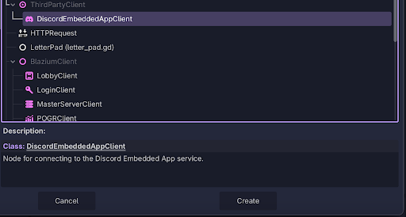
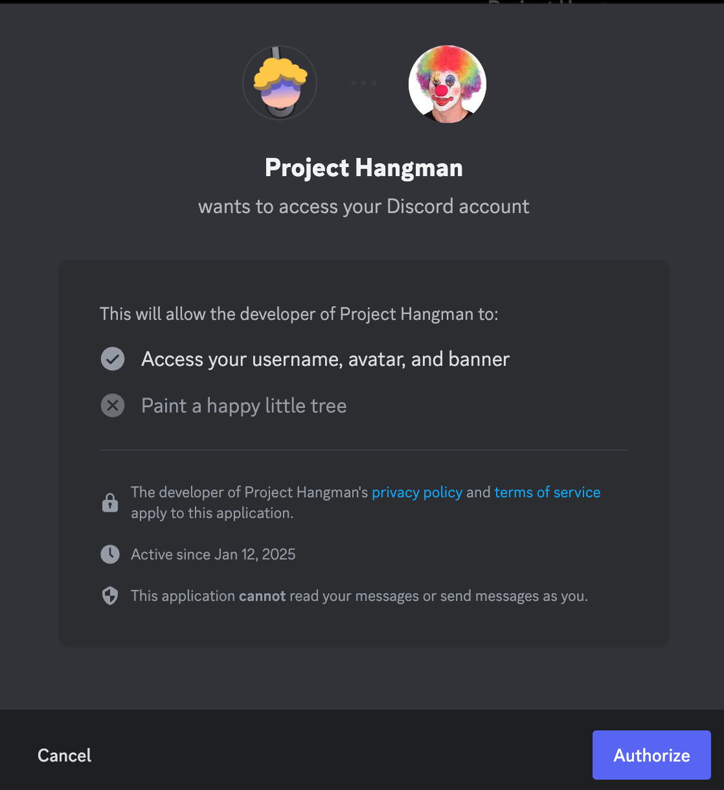

Pick a job first. The APIs are not interchangeable.



| | Embedded App | Social SDK |
|---|---|---|
| Environment | Web, inside Discord | Desktop game |
| Class | `DiscordEmbeddedAppClient` | `Discord` singleton |
| Module | `socialexports` | `discord_module` |
| Export | `Web` preset plus `blazium/discord_embed/enabled` | Ordinary desktop export |
| Auth helper | `authorize` / `authenticate` on the embed client | `authenticate_with_server` returns a JWT |

`socialexports` also registers `YoutubePlayablesClient` and `ReactClient`. Those are the same "third party page" pattern. They are not the Social SDK.

## Embedded Apps

`DiscordEmbeddedAppClient` bridges the Discord Embedded App SDK (the header notes SDK v1.9.0). It is a `Node`. The page has to actually be running inside Discord. `is_discord_environment()` is the check. `is_ready` is the later gate.

Web export writes `{name}.discord.embed.js` when `blazium/discord_embed/enabled` is set, and substitutes `$BLAZIUM_DISCORD_AUTODETECT` from `blazium/discord_embed/autodetect`. Host the export with [Docker web export](../docker-web-export/docker-web-export.md) so Nginx answers `/.proxy/`. In the Discord developer portal, create the application and set the URL mappings to that host.




```gdscript
@export var discord: DiscordEmbeddedAppClient

func _ready() -> void:
    if not discord.is_discord_environment():
        return
    var ready: DiscordEmbeddedAppResult = await discord.is_ready().finished
    if ready.has_error():
        push_error(ready.error)
        return
    var auth: DiscordEmbeddedAppResult = await discord.authorize("code", "", "none", ["identify", "guilds"]).finished
    if auth.has_error():
        push_error(auth.error)
```

Calls return a `DiscordEmbeddedAppResponse` (or a typed result) and you wait on `finished`. Other methods on the same class: `authenticate`, `get_channel`, `get_entitlements`, `get_instance_connected_participants`, `set_activity`, `open_invite_dialog`, `open_share_moment_dialog`, `start_purchase`. I am not listing a fake login-service node here. On `blazium-dev` there is no registered `LoginClient`. If the embed needs a session on your server, send the Discord token to your own endpoint.



## Social SDK

`Discord` is a singleton for a desktop (or similar) build, backed by the Discord Social SDK.

- `initialize_presence_only` for rich presence.
- `initialize(client_id)` when you need OAuth: friends, invites, and `authenticate_with_server`.
- `run_callbacks()` pumps the SDK. After `initialize` it also runs once per frame on its own.
- `authenticate_with_server(url, access_token, client_id)` returns `DiscordAuthResult`. `get_jwt()` is the token your backend minted. That JWT tooling is [Identity, Steam, and Xbox](../online-identity-and-stores/online-identity-and-stores.md).
- `create_or_join_lobby(secret)` is a Discord lobby.

```gdscript
func _ready() -> void:
    var err := Discord.initialize(client_id)
    if err != OK:
        push_error(err)
```

`initialize` returns an `Error`. `get_auth_state`, `get_access_token`, and `get_username` are the reads after the player finishes OAuth. `run_callbacks()` is public if you need to pump early. The module also calls it each frame once initialization has started.

## Which one ships

An activity inside the Discord client is the web export, the embed flag, the Docker `.proxy` host, and `DiscordEmbeddedAppClient`. A game installed on a PC that shows Discord presence and invites is `discord_module`. Building both into one desktop binary does not make the embed SDK work, and the embed SDK does not replace `initialize` on desktop.

---

**[Jump into our Discord](https://blazium.app/chat)** for real-time chats, dev support and feedback

Or follow us everywhere else:

- **[GitHub](https://github.com/blazium-games)**
- **[IndieDB](https://www.indiedb.com/engines/blazium-engine)**
- **[X / Twitter](https://x.com/BlaziumGames)**
- **[YouTube](https://www.youtube.com/@blazium)**
- **[itch.io](https://blaziumengine.itch.io)**
