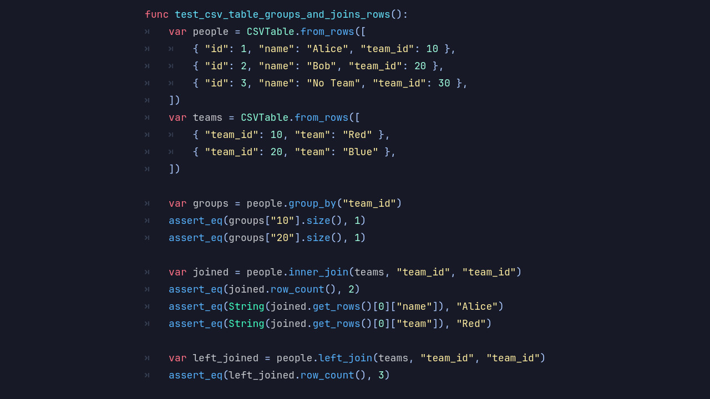

# Introducing the DotCSV Module

**DotCSV** reads and writes CSV files inside **Blazium Engine**.
Game data, config exports, spreadsheet imports: if it is tabular text, DotCSV handles it without pulling in external libraries.

## Key Features

- **Simple CSV Parsing**: Load and parse CSV files into structured arrays with minimal boilerplate.
- **Flexible Delimiters**: Supports custom delimiters beyond commas for different data formats.
- **Read & Write Support**: Generate and save CSV files directly from your project.
- **Type-Friendly Handling**: Works with strings, numbers, and mixed data without cumbersome conversions.
- **Lightweight Design**: Fast execution even with large datasets.
- **Engine-Native Integration**: Works with GDScript and C#, no external dependencies required.
- **Error Handling**: Handles malformed rows, missing values, and edge cases without crashing.

## Why Use DotCSV in Your Blazium Projects?

CSV shows up everywhere in game dev. DotCSV keeps the workflow inside the engine:

- **Data-Driven Design**: Store game balance values, dialogue, localization, or level data in easily editable CSV files.
- **Tooling & Pipelines**: Integrate with spreadsheets or external tools and import data directly into your game.
- **Rapid Iteration**: Designers can tweak values without touching code.
- **Save/Export Systems**: Generate CSV outputs for debugging, analytics, or player-generated content.
- **Interoperability**: CSV remains one of the most widely supported formats for cross-tool data exchange.

From indie prototypes to larger systems, DotCSV keeps data workflows readable and straightforward.

## Documentation & Next Steps

The module is already available in the [latest nightly of Blazium](https://blazium.app/download) and
includes a dedicated test project (see
[dotcsv_module_tests](https://github.com/blazium-games/dotcsv_module_tests)
for examples).

DotCSV brings engine-native CSV handling to Blazium so you can build data-driven systems faster and with less friction.

---

**[Jump into our Discord](https://blazium.app/chat)** for real-time chats, dev support and feedback!

Or follow us everywhere else:

- **[IndieDB](https://www.indiedb.com/engines/blazium-engine/articles)**
- **[X / Twitter](https://x.com/BlaziumGames)**
- **[YouTube](https://www.youtube.com/@blazium)**
- **[itch.io](https://blaziumengine.itch.io)**
