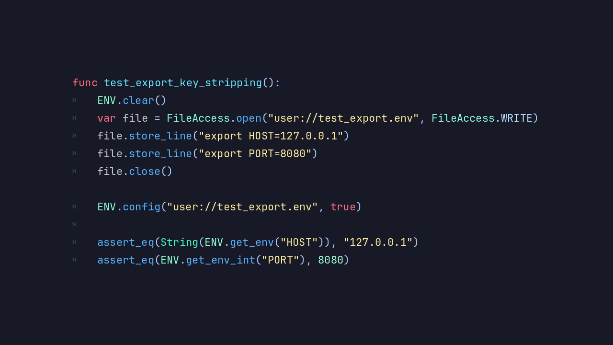

# Introducing the DotENV Module  

**DotENV** loads `.env` files into **Blazium Engine** at runtime.
If you already use the `.env` pattern in web or backend projects, this module works the same way:
keep config out of source code and swap values per environment.

Handy for API keys, feature flags, or anything that changes between dev and production builds.

## Key Features

- **.env File Parsing**: Load key-value pairs from `.env` files into your project at runtime.
- **Environment Separation**: Keep different configs for development, testing, and production.
- **Simple API**: Access variables through a straightforward interface.
- **Secure Configuration Handling**: Keep tokens and credentials out of source code.
- **Lightweight Implementation**: Fast loading with negligible performance impact.
- **Engine-Native Integration**: Works with GDScript and C#, no additional libraries required.
- **Flexible Usage**: Fits small projects and larger multi-service setups alike.

## Why Use DotENV in Your Blazium Projects?

Configuration management is one of those chores every project hits eventually. DotENV keeps it simple:

- **Cleaner Codebase**: Remove hardcoded values and centralize configuration in dedicated `.env` files.
- **Improved Security**: Keep secrets out of your repository and reduce the risk of accidental exposure.
- **Environment Flexibility**: Switch between development and production settings without modifying code.
- **Team-Friendly Workflow**: Developers can maintain their own local configurations without conflicts.
- **Scalable Architecture**: Useful when you have multiple deployment targets or services.
- **Rapid Setup**: Configure new environments or features with minimal setup.

From indie games to larger applications, DotENV helps keep config out of your codebase.

## Documentation & Next Steps

The module is already available in the [latest nightly of Blazium](https://blazium.app/download) and
includes a dedicated test project (see
[dotenv_module_tests](https://github.com/blazium-games/dotenv_module_tests)
for examples).

DotENV brings familiar `.env` configuration handling to Blazium.

---  

**[Jump into our Discord](https://blazium.app/chat)** for real-time chats, dev support and feedback!

Or follow us everywhere else:  

- **[IndieDB](https://www.indiedb.com/engines/blazium-engine/articles)**  
- **[X / Twitter](https://x.com/BlaziumGames)**  
- **[YouTube](https://www.youtube.com/@blazium)**  
- **[itch.io](https://blaziumengine.itch.io)**
