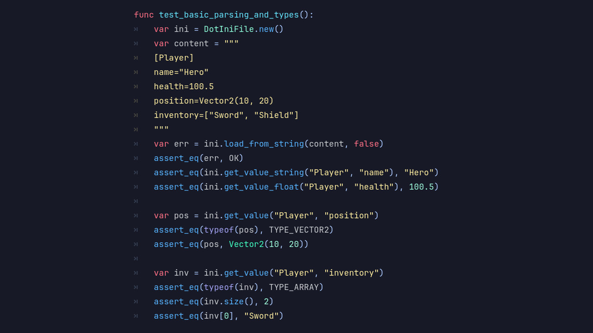
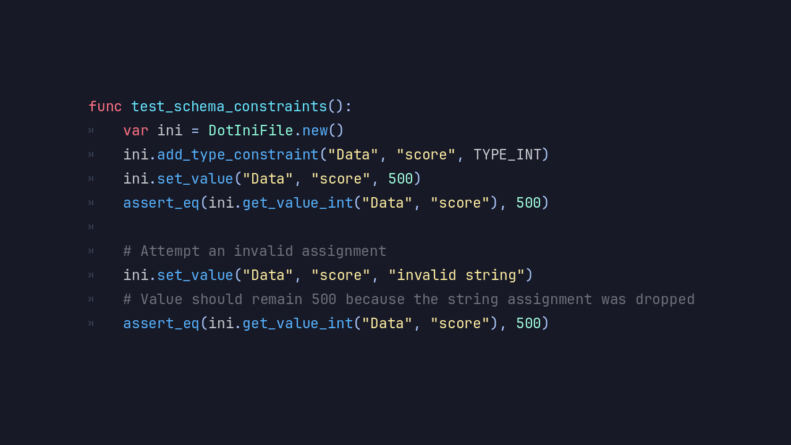

# Introducing the DotINI Module

**DotINI** reads and writes INI files directly in **Blazium Engine**.
INI has been around forever for config files, and DotINI makes it feel native to the engine.
No external libraries, no custom parser to maintain.

Use it for settings, user preferences, or any structured data that fits the section/key format.

## Key Features

- **Simple INI Parsing**: Load `.ini` files into structured sections and key-value pairs.
- **Section-Based Organization**: Group data with INI sections for readable config files.
- **Read & Write Support**: Modify and save INI files from your project.
- **Type-Friendly Values**: Handles strings, numbers, and booleans without extra conversion code.
- **Lightweight & Fast**: Low overhead, even when you read and write often.
- **Engine-Native Integration**: Works with GDScript and C#, no external dependencies.
- **Graceful Error Handling**: Handles missing sections, duplicate keys, and malformed lines.

## Why Use DotINI in Your Blazium Projects?

DotINI fits anywhere you need structured configuration:

- **Game Settings & Preferences**: Store player settings such as audio levels, controls, or graphics options.
- **Configuration Files**: Manage engine or project-level settings in a clean, human-readable format.
- **Modding Support**: Let users tweak gameplay values or configurations without specialized tools.
- **Save Metadata**: Store lightweight structured information alongside save files.
- **Rapid Iteration**: Tweak values without recompiling or touching core logic.

INI files are easy to read, edit, and version-control. That makes DotINI practical for both developers and designers.

## Documentation & Next Steps

The module is already available in the [latest nightly of Blazium](https://blazium.app/download) and
includes a dedicated test project (see
[dotini_module_tests](https://github.com/blazium-games/dotini_module_tests)
for examples).

DotINI gives you straightforward, engine-native config handling in Blazium.

---

**[Jump into our Discord](https://blazium.app/chat)** for real-time chats, dev support and feedback!

Or follow us everywhere else:

* **[IndieDB](https://www.indiedb.com/engines/blazium-engine/articles)**
* **[X / Twitter](https://x.com/BlaziumGames)**
* **[YouTube](https://www.youtube.com/@blazium)**
* **[itch.io](https://blaziumengine.itch.io)**
