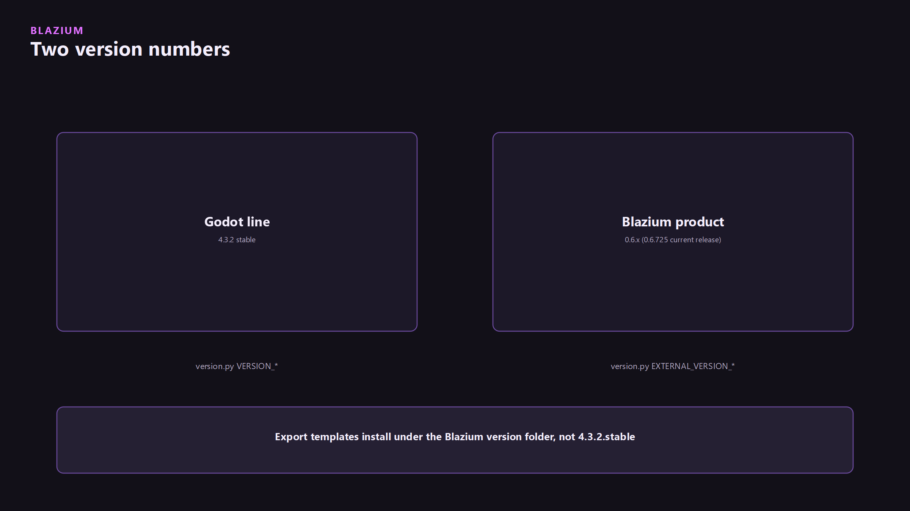
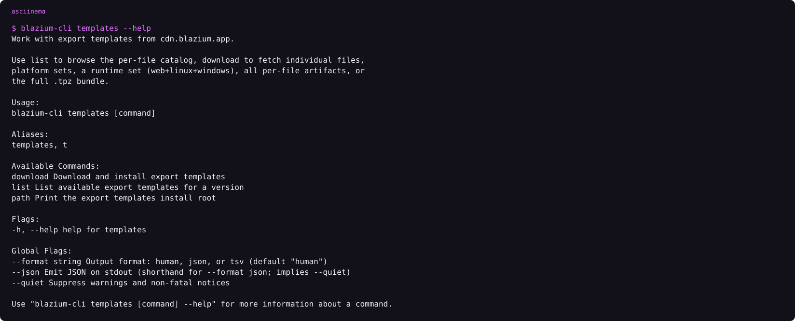
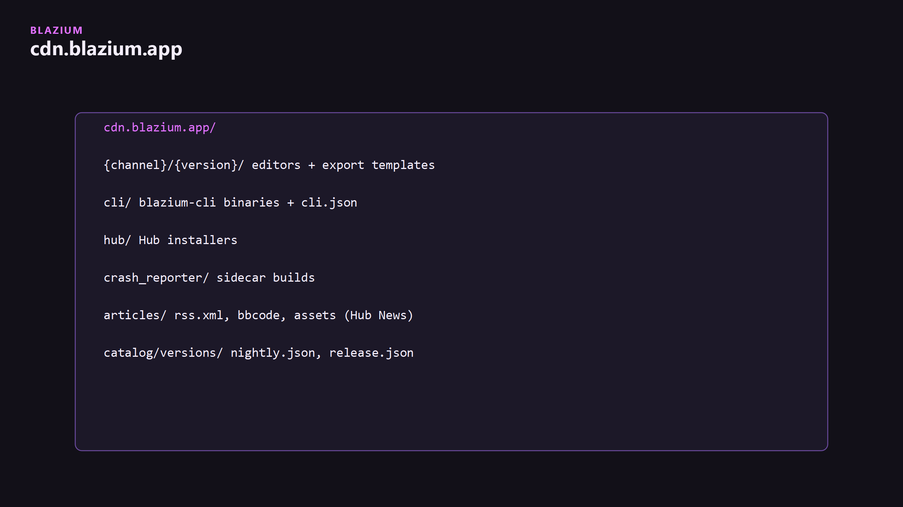

The template manager keys off Blazium `0.6.x`. It does not look in a `4.3.2.stable` folder. That mismatch is why exports say templates are missing after a Godot-style install.



## What a template is

Per platform: `template_debug` and `template_release`. Optional Mono variants. Web extras: Discord embed, YouTube Playable, gzip WASM. See [Discord on Blazium](../discord-on-blazium/discord-on-blazium.md).

## CLI

```text
blazium-cli install 0.6.725 --templates
blazium-cli templates list
blazium-cli templates download 0.6.725 --tpz
```

Resolution order for individual template files:

1. `https://cdn.blazium.app/{channel}/{version}/template_files.json`
2. `…/templates.json` (legacy)
3. `…/details.json`
4. `GET /api/v1/templates/{deploy_type}/{version}` on blazium.app (`BLAZIUM_CEREBRO_URL` overrides the base)


<!-- ASCIINEMA: assets/cli-templates-help.cast | blazium-cli templates --help -->

<!-- ASCIINEMA: assets/cli-templates-list.cast | blazium-cli templates list -->
<!-- CAPTURE: record with asciinema rec assets/cli-templates-list.cast -->

## Editor

Export Template Manager in the editor. Export dialog. Web preset checkboxes live under the web export:

- `blazium/discord_embed`
- `blazium/youtube_playable`

<!-- CAPTURE: assets/template-manager.png | Editor | Export Template Manager, Blazium version in the path -->
<!-- CAPTURE: assets/web-export-flags.png | Editor | Web export: Discord embed and YouTube Playable checkboxes -->
<!-- CAPTURE: assets/cover.png | Editor | Replace with Export dialog, web preset, those flags visible -->

## CDN layout



| Prefix | Contents |
|---|---|
| `/{channel}/{version}/` | Editors + templates |
| `/cli/` | CLI binaries + `cli.json` |
| `/hub/` | Hub installers |
| `/crash_reporter/` | Sidecar |
| `/articles/` | Hub News (`rss.xml`, bbcode, assets) |
| `/catalog/versions/` | `nightly.json`, `release.json` |

Hub catalogs and News are CDN only. Cerebro publishes into that bucket from CI. Hub never calls Cerebro at runtime.

## One export

Install templates for the same Blazium version as the editor, then Export. If the editor is `0.6.725` and templates landed under `4.3.2`, start over with `blazium-cli install 0.6.725 --templates`.
