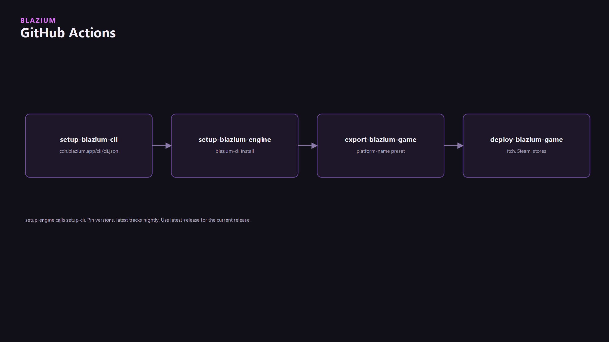
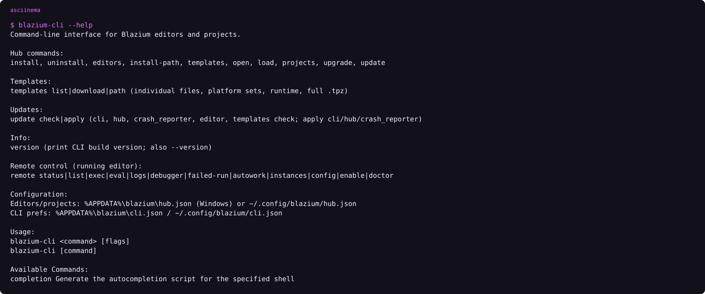

Four Actions. They live in this ecosystem checkout under `github_actions/`. CI talks to the CDN through [blazium-cli](../blazium-cli/blazium-cli.md).



| Action | Folder | Job |
|---|---|---|
| Setup Blazium CLI | `github_actions/setup-blazium-cli` | Download CLI from `cdn.blazium.app/cli/cli.json` onto PATH |
| Setup Blazium Engine | `github_actions/setup-blazium-engine` | `blazium-cli install`, optional `--templates` |
| Export Blazium Game | `github_actions/export-blazium-game` | Export a project. `platform-name` must match an editor export preset |
| Deploy Blazium Game | `github_actions/deploy-blazium-game` | Push an already-exported artifact (Docker, itch, Play Store, iOS/macOS stores, Steam) |

Published names: `blazium-games/setup-blazium-cli@v0.2.1`, `blazium-games/setup-blazium-engine@v0.3.0`. Export/deploy reusable workflows are still referenced from the older `blazium-engine/` org in some READMEs. Pin what you actually run.


<!-- ASCIINEMA: assets/cli-help.cast | blazium-cli --help -->

## Minimal workflow

```yml
name: export
on: [push]
jobs:
  linux:
    runs-on: ubuntu-latest
    steps:
      - uses: actions/checkout@v4
      - uses: blazium-games/setup-blazium-engine@v0.3.0
        with:
          version: latest-release
          download_template: true
      - name: Autowork
        run: Blazium --headless --path . -s run_tests.gd
      - uses: blazium-engine/export-blazium-game@master
        with:
          blazium-version: latest-release
          game-name: MyGame
          platform-name: Linux x86_64
```

`setup-blazium-engine` calls `setup-blazium-cli` for you.

## Version pins

| Input | Meaning |
|---|---|
| `0.6.725` | That release |
| `latest-release` | Current release channel |
| `nightly` / `latest` / `latest-nightly` | Nightly channel |
| `0.6.751-nightly` | That nightly |
| `latest-0.6` | Highest 0.6.x across nightly + release |
| `lts` | LTS alias |

`latest` on setup-engine tracks **nightly**. If you wanted a release, say `latest-release`. Same trap as [export templates](../export-templates-and-cdn/export-templates-and-cdn.md): Blazium `0.6.x`, not Godot `4.3.2`.

CLI-only:

```yml
- uses: blazium-games/setup-blazium-cli@v0.2.1
- run: blazium-cli install 0.6.725 --templates --json
```

Empty `version` on setup-cli uses `latest` from `cli.json`.

## Export

`platform-name` must match the export preset name in the editor (examples: `Linux x86_64`, `Windows Desktop x86_64`, `Web`, `Android`, `macOS`, `iOS`). The action rewrites `export_presets.cfg`. Signing secrets are optional until you export Apple or Android store builds. Steam: `store-name: steam` plus `steam-app-id`.

## Deploy

Runs on an artifact from export. Targets documented in `github_actions/deploy-blazium-game/README.md`: Docker registry, itch.io, Play Store, iOS App Store, macOS App Store, Steam. Do not paste secrets into the article. Name the kinds: Apple certs, Android keystore, butler credentials, Docker token, Steam.

## Autowork in CI

```text
Blazium --headless --path . -s run_tests.gd
```

Or, if an editor is up with remote_control: `blazium-cli remote autowork run --wait`. See [Drive the editor](../remote-control-and-mcp/remote-control-and-mcp.md).

<!-- CAPTURE: assets/cover.png | GitHub | Green Actions run, export job -->
<!-- CAPTURE: assets/workflow-yml.png | GitHub | Workflow file in the GitHub UI (YAML is also fenced above) -->
<!-- CAPTURE: assets/setup-cli-log.png | GitHub | setup-blazium-cli step log -->
<!-- CAPTURE: assets/export-artifacts.png | GitHub | Uploaded zip / apk / web artifacts -->
