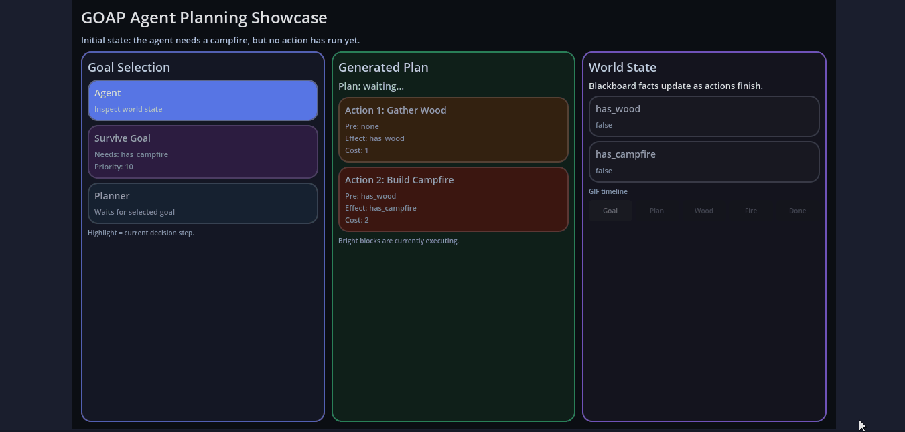
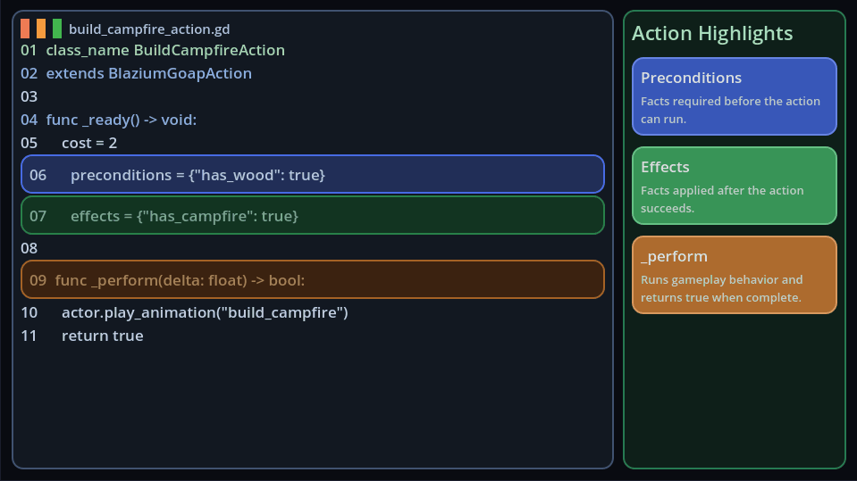

# Introducing the GOAP Module

Blazium Game Engine now includes a native **GOAP** module for building flexible, goal-driven AI directly inside your projects.
Goal-Oriented Action Planning lets an agent decide what it wants to accomplish, inspect the current world state,
and build a sequence of actions that moves the game toward that goal.

The module exposes a small set of focused engine classes, including `BlaziumGoapAgent`,
`BlaziumGoapGoal`, `BlaziumGoapAction`, `BlaziumGoapWorldState`, and `BlaziumGoapActionPlanner`.
Together they provide a scene-friendly workflow where designers and programmers can organize goals and actions as nodes,
define preconditions and effects with dictionaries, and let the planner choose the lowest-cost valid path at runtime.

## Key Features

- **Native Goal-Oriented Planning**: Built into the engine as a C++ module, giving projects a ready-to-use
planning layer without external plugins.
- **Scene-Based Workflow**: Add a `BlaziumGoapAgent` to your actor, point it at goal and action containers,
and keep AI behavior organized in the scene tree.
- **Dictionary World State**: Use `BlaziumGoapWorldState` as a shared blackboard for facts like inventory,
health, resources, nearby targets, or tactical conditions.
- **Cost-Aware Action Selection**: Assign costs to actions and priorities to goals so the planner can choose
efficient plans instead of only following hard-coded behavior trees.
- **Dynamic GDScript Hooks**: Override methods such as `_is_valid`, `_get_cost`, `_get_priority`,
`_prepare_action`, `_enter`, `_perform`, and `_exit` to adapt plans to live gameplay.
- **Replanning and Failure Handling**: React when goals become invalid, actions fail, or the world changes before a plan completes.
- **Signals and Debugging Tools**: Track goal, plan, and action changes through signals, enable `debug_enabled`,
and inspect GOAP activity with the editor debugger panel.

## Why Add GOAP to Your Blazium Project?

GOAP is useful when an AI character needs to respond to changing conditions without every possible decision being scripted by hand.
Instead of writing a fixed chain like "find wood, walk to fire pit, light fire," you describe the desired state and
the actions that can create it.
The planner then works out which actions are currently possible and how expensive each route is.

**For Games**
- **Adaptive NPC behavior**: Let characters choose between gathering, fleeing, healing, fighting, crafting,
or searching based on the current world state.
- **Emergent enemy AI**: Give enemies multiple ways to reach the same objective, such as flanking, reloading,
calling allies, or retreating when conditions change.
- **Survival and simulation systems**: Model needs like hunger, warmth, shelter, safety, and inventory as
goals and let agents plan around available actions.
- **Companion and squad AI**: Build helpers that can prioritize supporting the player, collecting items,
defending positions, or completing objectives.
- **Readable AI debugging**: Inspect which goal was selected, which plan was produced, and why an action is currently running.

**For Applications & Tools**
- Prototype planning systems for robotics, automation, simulations, or training scenarios.
- Build development tools that visualize decision-making and compare possible action paths.
- Use the planner as a lightweight automation layer for non-character systems that still need goal-driven behavior.

Because goals, actions, and world facts are exposed through engine objects and dictionaries, teams can start
simple and add complexity gradually.
A small prototype can use fixed preconditions and effects, while a larger project can compute costs, validity,
and action preparation dynamically from gameplay data.

## Documentation & Next Steps

The module is already available in the [latest nightly of Blazium](https://blazium.app/download) and
includes a dedicated test project (see
[goap_module_tests](https://github.com/blazium-games/goap_module_tests)
for examples).

For full technical details head over to the official **Blazium Documentation** at [docs.blazium.app](https://docs.blazium.app).

Whether you are building smarter NPCs, systemic simulations, or inspectable AI tools, the GOAP module gives Blazium projects a native planning foundation that fits naturally into the engine workflow.

---

**[Jump into our Discord](https://blazium.app/chat)** for real-time chats, dev support and feedback

Or follow us everywhere else:

- **[IndieDB](https://www.indiedb.com/engines/blazium-engine/articles)**
- **[X / Twitter](https://x.com/BlaziumGames)**
- **[YouTube](https://www.youtube.com/@blazium)**
- **[itch.io](https://blaziumengine.itch.io)**
