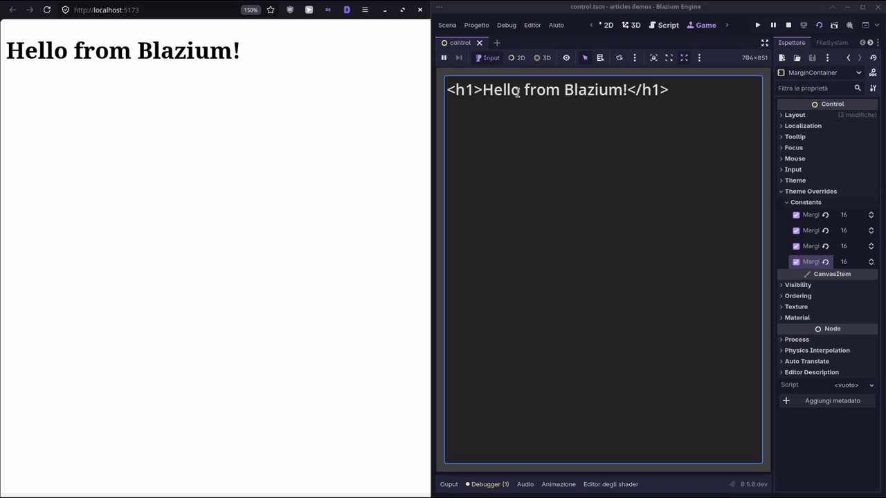
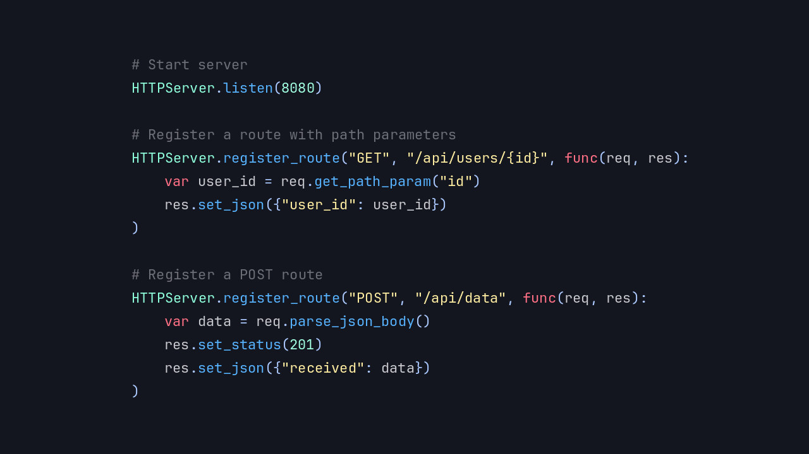

# Introducing the HTTP Server Module

Blazium Game Engine continues to expand its networking capabilities with the **HTTPServer** module.
This native C++ implementation brings a lightweight, high-performance HTTP server directly into the engine,
allowing developers to serve web content, handle API requests, stream real-time updates, and more,
all from within your Blazium project.

The module exposes easy-to-use nodes and classes (including `HTTPServer` and related request/response helpers)
that work with Blazium's scene system and GDScript/C# scripting. It supports standard
HTTP methods, custom routing, response generation, and advanced features like **Server-Sent Events (SSE)**
for push-style real-time communication.

## Key Features

- **Native Performance**: Implemented in C++ and built into the engine for low overhead and high
concurrency, suitable for both development tools and deployed applications.
- **Full HTTP Request/Response Handling**: Process GET, POST, PUT, DELETE, and other methods with
easy access to headers, query parameters, body data, and JSON support.
- **Routing Capabilities**: Define custom routes and handlers for different endpoints directly in your scripts.
- **Server-Sent Events (SSE)**: Built-in `SSEConnection` support for efficient one-way real-time
data streaming (ideal for live updates, logs, or status feeds).
- **Static File Serving**: Serve HTML, CSS, JavaScript, images, and other assets directly from
your project or external directories.
- **SSL/TLS Ready**: Secure your server with HTTPS support using Blazium's existing SSL infrastructure.
- **Headless-Friendly**: Good for running dedicated servers, tools, or backend services without a graphical window.
- **Deep Engine Integration**: Use signals for request events, combine with other Blazium modules, and use the editor for rapid prototyping.

## Possible Uses in Games and Applications

The HTTP Server module supports many practical scenarios:

**For Games**
- **In-game web dashboards**: Create admin panels, live stats viewers, or debug tools accessible via
browser while the game runs.
- **Real-time multiplayer features**: Use SSE to push game state updates, scores, or events to
connected web clients or companion apps.
- **Modding & Content Delivery**: Serve custom mods, levels, or assets directly from the game executable.
- **Twitch/External Integrations**: Expose internal game data via simple REST APIs for overlays, bots, or third-party services.
- **Local Co-op Tools**: Run a local web server so players on the same network can join via browser-based interfaces.

**For Applications & Tools**
- Build lightweight web servers for configuration UIs, monitoring dashboards, or data exporters.
- Create RESTful APIs for desktop/mobile tools built in Blazium.
- Develop internal development servers for testing webhooks, callbacks, or frontend prototypes side-by-side with your game logic.
- Prototype full-stack experiences where the game engine doubles as both client and server.

Because it runs natively and supports headless mode, it's also excellent for dedicated game servers or CI/CD pipelines.

## Documentation & Next Steps

The module is already available in the [latest release of Blazium](https://blazium.app/download) and
includes a dedicated test project (see
[httpserver_module_tests](https://github.com/blazium-games/httpserver_module_tests)
for examples).

For full technical details head over to the official **Blazium Documentation** at [docs.blazium.app](https://docs.blazium.app).

The HTTP Server module joins other recent networking additions to make Blazium an even more
versatile engine for both games and tools.

---

**[Jump into our Discord](https://blazium.app/chat)** for real-time chats, dev support and feedback

Or follow us everywhere else:

- **[IndieDB](https://www.indiedb.com/engines/blazium-engine/articles)**
- **[X / Twitter](https://x.com/BlaziumGames)**
- **[YouTube](https://www.youtube.com/@blazium)**
- **[itch.io](https://blaziumengine.itch.io)**
- **[Patreon](https://www.patreon.com/cw/Blazium)**
