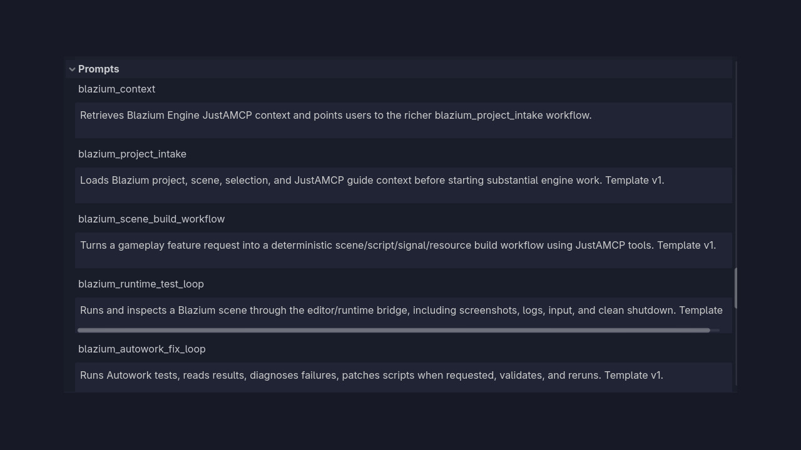
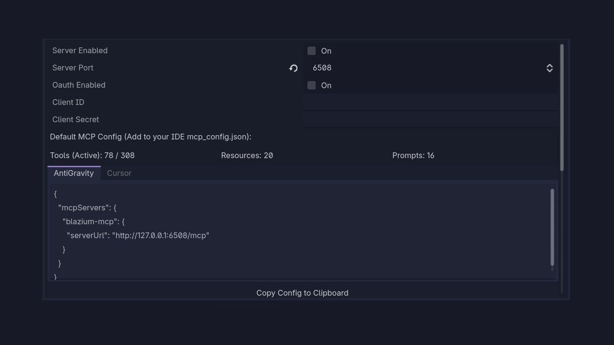

# Introducing the MCP Module

The new **JustAMCP** module brings the Model Context Protocol directly into the Blazium editor.
AI agents and automation tools can inspect scenes, edit scripts, browse resources, and query
documentation through a native MCP server. No external bridge required.

The module centers on `JustAMCPServer` for transport, `JustAMCPToolExecutor` for dispatch, and
dozens of specialized tool groups covering scenes, scripts, shaders, tilemaps, themes, and more.
`JustAMCPRuntime` keeps a local endpoint running even as you switch between projects and scenes.

## Key Features

- **Native MCP Server**: Streamable HTTP transport with protocol capabilities, pagination, logging, and async task support.
- **Tool Executor**: Central dispatch to scene, script, resource, documentation, networking, and analysis tool groups.
- **Editor Integration**: Tools operate on the active scene tree, inspector, and filesystem through validated editor APIs.
- **Runtime Endpoint**: `JustAMCPRuntime` exposes a configurable port for headless or in-game automation.
- **Task Manager**: Async MCP tasks with status notifications and result retrieval for long-running operations.
- **Contract Validation**: Full tool schema catalog with dispatch and settings tests in the Autowork suite.

## Why use MCP in Your Blazium Project?

Agent-driven workflows become a native part of the editor instead of a fragile sidecar:

**For Developers**
- **Scene automation**: Let agents create nodes, read properties, and modify the scene tree safely.
- **Script assistance**: Validate, read, and update GDScript files with structured tool responses.
- **Resource management**: Browse and update themes, shaders, tilemaps, and other project resources.

**For Tooling & Pipelines**
- Wire CI or local agents into the editor without custom socket protocols.
- Forward engine logs through MCP for unified debugging during agent sessions.

## Documentation & Next Steps

The module is available in the [latest nightly of Blazium](https://blazium.app/download) and
includes a dedicated test project (see
[justamcp_module_tests](https://github.com/blazium-games/justamcp_module_tests)
for examples).

---

**[Jump into our Discord](https://blazium.app/chat)** for real-time chats, dev support and feedback

Or follow us everywhere else:

- **[GitHub](https://github.com/blazium-games)**
- **[IndieDB](https://www.indiedb.com/engines/blazium-engine/articles)**
- **[X / Twitter](https://x.com/BlaziumGames)**
- **[YouTube](https://www.youtube.com/@blazium)**
- **[itch.io](https://blaziumengine.itch.io)**
