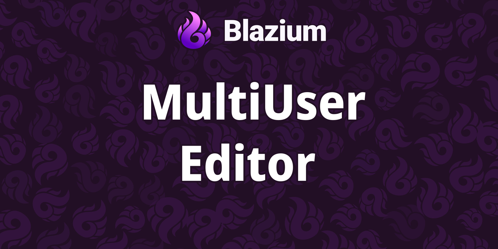

# Introducing the Multiuser Editor Module

The **Multiuser Editor** module brings real-time collaborative editing to the Blazium editor.
Multiple developers can work on the same project at once, syncing scripts, files, and editor state
across the network without leaving the engine.

It is an editor plugin built for teams: host a session, invite peers, assign roles, and watch changes
land as they happen. Ghost cursors, lock management, and a permission matrix keep sessions predictable
even on larger projects.

## Key Features

- **Session Hosting & Joining**: Start or join collaborative sessions directly from the editor dock with port and password support.
- **CRDT Script Sync**: Conflict-free replicated text buffers merge concurrent edits to GDScript files deterministically.
- **Filesystem Sync**: Diff-based file transfer with chunked uploads, rename detection, and safe path validation.
- **Role-Based Permissions**: Host, Editor, and Viewer tiers with override support for fine-grained access control.
- **Ghost Cursor Overlays**: See where remote collaborators are working in the scene and script editors.
- **Security Validation**: Path canonicalization, property name checks, and JWT-backed session authentication.

## Why use Multiuser Editor in Your Blazium Project?

Pair programming and distributed teams get a first-class workflow inside the editor:

**For Teams**
- **Live co-editing**: Two or more developers iterate on scenes and scripts simultaneously.
- **Remote collaboration**: Work across time zones without constant Git push/pull cycles for small changes.
- **Role separation**: Let designers view while engineers edit, or restrict host-only actions to session owners.

**For Studios & Tools**
- Run internal playtest or content review sessions with shared editor access.
- Prototype multiplayer game logic with synchronized script changes.
- Integrate with Autowork for distributed test runs across connected peers.

## Documentation & Next Steps

The module is available in the [latest nightly of Blazium](https://blazium.app/download).

---

**[Jump into our Discord](https://blazium.app/chat)** for real-time chats, dev support and feedback

Or follow us everywhere else:

- **[GitHub](https://github.com/blazium-games)**
- **[IndieDB](https://www.indiedb.com/engines/blazium-engine/articles)**
- **[X / Twitter](https://x.com/BlaziumGames)**
- **[YouTube](https://www.youtube.com/@blazium)**
- **[itch.io](https://blaziumengine.itch.io)**
