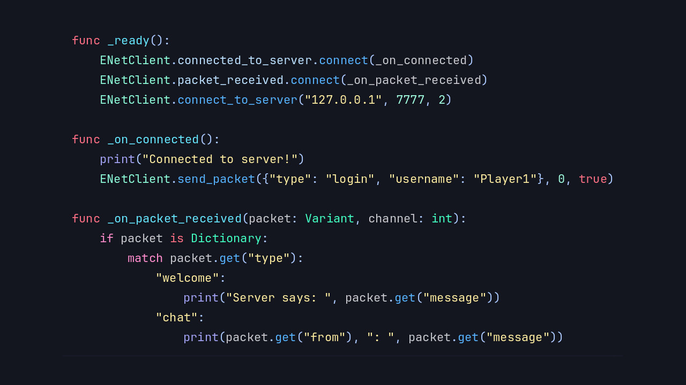
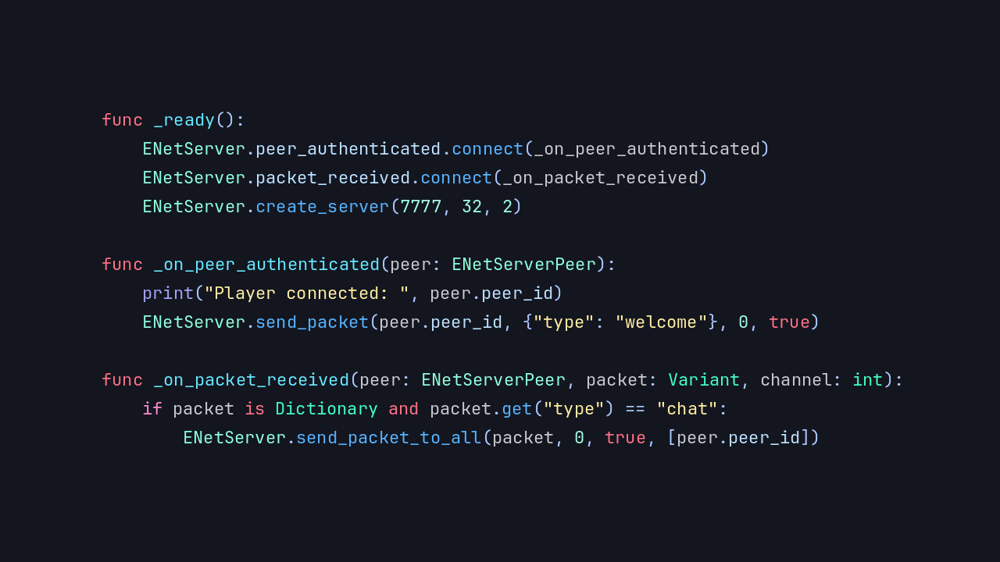

# Introducing the New ENet Module

Blazium Game Engine now features an enhanced **ENet** module with a low-level implementation
separate from Godot's high-level networking system.
This native C++ module provides direct access to the ENet library, giving developers full control
over creating custom ENet hosts, managing peers, and handling packet-level communication.

The module exposes clean, low-level classes such as `ENetServer`, `ENetPeer`, and related helpers.
It integrates with Blazium's scripting system (GDScript or C#) while staying completely independent
of the engine's high-level multiplayer API.

## Key Differences from Godot's Built-in ENet Implementation

Blazium retains the standard Godot-style ENet module, which includes high-level classes like `ENetMultiplayerPeer`,
`ENetConnection`, and `ENetPacketPeer`. This default implementation is tightly coupled with Godot's internal
networking stack (scene replication, RPCs, MultiplayerAPI, etc.).

In contrast, the **new** ENet module is designed for maximum flexibility:

- It allows you to build your own custom ENet protocol and server structure from the ground up.
- It operates **outside** the internal high-level networking system.
- Perfect for connecting directly to third-party ENet-based servers without compatibility headaches or workarounds.
- Gives you raw control over host creation, peer management, packet compression, channels, and event handling.

This makes it ideal when you need to interface with external dedicated servers, custom protocols,
or legacy ENet services that don't align with the standard high-level multiplayer peer model.

## Possible Uses in Games and Applications

The new ENet module opens up advanced networking scenarios:

**For Games**
- Connect to third-party or custom ENet game servers (e.g., dedicated servers written in other
languages or engines) without fighting high-level abstractions.
- Implement highly customized client-server architectures with fine-grained control over reliability, sequencing, and bandwidth.
- Build hybrid networking solutions that combine Blazium's high-level multiplayer with low-level ENet for specific features.
- Create lightweight, high-performance multiplayer backends or proxies.

**For Applications & Tools**
- Develop custom network tools, servers, or bridges that speak native ENet.
- Prototype or integrate with existing ENet-based services and libraries.
- Build dedicated headless servers with full low-level protocol control.

The implementation remains lightweight, performant, and works in both editor and exported builds (including headless mode).

## Documentation & Next Steps

The module is already available in the [latest release of Blazium](https://blazium.app/download) and
includes a dedicated test project (see
[enet_module_tests](https://github.com/blazium-games/enet_module_tests)
for examples).

For full technical details head over to the official **Blazium Documentation** at [docs.blazium.app](https://docs.blazium.app).

Whether you're building a custom multiplayer experience or need to talk to external ENet servers,
the low-level ENet module gives you the control and flexibility you need.

---

**[Jump into our Discord](https://blazium.app/chat)** for real-time chats, dev support and feedback

Or follow us everywhere else:

- **[IndieDB](https://www.indiedb.com/engines/blazium-engine/articles)**
- **[X / Twitter](https://x.com/BlaziumGames)**
- **[YouTube](https://www.youtube.com/@blazium)**
- **[itch.io](https://blaziumengine.itch.io)**
- **[Patreon](https://www.patreon.com/cw/Blazium)**
