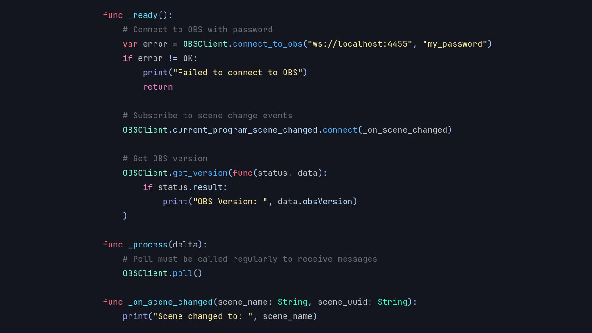
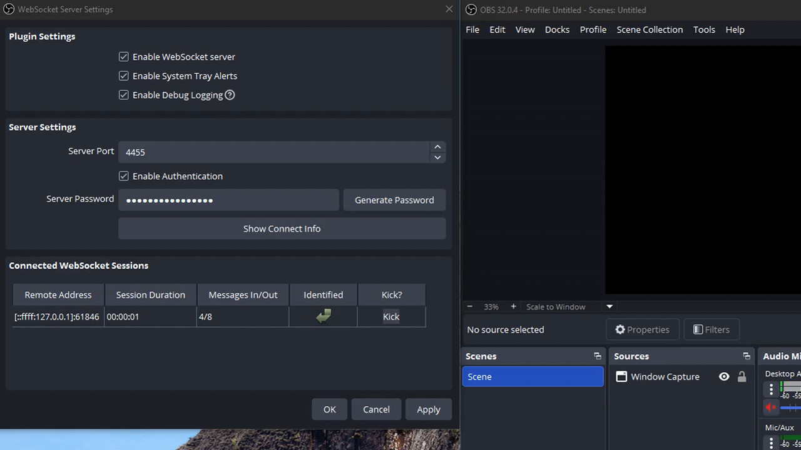

# Introducing the OBS Client Module

Blazium Game Engine adds integration with **OBS Studio** through the **OBS Client** module.
This module lets you connect directly to a running instance of OBS Studio (via its WebSocket protocol) and
control virtually every aspect of your streaming or recording setup from within your Blazium project.

The module provides the `OBSClient` class, which you can use as a singleton or instantiate as needed. It offers a
complete set of tools to manage connections, scenes, sources, streaming, recording, and more, all accessible through
simple method calls and a rich signal system in GDScript or C#.

## Key Features

- **OBS Connection**: Connect to OBS Studio with authentication support and real-time connection state
tracking (disconnected, connecting, identifying, connected).
- **Scene & Source Management**: Get scene lists, switch between program and preview scenes, create/remove scenes,
manage scene items (position, visibility, transform, filters), and control inputs/sources (volume, mute, settings).
- **Streaming & Recording Control**: Start, stop, pause, or toggle streaming and recording. Manage replay buffer,
virtual camera, record file splitting, and chapters.
- **Event Subscriptions**: Subscribe to a wide range of OBS events (scenes, inputs, transitions, outputs, media, UI, etc.)
and receive real-time updates via signals.
- **Request System**: Send individual or batched requests to OBS with optional callbacks for version info, stats,
custom actions, and more.
- **Media & Studio Features**: Control media playback, toggle studio mode, open projectors, and handle filters or
transitions dynamically.

Everything reacts through Blazium's familiar signal system, making it easy to update your in-game UI, trigger events,
or automate your broadcast workflow.

## Possible Uses in Games and Applications

The OBS Client module is especially valuable for content creators, streamers, and interactive experiences:

**For Games**
- **Live streaming integration**: Automatically switch scenes, show/hide game elements, or adjust overlays based on in-game events.
- **Interactive streaming experiences**: Let viewers influence the stream (e.g., change scenes, trigger effects,
or control media) through your game's logic.
- **Debug & development overlays**: Display real-time game stats, performance metrics, or debug info directly in
your OBS scene while testing.
- **Automated broadcast tools**: Create games that manage their own streaming setup, such as starting/stopping
recording during key moments or chapters.

**For Applications & Tools**
- Build custom streaming dashboards, remote controllers, or automation tools entirely in Blazium.
- Create companion apps that monitor and control OBS Studio for multi-PC setups, virtual productions, or live events.
- Develop interactive installations or tools that combine game-like interfaces with professional broadcasting features.

## Documentation & Next Steps

The module is already available in the [latest release of Blazium](https://blazium.app/download) and
includes a dedicated test project (see
[obsclient_module_tests](https://github.com/blazium-games/obsclient_module_tests)
for examples).

For full technical details head over to the official **Blazium Documentation** at [docs.blazium.app](https://docs.blazium.app).

With the OBS Client module, Blazium makes it straightforward to bridge your games and tools with professional streaming workflows.

---

**[Jump into our Discord](https://blazium.app/chat)** for real-time chats, dev support and feedback

Or follow us everywhere else:

- **[IndieDB](https://www.indiedb.com/engines/blazium-engine/articles)**
- **[X / Twitter](https://x.com/BlaziumGames)**
- **[YouTube](https://www.youtube.com/@blazium)**
- **[itch.io](https://blaziumengine.itch.io)**
- **[Patreon](https://www.patreon.com/cw/Blazium)**
