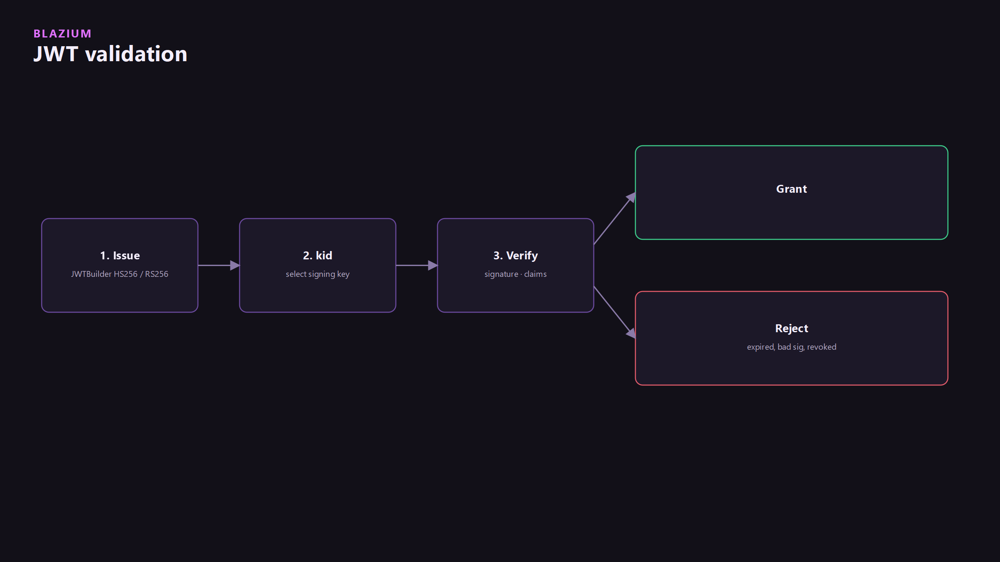
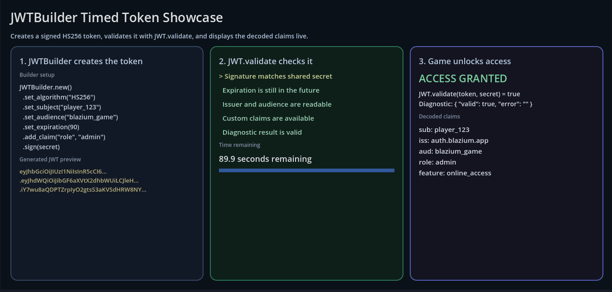
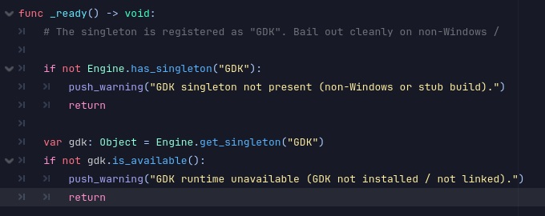

## Why we built it

GodotSteam was removed in 0.5.246. The native `Steam` singleton replaced it for achievements, stats, inventory, web API tickets, and backend auth. `Steam.xml` says the library loads at runtime and methods fail without crashing if it is missing. The 0.6.725 notes add the Discord Social SDK for presence, and the GDK module as Microsoft's kit in the editor with export tooling. Tokens can be built and checked in the engine for backends, multiplayer, and APIs. `JWTBuilder.xml` documents HS256 and RS256. `JWTBuilder` uses `set_issuer`, `set_subject`, `set_algorithm`, `set_expiration`, and `sign`. `JWT.parse` checks a token.

The engine README separates this from the Blazium Games store. That store is Divine Games, Inc. Uploads use `chauffeur`. A game on the store does not have to be made with the engine. The Steam module is not the store uploader.

## What Blazium Games uses it for

Our example game, Hangman, shipped on Steam, Discord, Google Play, and the Apple App Store. Those four storefronts are how store export and deploy were checked end to end. That does not say the Steam build called `Steam.initialize`, or that the Apple build called `GDK.initialize`, or that any of them called `JWTBuilder`.

Blazium Games used the Steam module, the Discord Social SDK, GDK, and JWT in-house to validate tickets and backend auth, desktop presence, Xbox init, and token signing. The Blazium Games store upload path is still `chauffeur`, not these modules.

## What other projects get

Steamworks calls stay in-engine, including a ticket exchange that returns a JWT from your backend. Discord desktop auth is the Social SDK, not the Embedded App client. Xbox stays off unless the template was built with `module_xbox_module_enabled=yes`. Leaderboard methods are not on the Steam singleton. [blazium#807](https://github.com/blazium-games/blazium/issues/807) asks for them.

A store ticket or an OAuth code is not a session. Turn it into a JSON Web Token (JWT), then check it on your backend. The engine pieces on `blazium-dev` are `modules/jwttool`, `modules/steam`, `modules/discord_module`, and `modules/xbox_module`.

## Status

JWT, Steam, and Discord desktop auth are in the tree and build with the engine. `xbox_module` is off unless SCons gets `module_xbox_module_enabled=yes`. The stable script surface is `GDK` in the class reference (`initialize`, `shutdown`, `is_available`, `is_initialized`, `dispatch`). C++ getters for users, achievements, stats, leaderboards, store, and presence are in `modules/xbox_module/gdk/gdk.h`. Most of those sub-objects have no class-reference XML yet. Read the header before calling them. `EditorExportPlatformXbox` needs a GDK install on the machine. This is not a retail console-kit guide. Signed-in tests need `LIVE_TESTS=1`.

Steam on `blazium-dev` covers `initialize`, achievements, stats, inventory, workshop items, and `authenticate_with_server`. It does not expose Steam leaderboards. [blazium#807](https://github.com/blazium-games/blazium/issues/807) asks for `ISteamUserStats` leaderboard calls. That issue is open. The methods are not in `modules/steam`.

`LoginClient`, `LobbyClient`, and `MasterServerClient` are not registered. Script templates with those names are still under `modules/gdscript/editor/script_templates/` and will not run. GodotSteam was removed in 0.5.246. Achievements, stats, and inventory are methods on the `Steam` singleton after `Steam.initialize(app_id)`. `request_web_api_ticket` emits `web_api_ticket_ready`. `authenticate_with_server` is synchronous and returns `SteamAuthResult`. Engine docs: [docs.blazium.app](https://docs.blazium.app).




## JWT

`JWT` is the singleton. `JWTBuilder` constructs a token. `DecodedJWT` reads one. Algorithms documented on the class are HS256 and RS256. `kid` is the header key id. `JWT.validate_with_map` picks the key by that `kid`. Expiry is `set_expiration(seconds_from_now)` on the builder, and `is_expired` / `validate_timing(jwt, leeway_seconds)` on the way in. `revoke_jti` / `is_revoked` / `clear_revoked` are the in-process revocation list.

The builder example in `JWTBuilder.xml`:

```gdscript
var builder := JWTBuilder.new().set_issuer("auth.local").set_subject(user_id)
builder.set_algorithm("HS256")
builder.set_expiration(3600)
var token := builder.sign(secret)
var decoded := JWT.parse(token)
print(decoded.get_claim_as_string("sub"))
if decoded.is_expired():
    return
```

`sign` takes a `String` secret for HS256 or a `CryptoKey` for RS256. `JWT.create_jwt_timed` is deprecated. Use the builder.



This page does not stand up a login server. It is the token the game already has, and how Steam or Discord can exchange a platform ticket for one.

## Steam

Native `Steam` singleton in `modules/steam`. GodotSteam was removed in 0.5.246. `initialize(app_id)` returns an `Error`. `480` is Spacewar, Steam's test app id.

```gdscript
func _ready() -> void:
    if Steam.initialize(480) != OK:
        push_warning("Steam unavailable")
        return
    Steam.web_api_ticket_ready.connect(_on_ticket)
    Steam.request_web_api_ticket("blazium")

func _on_ticket(hex_ticket: String, auth_ticket_handle: int) -> void:
    var result := Steam.authenticate_with_server(backend_url, hex_ticket, 480)
    if result.is_success():
        print(result.get_jwt().length())
    Steam.cancel_auth_ticket(auth_ticket_handle)
```

`authenticate_with_server(url, ticket, app_id)` is the call that comes back as `SteamAuthResult` (`get_jwt()`, `get_steam_id()`, `get_persona()`, `is_success()`). `cancel_auth_ticket` drops a handle you no longer need. Achievements, stats, and inventory are the rest of the same singleton, after `Steam.initialize(app_id)`. App id `480` is Spacewar, the usual local test id.

## Discord desktop login

Separate from an embedded activity. `Discord.initialize(client_id)` is the full OAuth path (friends, invites, server auth). `initialize_presence_only` is rich presence without that. `authenticate_with_server(url, access_token, client_id)` returns a `DiscordAuthResult` whose `get_jwt()` is the session your backend issued. `create_or_join_lobby(secret)` is a Discord SDK lobby, not a Blazium HTTP service.

Embedded activities use `DiscordEmbeddedAppClient` on a `Web` export with `blazium/discord_embed/enabled`, not the desktop `Discord` singleton. `is_discord_environment()` checks that the page is inside Discord. `authorize` takes the scope as an Array.

## GDK / Xbox

`xbox_module` is off unless you pass `module_xbox_module_enabled=yes`. The class reference singleton is `GDK` (`initialize(config)`, `shutdown`, `is_available`, `is_initialized`, `dispatch`). C++ also exposes getters for users, achievements, stats, leaderboards, store, presence, and related Xbox Live surfaces (`modules/xbox_module/gdk/gdk.h`). Those sub-objects are real. Most of them do not have class-reference XML yet, so treat `GDK.xml` as the stable surface and read the headers before you call further.

The export platform is `EditorExportPlatformXbox`. A GDK install has to be on the machine (`gdk_path`, or `GameDKCoreLatest` / `GameDKLatest`). This page does not describe a retail console kit.



Tests in the module can require `LIVE_TESTS=1` for signed-in Xbox Live calls. Packaging checks run without that.

## Networking that compiles

Matchmaking you can compile on `blazium-dev` is `ENetServer` / `ENetClient`, `SignalClient` plus `WebRTCEnetSession` in `games_enet_webrtc`, or `Discord.create_or_join_lobby`. The missing login and lobby classes are in Status. They are not a later section of this page.

---

**[Jump into our Discord](https://blazium.app/chat)** for real-time chats, dev support and feedback

Or follow us everywhere else:

- **[GitHub](https://github.com/blazium-games)**
- **[IndieDB](https://www.indiedb.com/engines/blazium-engine)**
- **[X / Twitter](https://x.com/BlaziumGames)**
- **[YouTube](https://www.youtube.com/@blazium)**
- **[itch.io](https://blaziumengine.itch.io)**
