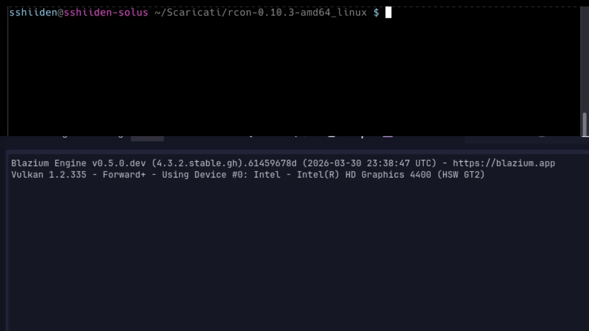
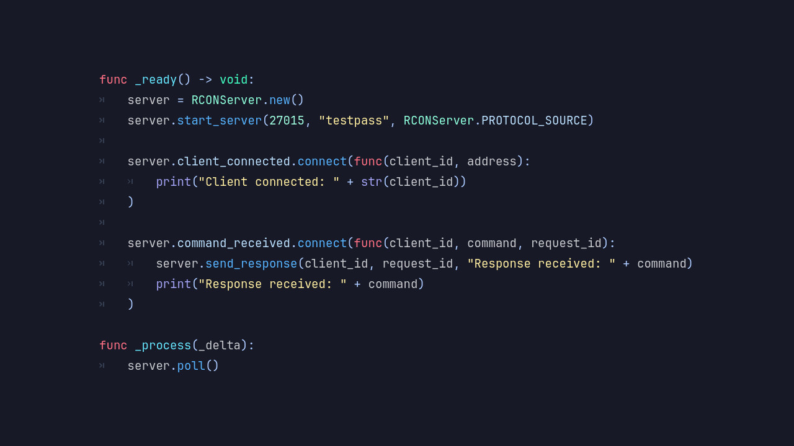

# Introducing the RCON Module

Blazium Game Engine adds another networking tool with the **RCON** module.
This native C++ implementation provides both **RCON Client** and **RCON Server** capabilities, enabling
remote administration and control of games and applications using the widely adopted RCON (Remote Console) protocol.

The module registers easy-to-use classes with the engine, including `RCONClient` and `RCONServer`,
along with supporting packet handling (`RCONPacket`). It fits into Blazium's
node-based architecture and scripting system (GDScript or C#), allowing developers to send commands,
receive responses, and manage remote connections with minimal overhead.

## Key Features

- **Full RCON Protocol Support**: Implements the standard Source RCON protocol
(commonly used by Valve games and many dedicated servers) for authentication, command execution, and multi-packet responses.
- **Client & Server Sides**: Connect as a client to existing RCON-enabled servers or run your own
RCON server inside a Blazium project.
- **Native Performance**: Written in C++ with low-level packet handling for reliable, efficient communication.
- **Deep Engine Integration**: Exposes signals for connection events, command responses, and
authentication results. Works in both editor and exported builds, including headless mode.
- **Packet Management**: Handles RCON packets, including size, ID, type, and body data.

## Possible Uses in Games and Applications

The RCON module is particularly valuable for multiplayer and server-based projects:

**For Games**
- **Remote server administration**: Connect to your dedicated game servers (e.g., for Source-engine
titles or custom servers) to issue console commands, change maps, kick/ban players, or adjust settings
from within a Blazium tool or in-game admin panel.
- **Live game management tools**: Build browser-like or desktop admin dashboards that control running game servers in real time.
- **Automated server monitoring**: Create bots or tools that periodically query server status,
player lists, or performance metrics via RCON.
- **In-game remote commands**: Allow authorized players or developers to execute limited commands on a running game instance.

**For Applications & Tools**
- Develop full-featured RCON clients or management utilities entirely in Blazium.
- Integrate remote control into multiplayer backends, dev tools, or community management software.
- Prototype or extend support for games and services that expose RCON interfaces.
- Run lightweight RCON servers inside Blazium applications for custom remote access needs.

Combined with other Blazium networking modules, it enables rich hybrid admin and monitoring solutions.

## Documentation & Next Steps

The module is already available in the [latest release of Blazium](https://blazium.app/download) and
includes a dedicated test project (see
[rcon_module_tests](https://github.com/blazium-games/rcon_module_tests)
for examples).

For full technical details head over to the official **Blazium Documentation** at [docs.blazium.app](https://docs.blazium.app).

Whether you're managing dedicated game servers or building remote administration tools, the RCON module brings battle-tested remote console capabilities straight into Blazium.

---

**[Jump into our Discord](https://blazium.app/chat)** for real-time chats, dev support and feedback

Or follow us everywhere else:

- **[IndieDB](https://www.indiedb.com/engines/blazium-engine/articles)**
- **[X / Twitter](https://x.com/BlaziumGames)**
- **[YouTube](https://www.youtube.com/@blazium)**
- **[itch.io](https://blaziumengine.itch.io)**
- **[Patreon](https://www.patreon.com/cw/Blazium)**
