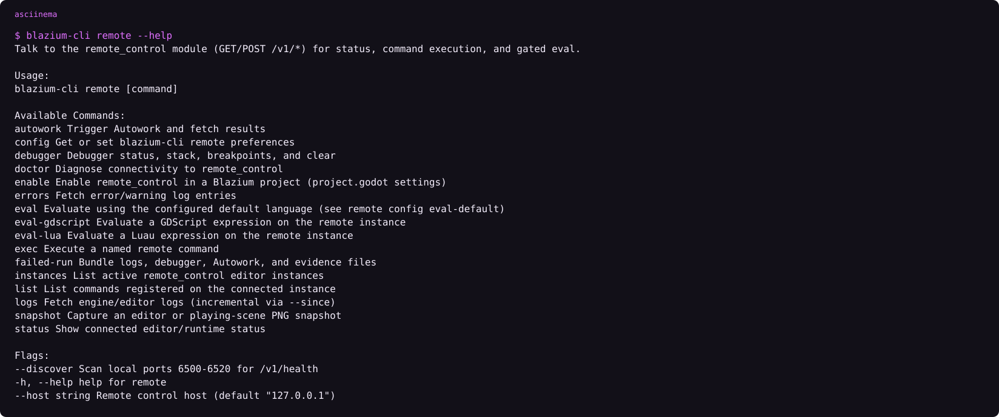
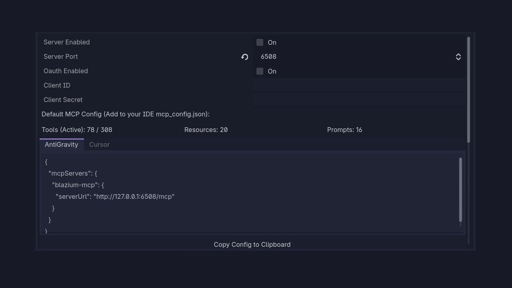
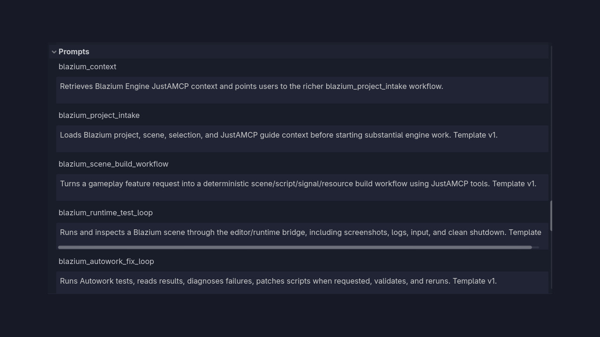

Three tools, three jobs. Do not collapse them.


## remote_control

Localhost JSON HTTP on `/v1/*`. Default bind `127.0.0.1:6507`. Token required. Enable with Project Settings `blazium/remote_control/server_enabled` or `--enable-remote-control`. Port: `--remote-control-port` or `blazium/remote_control/server_port`. Token: `--remote-control-token` or `blazium/remote_control/token`.

Routes worth knowing:

| Route | Job |
|---|---|
| `GET /v1/health` | Liveness |
| `GET /v1/status` | Project, pid, instance id |
| `POST /v1/exec` | Built-in commands (play, pause, snapshot) |
| `POST /v1/eval` | GDScript or Luau expression |
| `GET /v1/logs` | Paginated engine log |

Play commands: `play_main_scene`, `play_current_scene`, `play_custom_scene`, `pause_playing`, `resume_playing`, `stop_playing`, `play_status`. Snapshots `snapshot_editor` / `snapshot_scene` return PNG as `png_base64`.

<!-- CAPTURE: assets/health-browser.png | Browser | GET http://127.0.0.1:6507/v1/health -->

## CLI is the client

```text
blazium-cli remote ping
blazium-cli remote eval-gdscript "2 + 2"
blazium-cli remote snapshot editor -o editor.png
blazium-cli remote autowork run --wait
blazium-cli remote config set enable-mcp-on-load true
blazium-cli remote doctor
```

`open` / `load` start remote_control by default and assign a 6-character instance id after `/v1/health`. Two editors: pass `--instance` or `--project`.


<!-- ASCIINEMA: assets/cli-remote-help.cast | blazium-cli remote --help -->

<!-- ASCIINEMA: assets/cli-remote-ping.cast | blazium-cli remote ping -->
<!-- CAPTURE: record with asciinema rec while an editor is running -->
<!-- CAPTURE: assets/cli-snapshot.png | Filesystem | editor.png written by remote snapshot -->

## JustAMCP

Native MCP server in the editor. Streamable HTTP. Tool groups: scene, script, shaders, tilemaps, themes, docs. `JustAMCPRuntime` keeps a port up across scene switches. `blazium-cli remote config set enable-mcp-on-load true` turns it on when CLI loads a project.





<!-- CAPTURE: assets/mcp-agent.gif | Editor + agent | Agent creates a Node2D, scene tree updates. Master mp4 15s. -->
<!-- CAPTURE: assets/cover.png | Editor + terminal | Replace diagram cover: editor, terminal remote ping, MCP settings -->

## Two `blazium://` owners

| Owner | Example |
|---|---|
| CLI / Hub (OS protocol) | `blazium://open?path=C:\game` |
| JustAMCP (MCP resource) | `blazium://scene/…`, `blazium://docs/…`, `blazium://tags/…` |

## Autowork

Run the suite in the editor panel, or:

```text
blazium --headless --path . -s run_tests.gd
blazium-cli remote autowork run --wait
```

Hub's own repo runs Autowork in CI. Full write-up belongs with the Autowork module article. This piece only needs: a failing assert in the panel, then the CLI command going green.

<!-- CAPTURE: assets/autowork-panel.png | Editor | Autowork pass/fail in the panel -->
