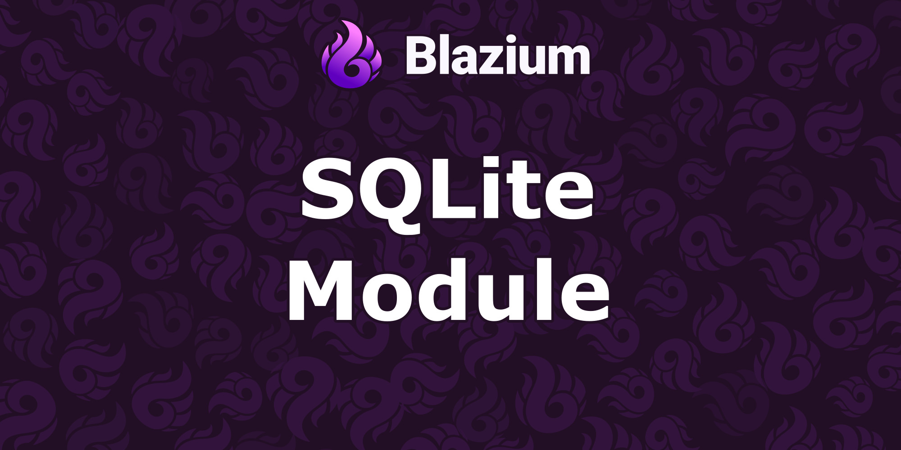
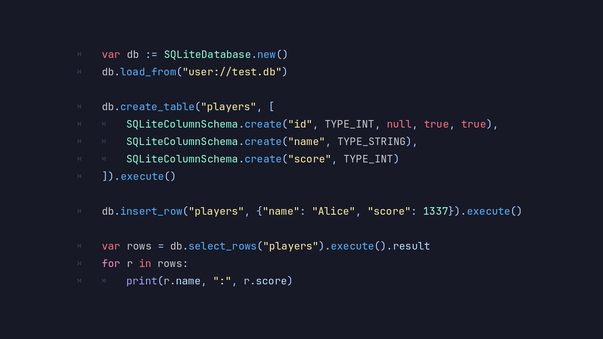

# Introducing the SQLite3 Module

Blazium Game Engine now includes a native **SQLite3** module for projects that need local databases, structured saves,
embedded tools, analytics, or data-heavy gameplay systems.
SQLite is one of the most widely used database engines in the world, and this module brings it directly into
Blazium with a rich engine-facing API.

The module provides three layers for different workflows: `SQLiteAccess` for low-level control,
`SQLiteDatabase` as a resource-backed database layer, and the `SQLite` node for scene-friendly integration.
Together they cover simple queries, prepared statements, transactions, backups, BLOB access, custom SQL functions,
JSON import/export, object serialization, diagnostics, and reactive hooks.

## Key Features

- **Native SQLite Integration**: Use SQLite directly inside Blazium projects with the performance and portability
of a built-in C++ module.
- **Multiple API Layers**: Choose `SQLiteAccess` for direct control, `SQLiteDatabase` for resource workflows,
or the `SQLite` node for scene-based projects.
- **File, Memory, and Buffered Databases**: Open persistent database files, in-memory databases, or
buffered databases backed by packed byte arrays.
- **Prepared Queries and Binding**: Create reusable queries, pass arguments safely, inspect results,
and handle errors through structured result objects.
- **Transactions, Savepoints, and WAL**: Use classic database transaction tools, savepoints,
write-ahead logging, and checkpoints for reliable data flows.
- **Backup and Restore Tools**: Run synchronous backups or use `SQLiteBackup` for stepped asynchronous backup and restore workflows.
- **Incremental BLOB Access**: Read and write large binary values in chunks with `SQLiteBlob`, useful for
save data, assets, thumbnails, or cached content.
- **Custom SQL Extensions**: Register custom functions, aggregate functions, and collations with `Callable` hooks from engine scripts.
- **Serialization and Diagnostics**: Export/import JSON, serialize objects, inspect database status, set limits,
tune configuration, and collect diagnostic data.

## Possible Uses in Games and Applications

The SQLite3 module is useful anywhere a project needs more structure than flat files but does not need a separate database server.
It is small, battle-tested, and well suited to desktop tools, headless servers, editor utilities, and exported games.

**For Games**
- **Structured save systems**: Store player progress, inventory, quests, statistics, unlocked content,
and world state in normalized tables.
- **Mod and content databases**: Package items, enemies, dialogue, maps, localization, or balancing data in
SQLite files that tools can inspect and update.
- **Analytics and telemetry buffers**: Record gameplay events locally and upload or export them later when connectivity is available.
- **Live service cache layers**: Cache remote catalog data, profiles, leaderboards, or matchmaking metadata for offline-friendly behavior.
- **Large binary data workflows**: Store screenshots, thumbnails, replay chunks, or generated content through BLOB APIs.

**For Applications & Tools**
- Build local-first editors, launchers, dashboards, and data management tools with a real embedded database.
- Create import/export pipelines that move data between JSON, objects, and relational tables.
- Prototype backend-like systems inside Blazium without requiring an external database during development.
- Use status, limits, configuration, and diagnostics APIs to understand database behavior in demanding tools.

Because SQLite is embedded, the same project can run in the editor, in exported applications, or
in headless automation with the same database behavior.
The node and resource layers make common workflows approachable, while `SQLiteAccess` remains available
when a project needs advanced control.

## Documentation & Next Steps

The module is already available in the [latest nightly of Blazium](https://blazium.app/download) and
includes a dedicated test project (see
[sqlite3_module_tests](https://github.com/blazium-games/sqlite3_module_tests)
for examples).

Whether you are building a game with deep save data, an editor with structured project files, or
a headless service with local persistence, the SQLite3 module gives Blazium a solid embedded database toolkit.

---

**[Jump into our Discord](https://blazium.app/chat)** for real-time chats, dev support and feedback

Or follow us everywhere else:

- **[GitHub](https://github.com/blazium-games)**
- **[IndieDB](https://www.indiedb.com/engines/blazium-engine/articles)**
- **[X / Twitter](https://x.com/BlaziumGames)**
- **[YouTube](https://www.youtube.com/@blazium)**
- **[itch.io](https://blaziumengine.itch.io)**
