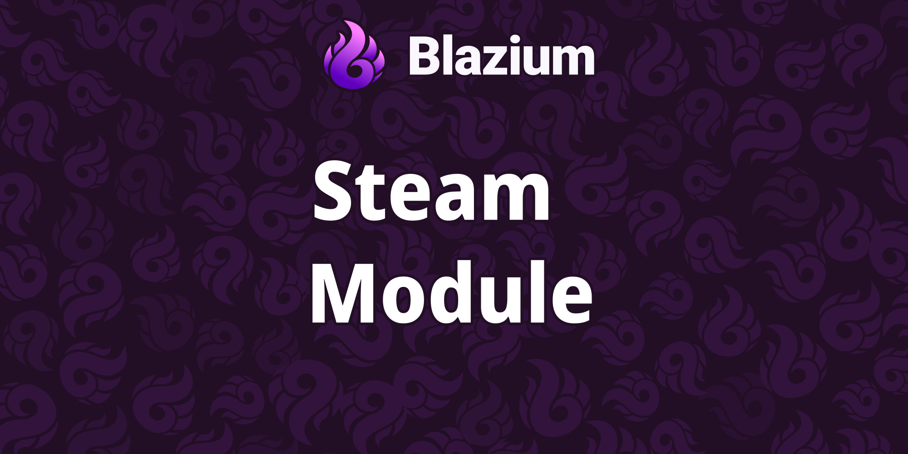
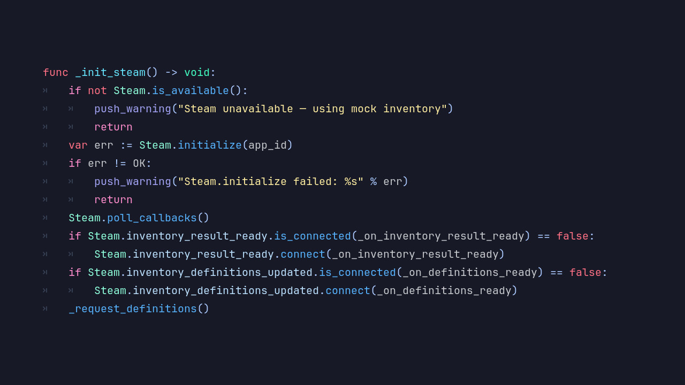

# Introducing the Steam Module

Blazium Game Engine ships a native **Steam** module that replaces the old GodotSteam integration.
It talks directly to Steamworks through a built-in C++ layer, exposing a clean `Steam` singleton.

After GodotSteam was removed in release 0.5.246, we built our own path forward. The result covers
achievements, stats, inventory, web API tickets, and backend authentication, the pieces most games
actually need on day one.

## Key Features

- **Steamworks Initialization**: `Steam.initialize(app_id)` with graceful fallback when the Steam client or DLL is unavailable.
- **Achievements & Stats**: Unlock, clear, and query achievements. Read and write integer and float stats with store/refresh support.
- **Inventory Support**: Load item definitions, grant promo items, update properties, consume, and exchange items.
- **Web API Tickets**: Request hex auth tickets and authenticate against your game backend via `authenticate_with_server`.
- **User Info**: Persona name, avatar images, and local Steam ID access.
- **Debug Logging**: Built-in debug log capture for diagnosing integration issues during development.

## Why Use the Steam Module in Your Blazium Project?

Whether you are shipping on Steam or building tools around it, the module keeps everything in-engine:

**For Games**
- **Achievement systems**: Unlock milestones, sync progress, and pull achievement icons for in-game UI.
- **Leader stats**: Track kills, playtime, or any numeric stat Steam supports.
- **Item drops and DLC**: Manage inventory items, promo grants, and property tags for cosmetic or consumable content.
- **Backend auth**: Exchange Steam tickets for JWTs on your own server without bolting on third-party extensions.

**For Applications & Tools**
- Build Steam-aware admin panels or live ops dashboards entirely in Blazium.
- Prototype inventory economies and stat systems before wiring up a full backend.
- Run end-to-end validation with the dedicated test project.

## Documentation & Next Steps

The module is available in the [latest nightly of Blazium](https://blazium.app/download).

---

**[Jump into our Discord](https://blazium.app/chat)** for real-time chats, dev support and feedback

Or follow us everywhere else:

- **[GitHub](https://github.com/blazium-games)**
- **[IndieDB](https://www.indiedb.com/engines/blazium-engine/articles)**
- **[X / Twitter](https://x.com/BlaziumGames)**
- **[YouTube](https://www.youtube.com/@blazium)**
- **[itch.io](https://blaziumengine.itch.io)**
