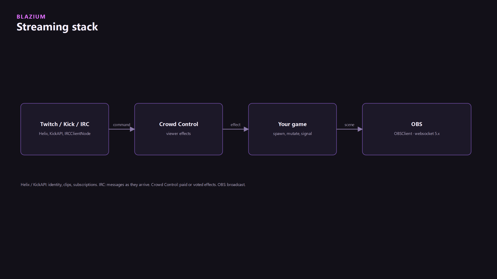
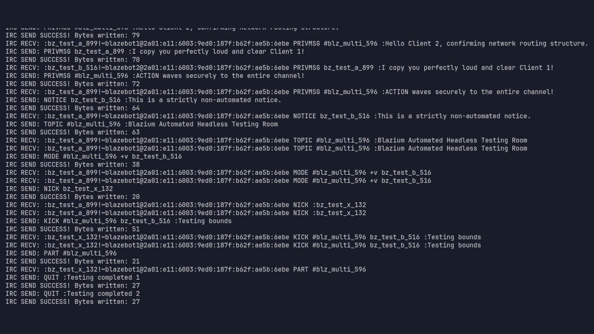
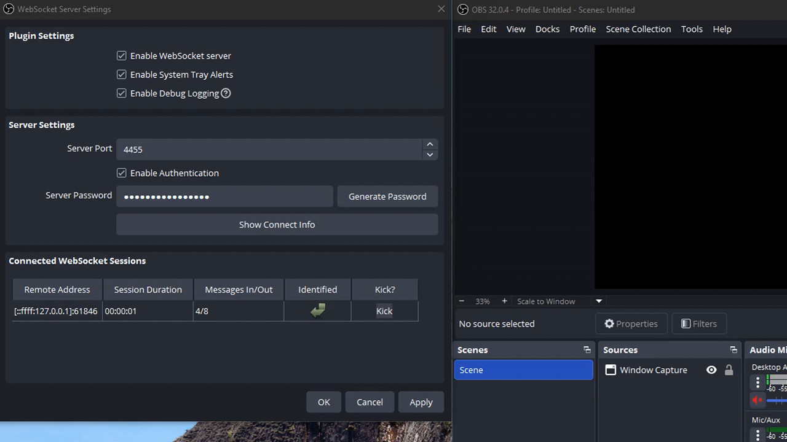

Chat comes in. The game changes. OBS cuts. Five modules on `blazium-dev` cover that path. They do not share a base class. You wire them.

## Status

`twitchapi`, `kickapi`, `ircclient`, `crowdcontrol`, and `obsclient` are in the engine tree. Each has its own module tests (links at the bottom). There is no scene template that connects all five, and no Blazium service that holds your Twitch, Kick, or OBS tokens. Tokens go in `.env` through the `ENV` singleton. See [ENV, INI, and CSV](../data-formats/data-formats.md).

`CrowdControl` and `OBSClient` are `Object`, not `Node`. Both need `poll()` from `_process`. Crowd Control has no `trigger()` method. The viewer starts the effect on Crowd Control's side. The game answers with `respond_to_effect_instant` or `respond_to_effect_timed`.

Per-service articles already on the site cover one module at a time: [Twitch](../twitchapi-module/twitchapi-module.md), [Kick](../kickapi-module/kickapi-module.md), [IRC](../irc-client-module/irc-client-module.md), [Crowd Control](../crowd-control-module/crowd-control-module.md), [OBS](../obs-client-module/obs-client-module.md). This page is the path across them.



## Chat inputs

| Need | Class | Module |
|---|---|---|
| Twitch Helix (users, streams, clips) | `TwitchAPI` | `twitchapi` |
| Twitch chat | `TwitchIRCClient` or `TwitchIRCClientNode` | `ircclient` |
| Kick | `KickAPI` | `kickapi` |
| Generic IRC | `IRCClient` or `IRCClientNode` | `ircclient` |

Helix is HTTP. `TwitchAPI.configure(client_id, access_token)` then category objects such as `get_users()`, `get_streams()`, and `get_chat()`. Signals include `request_completed` and `request_failed`. Do not poll Helix for every chat line.

Twitch chat is IRC. `TwitchIRCClient.connect_to_twitch(username, oauth_token, use_ssl)` and `TwitchIRCClientNode` is the `Node` wrapper. The chat signal is `twitch_message`, not a Helix request. Generic IRC uses `IRCClientNode.connect_to_server(...)` and `message_received(message: IRCMessage)`. `IRCMessage.get_nick()`, `command`, and `params` are the fields.

Kick is `KickAPI.configure(access_token)`, then `get_users()`, `get_oauth().introspect_token()`, and `get_public_key()`. `KickHTTPClient.poll()` drains the queue.



## Crowd Control

`CrowdControl` is an `Object`, not a node. `connect_to_crowdcontrol(url)` opens the socket. `poll()` has to be called. Auth is `request_authentication_websocket` or `request_authentication_http`, then `set_auth_token`. A game pack is `CrowdControlGamePack` plus `CrowdControlEffect` (`effect_id`, `effect_name`, `duration`, `price`). The game answers an effect with `respond_to_effect_instant` or `respond_to_effect_timed`, and publishes the catalog with `report_effects`. There is no `trigger()` method. The viewer buys the effect on Crowd Control's side. Your game reports the result.

## OBS

`OBSClient` is an `Object` speaking obs-websocket 5.x. It is not a scene-tree node.

```gdscript
OBSClient.connect_to_obs("ws://localhost:4455", "my_password")
```

`connect_to_obs(url, password, event_subscriptions)` returns an `Error` when the attempt starts. Call `poll()` until the handshake finishes. `set_current_program_scene` switches the program scene. The class also covers inputs, filters, record, and stream. `get_connection_state` is how you know the socket actually came up.



## One overlay

Tokens belong in `.env`, loaded by the `ENV` singleton. See [ENV, INI, and CSV](../data-formats/data-formats.md). This sample connects OBS and reacts to one IRC line. It does not pretend Crowd Control has a fire-and-forget trigger.

```gdscript
extends Node

@onready var irc: IRCClientNode = $IRCClientNode
var obs := OBSClient.new()

func _ready() -> void:
    ENV.auto_config("res://")
    obs.connect_to_obs(str(ENV.get_env("OBS_URL", "ws://127.0.0.1:4455")), str(ENV.get_env("OBS_PASSWORD", "")))
    irc.message_received.connect(_on_irc)

func _process(_delta: float) -> void:
    obs.poll()

func _on_irc(message: IRCMessage) -> void:
    if message.command != "PRIVMSG" or message.params.size() < 2:
        return
    if str(message.params[1]).strip_edges() != "!boom":
        return
    obs.set_current_program_scene("Alert")
```

For Twitch chat, use `TwitchIRCClientNode` and `twitch_message` instead of `message_received`. For a Crowd Control effect, construct a `CrowdControl`, `connect_to_crowdcontrol`, `poll` it beside OBS, and answer with `respond_to_effect_instant`.

Module tests: [twitchapi_module_tests](https://github.com/blazium-games/twitchapi_module_tests), [kickapi_module_tests](https://github.com/blazium-games/kickapi_module_tests), [irc_module_tests](https://github.com/blazium-games/irc_module_tests), [crowdcontrol_module_tests](https://github.com/blazium-games/crowdcontrol_module_tests), [obsclient_module_tests](https://github.com/blazium-games/obsclient_module_tests).

---

**[Jump into our Discord](https://blazium.app/chat)** for real-time chats, dev support and feedback

Or follow us everywhere else:

- **[GitHub](https://github.com/blazium-games)**
- **[IndieDB](https://www.indiedb.com/engines/blazium-engine)**
- **[X / Twitter](https://x.com/BlaziumGames)**
- **[YouTube](https://www.youtube.com/@blazium)**
- **[itch.io](https://blaziumengine.itch.io)**
