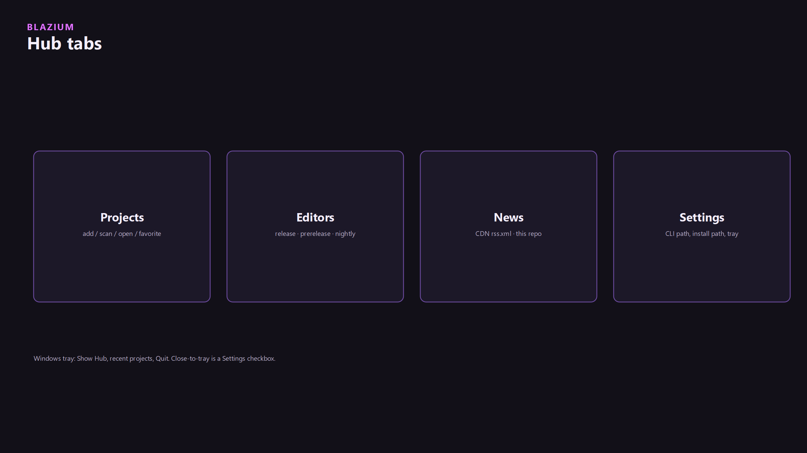
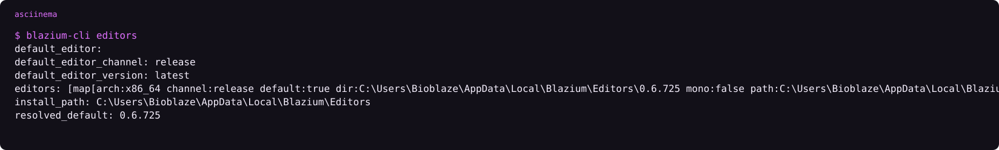

You install Hub. Hub asks the CLI to fetch an editor from the CDN. The editor is the engine. The News tab in Hub reads `https://cdn.blazium.app/articles/rss.xml` once a post is marked deployed and published.

Hub, the CLI, the crash reporter, and the CDN were built for the Blazium Engine and this ecosystem. Internal game builds use the same CDN downloads and export templates the public gets. Analytics and the in-game bug reporter were built for our example Hangman game and for Demon Lord: Clicker. Hangman shipped on Steam, Discord (as an Embedded App), Google Play, and the Apple App Store. Crash reports that are sent are read to find engine issues and to ship patches for those crashes. In Demon Lord: Clicker the bug reporter sends a description, a screenshot, logs, and session details, with account IDs and PC usernames stripped. The backend links those reports to GitHub issues. That path is not the minidump, and analytics events are not the patch input.

That is the stack people touch. Everything else is a module inside the editor, or a separate repo the CLI and the editor know how to call.

## The map


| Box | Job |
|---|---|
| [blazium.app](https://blazium.app) | Download pages, docs, changelog |
| cdn.blazium.app | Editor builds, export templates, CLI, Hub installers, crash sidecar, toolchain catalog, Hub News |
| Hub | Desktop launcher: Projects, Editors, News, Settings. Shells the CLI |
| CLI | Installs editors, registers projects, handles `blazium://` |
| Editor | Blazium `0.6.x` on the `blazium-dev` line (Godot 4.3 compatible). Speaks remote control so the CLI can talk to it |
| Crash sidecar | Shows the dump. Uploads only after you confirm |
| Cerebro | Internal. Release CI publishes catalogs. Hub never calls it. The CLI can, for template metadata, via `BLAZIUM_CEREBRO_URL` |

There is a second engine line, `blazium_4.8`. Hub's own executable is built from that branch. The editors you install from the CDN are whatever channel you picked. This page stays on what `blazium-dev` and the tool repos actually contain.

Published Hub and CLI binaries are Linux and Windows. There is no Flatpak in the download set. [blazium#428](https://github.com/blazium-games/blazium/issues/428) is the open request. Engine docs are [docs.blazium.app](https://docs.blazium.app). The store at [blazium.games](https://blazium.games) is a different product. Uploads there go through `chauffeur`, documented at [docs.blazium.games](https://docs.blazium.games), not through `blazium-cli deploy`.

## Two version numbers


Godot compatibility for `blazium-dev` is 4.3.2. The product you download is Blazium `0.6.x`. A recorded CLI session on one machine showed default editor `0.6.725` under `C:\Users\Bioblaze\AppData\Local\Blazium\Editors`. Export templates install under the Blazium version, not `4.3.2.stable`. Mixing those folders is the usual "templates missing" failure.

## The walk

1. Get Hub from the [dev-tools download page](https://blazium.app/dev-tools/download?tool=hub). Windows is Inno, machine-wide, admin. Linux is a `.deb`. The installer also lays down `blazium-cli` and `crash_reporter`.
2. Hub opens with four tabs.



3. Editors tab. Channel `release`, `prerelease`, or `nightly`. Install. The CLI downloads from `cdn.blazium.app` into `{install-path}/{channel}/{version}`.
4. Projects tab. Add a `project.godot`, or scan a folder. Open runs `blazium-cli open`.
5. The editor starts with remote control on port **6508** (unless you turned `enable-on-open` off), so `blazium-cli remote` can reach it.

Replay the CLI side locally:

```text
asciinema play assets/cli-editors.cast
```


<!-- ASCIINEMA: assets/cli-editors.cast | blazium-cli editors -->

## The other pieces

- **Crash sidecar.** The engine writes a minidump and a JSON file. A small UI asks you. Nothing leaves the machine until Send. Editor HTTP upload is not implemented. `require_user_consent` defaults to true.
- **Analytics.** Off until consent is given (`--analytics=accepted|declined`, `BLAZIUM_ANALYTICS_CONSENT`, `Analytics.set_consent`, or Editor Settings `blazium/analytics/consent`). Same app id and build id as crash reports. `flush()` is what POSTs.
- **CLI remote and MCP.** Localhost JSON for scripts on port 6508 (`GET /v1/health`, `POST /v1/exec`). JustAMCP for agents on port 6506. Autowork is the test runner both can start. `allow_eval` defaults to false.
- **Toolchain.** A GPL-3.0 CLI, [blazium-toolchain](https://github.com/blazium-games/blazium-toolchain). The editor spawns it for Interactive DVD (`export/inter_dvd/toolchain`). PS1, PS2, and N64 are terminal commands in that same binary. Compilers are not in `blazium.git`. `ps3` and `ps4` exit 2.
- **Web.** A normal editor preset named `Web`, plus [docker-webbuild-template](https://github.com/blazium-games/docker-webbuild-template) if Discord needs Nginx `/.proxy/` paths. Web is not a toolchain target.
- **Multiplayer that compiles on `blazium-dev`.** `ENetServer` / `ENetClient`, WebRTC signaling (`SignalClient`, `WebRTCEnetSession`), and `Discord.create_or_join_lobby`. `LobbyClient`, `LoginClient`, and `MasterServerClient` are not registered classes in this tree. Script templates with those names are still in the editor template folder. They do not run.

## Two meanings of `blazium://`

| Who | Example | Job |
|---|---|---|
| OS / CLI | `blazium://open?path=` | Open Hub or a project. Hub's remote port is **39218** |
| JustAMCP | `blazium://scene/…`, `blazium://tags/dictionary` | MCP resource inside the editor |

Same scheme. Two owners.

## License split

The engine is MIT. `blazium-toolchain` is GPL-3.0-or-later so it can fetch GCC and the console SDKs. The editor process stays MIT and only executes that binary. Fetching the SDK into the engine repo would be the thing the split exists to avoid.

Downloads: [blazium.app](https://blazium.app). Hub and the CLI: [dev tools](https://blazium.app/dev-tools).

---

**[Jump into our Discord](https://blazium.app/chat)** for real-time chats, dev support and feedback

Or follow us everywhere else:

- **[GitHub](https://github.com/blazium-games)**
- **[IndieDB](https://www.indiedb.com/engines/blazium-engine)**
- **[X / Twitter](https://x.com/BlaziumGames)**
- **[YouTube](https://www.youtube.com/@blazium)**
- **[itch.io](https://blaziumengine.itch.io)**
